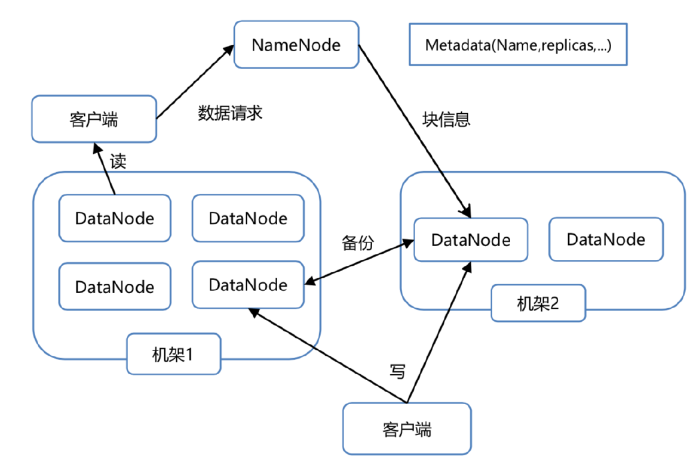
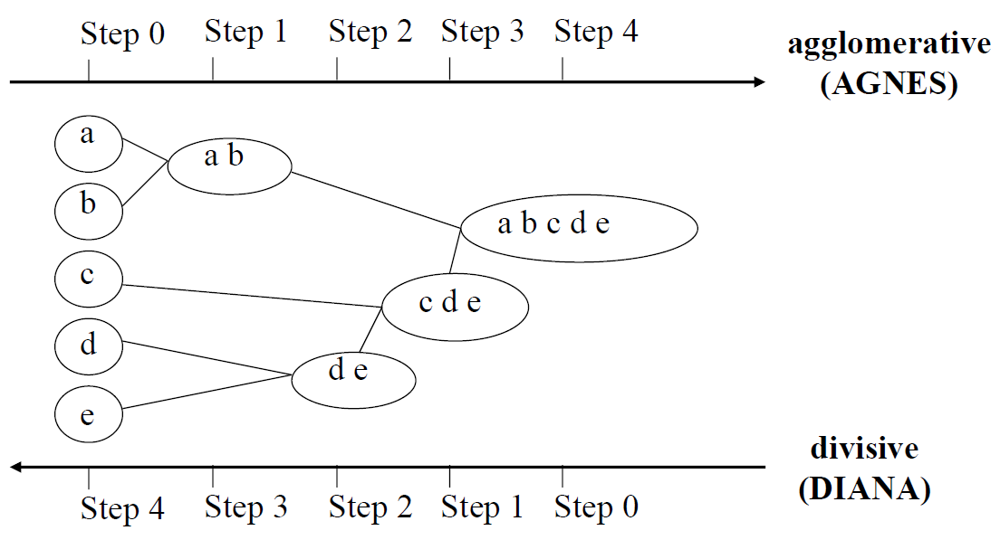
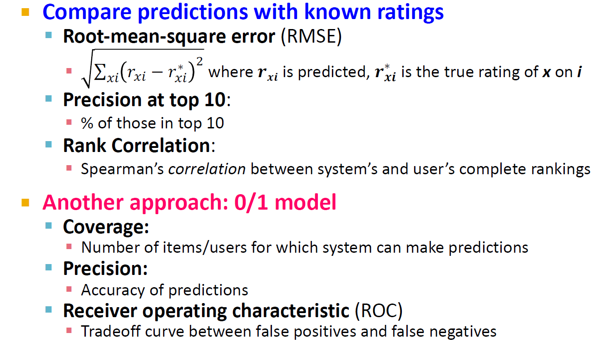
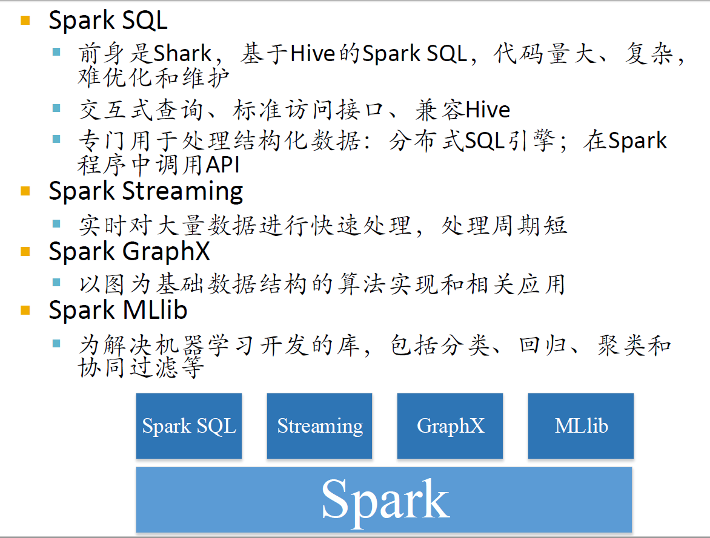
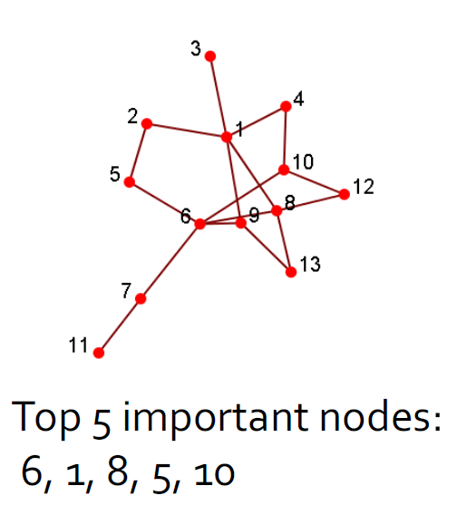
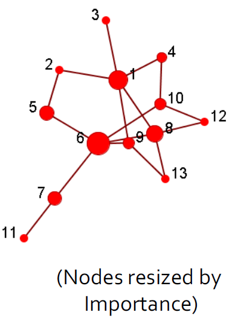
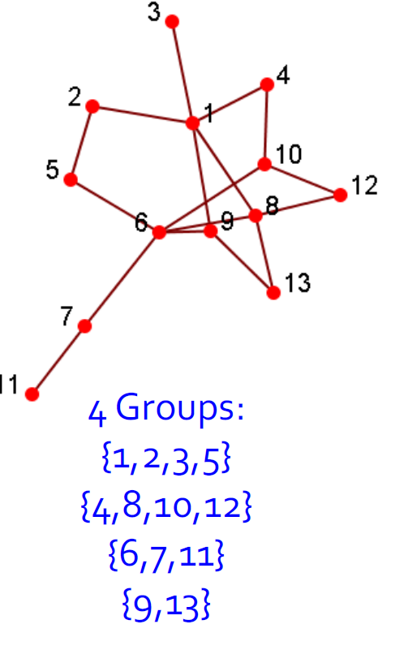
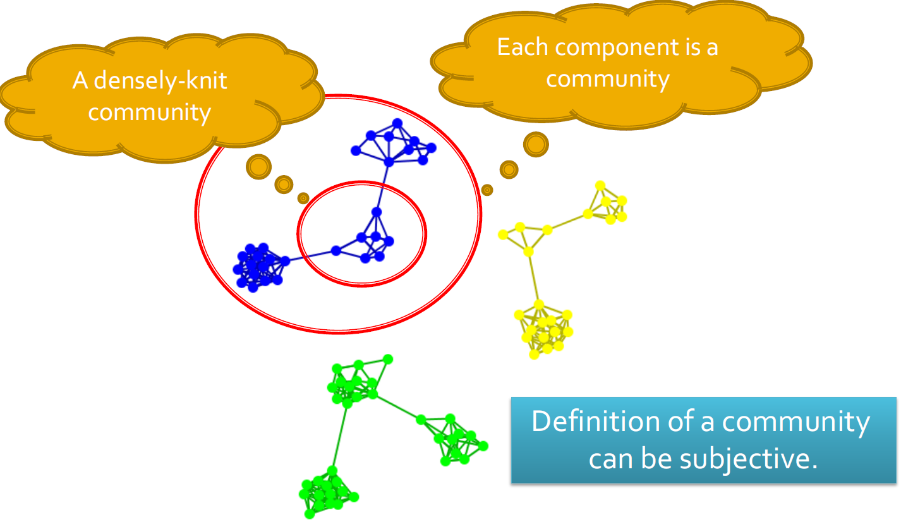

Exam-整理
---

# 1. 选择题
1. 设计分布式数据仓库Hive的数据表时，为取样更高效，一般可以对表中的连续字段进行**分桶**操作。
2. 客户端首次查询HBase数据库时，首先需要从`-ROOT-`表开始查找。
3. HBase的Region组成中，必须要有**MemStore**项。
4. HBase是分布式列式存储系统，记录按**列族**集中存放。
5. HBase数据库的BlockCache缓存的数据块中，**普通的数据块**不一定能提高效率。
6. 视频监控数据属于非结构化数据
7. MapReduce编程模型，键值对`<key, value>`的key必须实现`WritableComparable`
8.  若不针对MapReduce编程模型中的key和value值进行特别设置，**Average**是MapReduce不适宜的运算。
9. 在实验集群的master节点使用jps命令查看进程时，终端出现`Namenode,JobTracker, Secondary NameNode`能说明Hadoop主节点启动成功
10. Client 端上传文件的时候下列哪项正确？B
    - A. 数据经过 NameNode 传递给 DataNode
    - B. Client 端将文件切分为 Block，依次上传
    - C. Client 只上传数据到一台 DataNode，然后由 NameNode 负责 Block 复制工作
    - D. 以上都不正确
11. Hadoop1.0默认的调度器策略是**先进先出调度器**
12. **JobTracker**负责 MapReduce 任务调度
13. HDFS1.0 默认 Block Size大小是 **64MB**
14. HDFS 中的 block 默认保存**3**个备份
15. **Datanode**负责 HDFS 数据存储。

# 2. 判断题
1. Hadoop 支持数据的随机读写。（错，Hbase支持，Hadoop不支持）
2. NameNode 负责管理元数据信息metadata，client 端每次读写请求，它都会从磁盘中读取或会写入 metadata 信息并反馈给 client 端。（错，内存中读取）
3. MapReduce 的 input split 一定是一个 block。（错，默认是）
4. MapReduce适于PB级别以上的海量数据在线处理。（错，离线）
5. 链式MapReduce计算中，对任意一个MapReduce作业，Map和Reduce阶段可以有无限个Mapper，但Reducer只能有一个。（ 对）
6. MapReduce计算过程中，相同的key默认会被发送到同一个reduce task处理。（对）
7. HBase对于NULL的列，不需要占用存储空间。（没有则空不存储，对）
8. HBase可以有列，可以没有列族（column family）。 （错，有列族）

# 3. 简答题
  
## 3.1. 简述大数据技术的特点。
1. Volume（大体量）：即可从数百TB到数十数百PB、甚至EB规模。
2. Variety（多样性）：即大数据包括各种格式和形态的数据。
3. Velocity（时效性）：即很多大数据需要在一定的时间限度下得到及时处理。
4. Veracity（准确性）：即处理的结果要保证一定的准确性。
5. Value（大价值）：即大数据包含很多深度的价值，大数据分析挖掘和利用带来巨大的商业价值。

## 3.2. 启动Hadoop系统，当使用bin/start-all.sh命令启动时，请给出集群各进程启动顺序。
- 启动顺序：namenode –> datanode -> secondarynamenode -> resourcemanager -> nodemanager

## 3.3. 简述HBase的主要技术特点。
1. 列式存储
2. 表数据是稀疏的多维映射表
3. 读写的严格一致性
4. 提供很高的数据读写速度
5. 良好的线性可扩展性
6. 提供海量数据
7. 数据会自动分片
8. 对于数据故障，hbase是有自动的失效检测和恢复能力。
9. 提供了方便的与HDFS和MAPREDUCE集成的能力。

# 4. 年:2019

## 4.1. 选择题
1. HDFS 2.x 的默认块大小：128MB
2. 社交网络的商业模式是长尾模式(疑问，还是二八模式)
3. 不是hadoop的默认集群运行模式:微服务式
   1. standalone(独立式)
   2. 伪分布
   3. 分布式
   4. 微服务式
4. 以下哪种不是Spark的库：Storm
   1. SparkSQL
   2. GraphX
   3. MLlib
   4. Storm
5. tasktracker运行在hdfs的哪个程序上:datanode
   1. namenode
   2. datanode
   3. secondarynodee
   4. jobtracker

## 4.2. 判断题
1. namenode是HDFS集群的主节点，负责维护整个HDFS系统的文件目录树，和各个路径/文件的块信息。对
2. jaccard距离用于度量集合距离，定义是两集合的交集中的元素个数除以并集中的元素个数。对
3. 决策边界指N维空间中用于区分不同类别样本的平面或者曲面。对
4. HBase是基于行的NoSQL。错(列)

## 4.3. 计算题
1. pagerank：初始每张网页的权重相等，写出转移矩阵和一次迭代后的page rank值

```
A: B, C, D  
B: D, E  
C: E  
D: E  
E: A  
```

2. 奇异值分解，奇异值分解如下

$$
\begin{bmatrix}
  1 & 2 \\
  2 & 2 \\
  2 & 1 \\
\end{bmatrix}
$$

## 4.4. 简答题
1. 聚类中，计算类簇间的距离时，有哪些可能的计算方向和方法(提示，距离，link，类簇的表示)
2. 举例并描述在社区计算中常见的计算任务(20分)  (列举即可，至少四类)  
3. 简述推荐系统的三大问题，并说说推荐系统评分中的Explict和Implict各有什么样的例子？

# 5. 数据挖掘是什么？
1. 给定大量数据的情况，三维那张图片，有哪些挑战

## 5.1. 大数据挑战


### 5.1.1. 挑战
1. Usage：使用
2. Quality：质量
3. Context：内容
4. Streaming：数据流动，大量的算法
5. Scalability：可扩展性

### 5.1.2. 数据形态
1. Ontologies:源数据
2. Structed:结构化
3. Networks:网络
4. Text:文本
5. Multimedia:流媒体
6. Signals:信号

### 5.1.3. 操作
1. Collect：收集
2. Prepare：准备，数据的值是不是为空
3. Represent：表示
4. Model：模型
5. Reason：原因(验证)
6. Visualize：可视化

## 5.2. 发现具有以下特征的模型(模型)
1. 有效性
2. 可用性
3. 出乎意料
4. 可理解性

# 6. Hadoop

## 6.1. Hadoop生态圈
> 都是干什么的，特征是什么


### 6.1.1. MapReduce并行计算框架
1. MapReduce并行计算框架是一个并行化程序执行系统。它提供了一个包含Map和Reduce两阶段的并行处理模型和过程，提供一个并行化编程模型和接口，让程序员可以方便快速地编写出大数据并行处理程序。
2. MapReduce以键值对数据输入方式来处理数据，并能自动完成数据的划分和调度管理。
3. 在程序执行时，MapReduce并行计算框架将负责调度和分配计算资源，划分和输入输出数据，调度程序的执行，监控程序的执行状态，并负责程序执行时各计算节点的同步以及中间结果的收集整理。
4. MapReduce框架提供了一组完整的供程序员开发MapReduce应用程序的编程接口。

### 6.1.2. 分布式文件系统HDFS
1. HDFS（Hadoop Distributed File System）是一个类似于GoogleGFS的开源的分布式文件系统。
2. 它提供了一个可扩展、高可靠、高可用的大规模数据分布式存储管理系统，基于物理上分布在各个数据存储节点的本地Linux系统的文件系统，为上层应用程序提供了一个逻辑上成为整体的大规模数据存储文件系统。
3. 与GFS类似，HDFS采用多副本（默认为3个副本）数据冗余存储机制，并提供了有效的数据出错检测和数据恢复机制，大大提高了数据存储的可靠性。

### 6.1.3. 分布式数据库管理系统HBase(重点)
1. 为了克服HDFS难以管理结构化/半结构化海量数据的缺点，Hadoop提供了一个大规模分布式数据库管理和查询系统HBase。
2. HBase是一个建立在HDFS之上的分布式数据库，它是一个分布式可扩展的NoSQL数据库，提供了对结构化、半结构化甚至非结构化大数据的实时读写和随机访问能力。
3. HBase提供了一个基于行、列和时间戳的三维数据管理模型，HBase中每张表的记录数（行数）可以多达几十亿条甚至更多，每条记录可以拥有多达上百万的字段。
4. 一个数据库
5. 分布式的、非结构化的，稀疏的，面向列的
6. 基于HDFS，山寨版的BigTable，继承了可靠性、高性能、可伸缩性

### 6.1.4. 公共服务模块Common
1. Common是一套为整个Hadoop系统提供底层支撑服务和常用工具的类库和API编程接口，这些底层服务包括Hadoop抽象文件系统FileSystem、远程过程调用RPC、系统配置工具Configuration以及序列化机制。
2. 在0.20及以前的版本中，Common包含HDFS、MapReduce和其他公共的项目内容；从0.21版本开始，HDFS和MapReduce被分离为独立的子项目，其余部分内容构成Hadoop Common。

### 6.1.5. 数据序列化系统Avro
1. Avro是一个数据序列化系统，用于将数据结构或数据对象转换成便于数据存储和网络传输的格式。
2. Avro提供了丰富的数据结构类型，快速可压缩的二进制数据格式，存储持久性数据的文件集，远程调用RPC和简单动态语言集成等功能。

### 6.1.6. 分布式协调服务框架Zookeeper
1. Zookeeper是一个分布式协调服务框架，主要用于解决分布式环境中的一致性问题。
2. Zookeeper主要用于提供分布式应用中经常需要的系统可靠性维护、数据状态同步、统一命名服务、分布式应用配置项管理等功能。
3. Zookeeper可用来在分布式环境下维护系统运行管理中的一些数据量不大的重要状态数据，并提供监测数据状态变化的机制，以此配合其他Hadoop子系统（如HBase、Hama等）或者用户开发的应用系统，解决分布式环境下系统可靠性管理和数据状态维护等问题。

### 6.1.7. 分布式数据仓库处理工具Hive(重点)
1. Hive是一个建立在Hadoop之上的数据仓库，用于管理存储于HDFS或HBase中的结构化/半结构化数据。
2. 它最早由Facebook开发并用于处理并分析大量的用户及日志数据，2008年Facebook将其贡献给Apache成为Hadoop开源项目。
3. 为了便于熟悉SQL的传统数据库使用者使用Hadoop系统进行数据查询分析，Hive允许直接用类似SQL的HiveQL查询语言作为编程接口编写数据查询分析程序，并提供数据仓库所需要的数据抽取转换、存储管理和查询分析功能，而HiveQL语句在底层实现时被转换为相应的MapReduce程序加以执行。
4. 面向列存储，延迟比较高
5. Hive是基于Hadoop的数据仓库工具
   1. 学习成本低
   2. 提供完整的sql查询功能
   3. 可以将结构化的数据文件映射为一张数据库表
   4. 可以将sql语句转换为MapReduce任务进行运行。
   5. 可以通过类SQL语句快速实现简单的MapReduce统计，不必开发专门的MapReduce应用

### 6.1.8. 数据流处理工具Pig
1. Pig是一个用来处理大规模数据集的平台，由Yahoo!贡献给Apache成为开源项目。
2. 它简化了使用Hadoop进行数据分析处理的难度，提供一个面向领域的高层抽象语言Pig Latin，通过该语言，程序员可以将复杂的数据分析任务实现为Pig操作上的数据流脚本，这些脚本最终执行时将被系统自动转换为MapReduce任务链，在Hadoop上加以执行。Yahoo!有大量的MapReduce作业是通过Pig实现的。

### 6.1.9. 键值对数据库系统Cassandra
1. Cassandra是一套分布式的K-V型的数据库系统，最初由Facebook开发，用于存储邮箱等比较简单的格式化数据，后Facebook将Cassandra贡献出来成为Hadoop开源项目。
2. Cassandra以Amazon专有的完全分布式Dynamo为基础，结合了Google BigTable基于列族（Column Family）的数据模型，提供了一套高度可扩展、最终一致、分布式的结构化键值存储系统。
3. 它结合了Dynamo的分布技术和Google的Bigtable数据模型，更好地满足了海量数据存储的需求
4. 。同时，Cassandra变更垂直扩展为水平扩展，相比其他典型的键值数据存储模型，Cassandra提供了更为丰富的功能。

### 6.1.10. 日志数据处理系统Chukwa
1. Chukwa是一个由Yahoo！贡献的开源的数据收集系统，主要用于日志的收集和数据的监控，并与MapReduce协同处理数据。
2. Chukwa是一个基于Hadoop的大规模集群监控系统，继承了Hadoop系统的可靠性，具有良好的适应性和扩展性。
3. 它使用HDFS来存储数据，使用MapReduce来处理数据，同时还提供灵活强大的辅助工具用以分析、显示、监视数据结果。

### 6.1.11. 科学计算基础工具库Hama
1. Hama是一个基于BSP并行计算模型（Bulk Synchronous Parallel，大同步并行模型）的计算框架，主要提供一套支撑框架和工具，支持大规模科学计算或者具有复杂数据关联性的图计算。
2. Hama类似Google公司开发的Pregel，Google利用Pregel来实现图遍历（BFS）、最短路径（SSSP）、PageRank等计算。
3. Hama可以与Hadoop的HDSF进行完美的整合，利用HDFS对需要运行的任务和数据进行持久化存储。
4. 由于BSP在并行化计算模型上的灵活性，Hama框架可在大规模科学计算和图计算方面得到较多应用，完成矩阵计算、排序计算、PageRank、BFS等不同的大数据计算和处理任务。

### 6.1.12. 数据分析挖掘工具库Mahout
1. Mahout来源于Apache Lucene子项目，其主要目标是创建并提供经典的机器学习和数据挖掘并行化算法类库，以便减轻需要使用这些算法进行数据分析挖掘的程序员的编程负担，不需要自己再去实现这些算法。
2. Mahout现在已经包含了聚类、分类、推荐引擎、频繁项集挖掘等广泛使用的机器学习和数据挖掘算法。
3. 此外，它还提供了包含数据输入输出工具，以及与其他数据存储管理系统进行数据集成的工具和构架。

### 6.1.13. 关系数据交换工具Sqoop
1. Sqoop是SQL-to-Hadoop的缩写，是一个在关系数据库与Hadoop平台间进行快速批量数据交换的工具。
2. 它可以将一个关系数据库中的数据批量导入Hadoop的HDFS、HBase、Hive中，也可以反过来将Hadoop平台中的数据导入关系数据库中。
3. Sqoop充分利用了Hadoop MapReduce的并行化优点，整个数据交换过程基于MapReduce实现并行化的快速处理。

### 6.1.14. 日志数据收集工具Flume
1. Flume是由Cloudera开发维护的一个分布式、高可靠、高可用、适合复杂环境下大规模日志数据采集的系统。
2. 它将数据从产生、传输、处理、输出的过程抽象为数据流，并允许在数据源中定义数据发送方，从而支持收集基于各种不同传输协议的数据，并提供对日志数据进行简单的数据过滤、格式转换等处理能力。输出时，Flume可支持将日志数据写往用户定制的输出目标。

## 6.2. 三种模式的Hadoop
1. 独立式
2. 伪分布式
3. 全分布式

## 6.3. HDFS架构


### 6.3.1. NameNode
1. 可以看做是分布式文件系统中的管理者，存储文件系统的metadata，主要负责管理文件系统的命名空间，集群配置信息，存储块的赋值
2. 两个文件：EditLog、FSImage
3. 两个映射：`Filename -> BlockSequence(FsImage)`、`Block -> DatanodeList(BlockReport)`
4. 单点(NameNode)风险

### 6.3.2. Secondary NameNode
1. 不是备用NameNode，而是秘书
2. 合并和保存EditLog、FSImage
   1. Checkpoint.period
   2. Checkpoint.size
  
### 6.3.3. Datanode
1. 文件存储的基本单位。它存储文件块在本地文件系统中，保存了文件块的meta-data，同时周期性的发送所有存在的文件块的报错给Namenode

### 6.3.4. Client(客户端)
1. 客户端：对外接口，从namenode获取文件信息，然后访问datanode

# 7. PageRank：问题
1. dead ends
2. Spider traps


# 8. SVD：定义
> 计算一两步骤，问中间结果


# 9. 贝叶斯
1. 假设某种疾病的发病率为0.001（1000个⼈中会有⼀个⼈得病），现有⼀种试剂在患者确实得病的情况下，有99%的⼏率呈现为阳性，⽽在患者没有得病的情况下，它有5%的⼏率呈现为阳性（也就是假阳性），如有⼀位病⼈的检验成果为阳性，那么他的得病概率是多少呢？

$$
P(B_i|A) = \frac{P(B_i)P(A|B_i)}{\sum\limits_{j=1}\limits^nP(B_i)P(A|B_j)}
$$

# 10. 决策树算法(TODO)

## 10.1. ID3
1. 使用所有没有使用的属性并计算与之相关的样本熵值
2. 选取其中熵值最小的属性
3. 生成包含该属性的节点
4. Information Gain
5. 序号是最方便的最大连接

## 10.2. C4.5
1. C4.5算法是对ID3算法的改进，C4.5克服了ID3的2个缺点：
   1. 用信息增益选择属性时偏向于选择分枝比较多的属性值，即取值多的属性
   2. 不能处理连续属性
2. Information resheld

# 11. 聚类问题

## 11.1. KNN算法
1. 令K是最近邻数目，D是训练样例的集合。
2. 对于每个测试样本z=(x',y')，计算z和D中的每个训练样例(x, y)的距离d(x',x)。
3. 选择离z最近的K个训练样例的集合Dz。
4. 样例z的类别为Dz中出现次数最多的样本。
5. 加权决策

## 11.2. 硬聚类和软聚类
1. 硬聚类：每个文档完全属于一个聚类：更常见，更容易做到
2. 软集群：一个文档可以属于多个集群。
   1. 对于创建可浏览层次结构的应用程序更有意义
   2. 您可能希望将一双运动鞋分为两类：（i）运动服装和（ii）鞋子
   3. 您只能使用软集群方法来做到这一点。

## 11.3. K-Means优缺点
> 停止可能性：
1. 确定运行多少轮
2. 中心节点稳定不变

### 11.3.1. 长处
1. 相对有效：O(tkn)，其中n是对象，k是聚类，t是迭代。 通常，k，t<<n。
2. 通常以局部最优值终止。 可以使用诸如模拟退火和遗传算法之类的技术找到全局最优值

### 11.3.2. 弱点
1. 仅在定义均值时适用（分类数据是什么？）
2. 需要预先指定k，即簇数
3. 嘈杂的数据和异常值的问题
4. 不适合发现具有非凸形状的聚类

## 11.4. 层次方法聚类
1. 使用距离矩阵作为聚类标准。此方法不需要输入簇数k，但是需要终止条件
2. 两个方向：
   1. 聚合的
   2. 划分的



3. 计算两个类簇的距离


4. 关键操作:重复合并最近的两个簇
5. 三个重要问题：
   1. 您如何表示一个多点的集群？
   2. 您如何确定群集的“附近”？
   3. 什么时候停止组合集群？
6. 簇的最近对
   1. 定义最接近的集群对的许多变体
   2. 单链接：最相似的余弦相似度（单链接）
   3. 完整链接：“最远”点的相似度，最小余弦相似度
   4. 质心(centorid)：质心最接近余弦的聚类，真实存在？中心可能不是实际点
   5. 平均链接：元素对之间的平均余弦
7. 欧式空间与非欧式空间
8. 划分聚类复杂度:$O(N^3)$，使用优先级队列:$O(N_2logN)$
9. 聚合聚类复杂度至少为$O(N^2)$
10. 还有BIRCH、CURE

## 11.5. 聚类方法
1. 基于参数:比如两个簇之间的最大距离
2. 基于平均距离：欧式空间内
3. 基于密度：密度可达、密度连接

# 12. 启发式算法
1. 仿动物类的算法：
   1. 粒子群优化
   2. 蚂蚁优化
   3. 鱼群算法
   4. 蜂群算法等
2. 仿植物类的算法：
   1. 向光性算法
   2. 杂草优化算法
3. 仿人类的算法：和声搜索算法

# 13. 推荐

## 13.1. 基于内容的推荐
1. 主要思想：向客户推荐商品x与x之前评价较高的商品相似
2. 例子：电影、网站、新闻

### 13.1.1. 优点
1. 不需要其他用户的数据：没有冷启动或稀疏性问题
2. 可以向口味独特的用户推荐
3. 可以推荐不受欢迎的新商品：没有评分少的问题
4. 能够提供解释：可以通过以下方式提供推荐项目的说明

### 13.1.2. 缺点
1. 很难找到合适的功能，例如图像，电影，音乐
2. 对新用户的建议如何建立用户档案？
3. 过度专业化
   1. 绝不推荐用户内容档案之外的项目
   2. 人们可能有多种兴趣
   3. **无法利用其他用户的质量判断**

## 13.2. 协同过滤
1. 找到你的朋友圈，然后推荐给你
2. 基于物品-物品、用户-用户

### 13.2.1. 优点
1. 适用于所有类型的项，不需要选择特性。

### 13.2.2. 缺点
1. 冷启动：系统中需要足够的用户才能找到匹配项
2. 稀疏度：
   1. 用户/评分矩阵稀疏
   2. 很难找到评分相同的用户
3. 第一个评分问题：
   1. 无法推荐以前未评级的项目
   2. 新项目，神秘项目
4. 人气偏见：
   1. 无法向有独特品味的人推荐产品
   2. 倾向于推荐热门商品

## 13.3. 推荐系统评估


# 14. 为什么选择Spark？
1. **快**：基于内存的MapReduce计算比Hadoop快100x倍，基于硬盘的则快10x倍
2. **易用**：支持Scala、Java、Python和R语言开发
3. **功能强**：Spark SQL、Spark Streaming、Spark GraphX、Spark MLlib

## 14.1. Spark生态系统
1. Spark Streaming处理一些实时数据


## 14.2. 功能


## 14.3. 集群管理框架


## 14.4. Spark Streaming


# 15. NoSQL的几种类型
1. **图形存储**用于存储有关数据网络的信息，例如社交关系。Graph商店包括Neo4J和Fuseki等三重商店。
2. **文档数据库**将每个密钥与称为文档的复杂数据结构配对。
3. **键值存储**是最简单的NoSQL数据库。 数据库中的每一项都存储为属性名称（或“键”）及其值。 键值存储的示例有Riak和Berkeley DB。
4. **宽列存储**(Cassandra和HBase)针对在大型数据集上进行查询进行了优化，并将数据列而不是行存储在一起。

## 15.1. neo4j
1. Neo4j是由Neo Technologies开发的最受欢迎的图形数据库，其是用Java实现的开源，面向图的数据库
2. 以Java实施，可通过交换HTTP端点使用Cypher查询语言从其他语言编写的软件中访问。
3. 符合**ACID**的**事务**数据库，具有**本机图存储和处理功能**。
4. 一切都存储为边，节点或属性。
   1. 每个节点和边缘可以具有任意数量的属性。
   2. 节点和边均可标记。
   3. 标签可用于缩小搜索范围


## 15.2. cypher
1. Neo4j的查询语言
2. 易于根据关系制定查询
3. 许多功能源于使用SQL改善痛点，例如连接表

# 16. 社会计算

## 16.1. 社会媒体的特点
1. 每个人都可以成为媒体
2. 通讯障碍消失
   1. 丰富的用户互动
   2. 用户生成的内容
   3. 用户丰富的内容
   4. 用户开发的小部件
   5. 协作环境
   6. 集体智慧
   7. 长尾模式
3. 广播媒体(过滤，然后发布) -> 社交媒体(发布，然后过滤)

## 16.2. 社交网络
1. 由节点(个人或组织)组成的社会结构，这些节点通过各种相互依存关系(如友谊，亲属关系等)相互关联。
2. 图示
   1. 节点：成员
   2. 优势：关系
3. 各种实现
   1. 社交书签(Del.icio.us)
   2. 友谊网络(facebook，myspace)
   3. Blogosphere
   4. 媒体共享(Flickr，Youtube)
   5. 民间传说


## 16.3. 社交计算和数据挖掘
1. 社会计算涉及基于计算系统的社会行为和社会环境的研究。
2. 数据挖掘相关任务
   1. 集中度分析(中心和重点发现)
   2. 社团检测
   3. 分类
   4. 关联预测
   5. 病毒式营销
   6. 网络建模
3. 注意每一个任务的关注点

### 16.3.1. 集中性分析/影响力研究
1. 识别社交网络中最重要的参与者
   1. 给出：一个社交网络
   2. 输出：顶级节点列表
2. 计算出来任意两个节点之间的最近路径，然后计算出每一个节点相对于其他节点的是不是最近节点，得到中心度。
3. 或者还可以使用1跳或者xxx来作为判断标准

|                      |                      |
| -------------------- | -------------------- |
|  |  |

### 16.3.2. 社团检测(聚类)
1. 社团是一组节点，它们之间的交互(相对)频繁(也称为组，子组，模块，集群)
2. 社团检测又称分组，聚类，寻找有凝聚力的亚组(社团)，有点类似于聚类任务。
   1. 给出：一个社交网络
   2. 产出：(一些)演员的社团成员
3. 应用
   1. 了解人与人之间的互动
   2. 可视化和导航大型网络
   3. 为其他任务(例如数据挖掘)奠定基础
4. 分组后可视化结果

|                      |                       |
| -------------------- | --------------------- |
|  |  |

### 16.3.3. 分类
1. 用户首选项或行为可以表示为类标签
   1. 是否点击广告
   2. 是否对某些主题感兴趣
   3. 订阅了某些政治观点
   4. 喜欢/不喜欢产品
2. 输入
   1. 社交网络
   2. 网络中一些参与者的标签
3. 输出：网络中剩余参与者的标签
4. 总结：分类预测后可视化


### 16.3.4. 关联预测
1. 给定一个社交网络，预测哪些节点可能会连接
2. 输出(排名)节点对的列表
3. 示例：Facebook中的朋友推荐

### 16.3.5. 病毒式营销/爆发检测

#### 16.3.5.1. 什么是病毒式营销/爆发检测
1. 用户在社交网络中具有不同的社交资本(或网络价值)，因此，人们如何才能最好地利用这一信息？
2. 病毒式营销：找出一组用户来提供优惠券和促销以影响网络中的其他人，从而使我的**利益最大化**
3. 爆发检测：**监控一组节点**，这些节点可帮助检测爆发或中断感染传播(例如H1N1流感)
4. 目标：在预算有限的情况下，如何最大程度地提高整体收益？

#### 16.3.5.2. 病毒式营销的例子
1. 查找节点数量最少的整个节点网络的覆盖范围
2. 如何实现它，一个例子：基本贪婪选择：选择使实用程序最大化的节点，删除该节点，然后重复
   1. 首先选择节点1
   2. 然后选择节点8
   3. 最后选择节点7，节点7不是一个有高中心度的结点。


### 16.3.6. 网络建模
1. 大型网络展示了统计模式：
   1. 小世界效果(例如6度的分离度)
   2. 幂律分布(又称无标度分布)
   3. 社团结构(高聚集系数)
2. 模拟网络动力学
   1. 找到一种机制，以便可以复制在大型网络中观察到的统计模式。
   2. 示例：随机图，优先附着过程
3. 用于仿真以了解网络属性
   1. Thomas Shelling的著名模拟：是什么导致白人和黑人隔离
   2. 受攻击的网络稳健性
4. 二八现象：20%的节点上有着80%的重要性
5. 网络模型应用

## 16.4. 社交计算的应用
1. 通过社交网络做广告
2. 行为建模和预测
3. 流行病学研究
4. 协同过滤
5. 人群情绪阅读器
6. 文化趋势监测
7. 可视化
8. 健康2.0

## 16.5. 社团探测原则

### 16.5.1. 社团
1. 社团：具有相对牢固，直接，强烈，频繁或积极联系的演员的子集。
2. 社团是一组经常相互交流的参与者，例如：参加会议的人
3. 一群没有互动的人不是一个社团，例如：人们在车站等公共汽车，却不互相交谈
4. 人们在社交媒体中形成社团

### 16.5.2. 为什么在社交媒体上有社团
1. 人是社会的
2. 社交媒体中的部分互动是对现实世界的一瞥
3. 人们在现实世界以及在线中都与朋友，亲戚和同事保持联系
4. 易于使用的社交媒体使人们能够以前所未有的方式扩展社交生活，很难认识现实世界中的朋友，但更容易在网上找到志趣相投的朋友

### 16.5.3. 社团探测
1. 社团检测：根据社交网络属性正式确定强大的社交群体
2. 一些社交媒体网站允许人们加入群组，是否有必要根据网络拓扑提取群组？
   1. 并非所有站点都提供社团平台
   2. 并非所有人都参加
3. 网络交互可提供有关用户之间关系的丰富信息
   1. 组是隐式形成的
   2. 可以补充其他类型的信息
   3. 帮助网络可视化和导航
   4. 提供其他任务的基本信息
4. 社团定义的主观性



### 16.5.4. 社团标准分类
1. 条件因任务而异
2. 大致上，社团检测方法可分为4类(非排他性)：
   1. 以节点为中心的社团：组中的每个节点都满足某些属性
   2. 以团体为中心的社团：考虑整个组内的连接。 该组必须满足某些属性，而无需放大节点级别
   3. 以网络为中心的社团：将整个网络分成几个不相交的集合
   4. 以等级为中心的社团：构建社团的层次结构

# 17. 参考与更多
1. <a href = "https://blog.csdn.net/qq_44949838/article/details/89447599">大数据期末复习题目汇总</a>