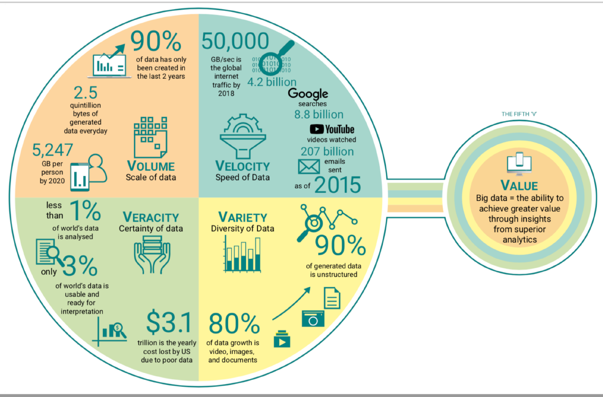
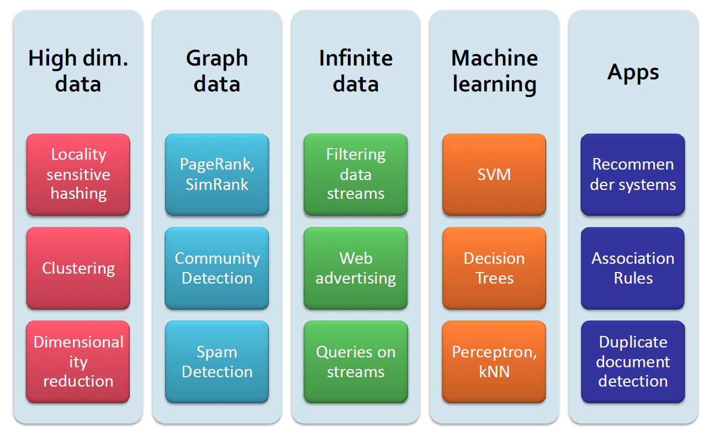

Lecture1-大数据分析
---

[TOC]

# 1. Mechine Learning
> 数据用于计算

# 2. Big Data Analysis
> 计算用于数据

## 2.1. 大数据产生原因
算力的增长远远赶不上数据产生的速度

## 2.2. 什么是大数据
1. 数据集的大小超出了典型数据库软件工具捕获，存储，管理和分析的能力
2. 大数据偏向于管理

## 2.3. 大数据4Vs

- Volumn，体积:数据量大
- Velocity，速度:数据产生的速度快
- Veracity，真实性:数据有效性
- Variety，多样性:数据多样性
- Value，价值:数据是价值稀疏的，大多数的数据是价值低的。

## 2.4. 什么是5G
1. Gain：盈利
2. Growth：共同成长
3. Gamification：游戏化，游戏的模式和思想(面向商业模式的构建)
4. Governance：管理，协调
5. Globalization：全球化

## 2.5. 为什么挖掘大数据
数据包含价值和知识

# 3. 数据挖掘
1. 给定大量数据的情况
2. 发现具有以下特征的模式（模型）：有效性、可用性、出乎意料、可理解性

## 3.1. 常见任务
1. 描述类的方法:找出人类可理解的模式来描述数据:聚类
2. 预测类的方法:使用一些变量来预测未知的或者未来的其他变量的值。
   1. 预测在实际应用中的问题:因为现在的决策会影响到未来的决策，也就让现在的分布和原来的分布不再是独立同分布。
   2. 发现没有价值的模式，被统计学家叫做Bonferroni原则

## 3.2. 大数据的考虑方向

### 3.2.1. 挑战
1. Usage：使用
2. Quality：质量
3. Context：内容
4. Streaming：数据流动，大量的算法
5. Scalability：可扩展性

### 3.2.2. 数据形态
1. Ontologies:源数据
2. Structed:结构化
3. Networks:网络
4. Text:文本
5. Multimedia:流媒体
6. Signals:信号

### 3.2.3. 操作
1. Collect：收集
2. Prepare：准备，数据的值是不是为空
3. Represent：表示
4. Model：模型
5. Reason：原因(验证)
6. Visualize：可视化

# 4. 课程学习目标
1. 挖掘多类型的数据：多维度、图数据、数据无限、标签数据
2. 不同的计算模型：MapReduce、流式数据和在线计算算法、单机器的内存数据库
3. 尝试解决一些现实问题：推荐系统、购物篮分析、重复文件监测
4. 使用一些工具：线性代数（SVD、推荐系统）、优化（梯度下降）、动态规划（频繁挖掘）、Hashing

