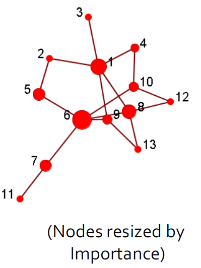
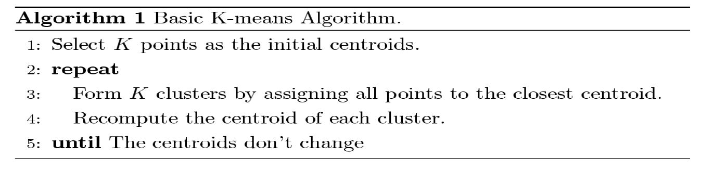

Lecture11-图挖掘-动机，应用和算法
---

# 1. 图：为什么我们会关心

# 2. 参与的网络和社交媒体

## 2.1. 传统的媒体

1. 广播：一对多，这些内容都是相对比较专业的

## 2.2. 社交媒体：多对多关系

- 交互提供了丰富的关于用户、内容的信息

### 2.2.1. 社交媒体的特点
1. 每个人都可以成为媒体
2. 通讯障碍消失
   1. 丰富的用户互动
   2. 用户生成的内容
   3. 用户丰富的内容
   4. 用户开发的小部件
   5. 协作环境
   6. 集体智慧
   7. 长尾巴
3. 广播媒体(过滤，然后发布) -> 社交媒体(发布，然后过滤)

### 2.2.2. 最经常被访问的20个网页
1. 前20个最常被访问的网站中有40%是社交网站

### 2.2.3. 社交网络有越来越重要的意义
1. 美国大选

### 2.2.4. 社交网络
1. 由节点（个人或组织）组成的社会结构，这些节点通过各种相互依存关系（如友谊，亲属关系等）相互关联。
2. 图示
   1. 节点=成员
   2. 优势=关系
3. 各种实现
   1. 社交书签（Del.icio.us）
   2. 友谊网络（facebook，myspace）
   3. Blogosphere
   4. 媒体共享（Flickr，Youtube）
   5. 民间传说

## 2.3. 社会矩阵
1. 社交网络也可以矩阵形式表示

## 2.4. 社交计算和数据挖掘
1. 社会计算涉及基于计算系统的社会行为和社会环境的研究。
2. 数据挖掘相关任务
   1. 集中度分析(中心和重点发现)
   2. 社区检测
   3. 分类
   4. 关联预测
   5. 病毒式营销
   6. 网络建模
3. Urban Computation:城市计算

### 2.4.1. 集中性分析/影响力研究
1. 识别社交网络中最重要的参与者
   1. 给出：一个社交网络
   2. 输出：顶级节点列表
2. 计算出来任意两个节点之间的最近路径，然后计算出每一个节点相对于其他节点的是不是最近节点，得到中心度。
3. 或者还可以使用1跳或者xxx来作为判断标准

|                      |                      |
| -------------------- | -------------------- |
|  |  |

### 2.4.2. 社区检测(社区也叫社团)
1. 社区是一组节点，它们之间的交互（相对）频繁（也称为组，子组，模块，集群）
2. 社区检测又称分组，聚类，寻找有凝聚力的亚组(社团)，有点类似于聚类任务。
   1. 给出：一个社交网络
   2. 产出：（一些）演员的社区成员
3. 应用
   1. 了解人与人之间的互动
   2. 可视化和导航大型网络
   3. 为其他任务（例如数据挖掘）奠定基础
4. 分组后可视化结果

|                      |                      |
| -------------------- | -------------------- |
|  |  |

### 2.4.3. 分类
1. 用户首选项或行为可以表示为类标签
   1. 是否点击广告
   2. 是否对某些主题感兴趣
   3. 订阅了某些政治观点
   4. 喜欢/不喜欢产品
2. 输入
   1. 社交网络
   2. 网络中一些参与者的标签
3. 输出：网络中剩余参与者的标签
4. 分类预测后可视化

### 2.4.4. 关联预测
1. 给定一个社交网络，预测哪些节点可能会连接
2. 输出（排名）节点对的列表
3. 示例：Facebook中的朋友推荐

### 2.4.5. 病毒式营销/爆发检测

#### 2.4.5.1. 什么是病毒式营销/爆发检测
1. 用户在社交网络中具有不同的社交资本（或网络价值），因此，人们如何才能最好地利用这一信息？
2. 病毒式营销：找出一组用户来提供优惠券和促销以影响网络中的其他人，从而使我的利益最大化
3. 爆发检测：监控一组节点，这些节点可帮助检测爆发或中断感染传播（例如H1N1流感）
4. 目标：在预算有限的情况下，如何最大程度地提高整体收益？

#### 2.4.5.2. 病毒式营销的例子
1. 查找节点数量最少的整个节点网络的覆盖范围
2. 如何实现它，一个例子：基本贪婪选择：选择使实用程序最大化的节点，删除该节点，然后重复
   1. 首先选择节点1
   2. 然后选择节点8
   3. 最后选择节点7，节点7不是一个有高中心度的结点。

### 2.4.6. 网络建模
1. 大型网络展示了统计模式：
   1. 小世界效果（例如6度的分离度）
   2. 幂律分布（又称无标度分布）
   3. 社区结构（高聚集系数）
2. 模拟网络动力学
   1. 找到一种机制，以便可以复制在大型网络中观察到的统计模式。
   2. 示例：随机图，优先附着过程
3. 用于仿真以了解网络属性
   1. Thomas Shelling的著名模拟：是什么导致白人和黑人隔离
   2. 受攻击的网络稳健性
4. 二八现象：20%的节点上有着80%的重要性
5. 网络模型应用

## 2.5. 社交计算的应用
1. 通过社交网络做广告
2. 行为建模和预测
3. 流行病学研究
4. 协同过滤
5. 人群情绪阅读器
6. 文化趋势监测
7. 可视化
8. 健康2.0

# 3. 社交探测原则

## 3.1. 社区
1. 社区：“具有相对牢固，直接，强烈，频繁或积极联系的演员的子集。”
2. 社区是一组经常相互交流的参与者，例如：参加会议的人
3. 一群没有互动的人不是一个社区，例如：人们在车站等公共汽车，却不互相交谈
4. 人们在社交媒体中形成社区

## 3.2. 社区的例子

## 3.3. 为什么在社交媒体上有社区
1. 人是社会的
2. 社交媒体中的部分互动是对现实世界的一瞥
3. 人们在现实世界以及在线中都与朋友，亲戚和同事保持联系
4. 易于使用的社交媒体使人们能够以前所未有的方式扩展社交生活，很难认识现实世界中的朋友，但更容易在网上找到志趣相投的朋友

## 3.4. 社区探测
1. 社区检测：“根据社交网络属性正式确定强大的社交群体”
2. 一些社交媒体网站允许人们加入群组，是否有必要根据网络拓扑提取群组？
   1. 并非所有站点都提供社区平台
   2. 并非所有人都参加
3. 网络交互可提供有关用户之间关系的丰富信息
   1. 组是隐式形成的
   2. 可以补充其他类型的信息
   3. 帮助网络可视化和导航
   4. 提供其他任务的基本信息
4. 社区定义的主观性

## 3.5. 社区标准分类
1. 条件因任务而异
2. 大致上，社区检测方法可分为4类（非排他性）：
3. 以节点为中心的社区：组中的每个节点都满足某些属性
4. 以团体为中心的社区：考虑整个组内的连接。 该组必须满足某些属性，而无需放大节点级别
5. 以网络为中心的社区：将整个网络分成几个不相交的集合
6. 以等级为中心的社区：构建社区的层次结构

### 3.5.1. 节点为中心的社区探测
1. 节点满足不同的属性
   1. 完全互惠：集团
   2. 会员可及性：k-clique，k-clan，k-club
   3. 节点度：k-plex，k-core
   4. 内外关系的相对频率：LS集，Lambda集
2. 在传统社交网络分析中常用
3. 在这里，我们讨论一些代表性的

#### 3.5.1.1. 完全互通：Clique
1. 三个或更多节点彼此相邻的最大完整子
2. NP-hard难以找到最大集团
3. 递归修剪：要查找大小为k的集团，请删除那些小于k-1度的节点
4. 非常严格的定义，不稳定
5. 通常以集团为核心或种子来探索更大的社区

#### 3.5.1.2. Geodesic
1. 可达性通过Geodesic距离进行校准
2. Geodesic：两个节点（12和6）之间的最短路径
   1. 两条路径：12-4-1-2-5-6、12-10-6
   2. 12-10-6是Geodesic
3. Geodesic距离：＃两个节点之间的Geodesic跳跃，例如，d（12，6）= 2，d（3，11）= 5
4. 直径：网络中任意2个节点的最大测地距离，最长路径最短的跳跃

#### 3.5.1.3. 可达性:k-clique、k-club
1. 组中的任何节点都应在k跳中可达
2. k-clique：最大子图，其中任何节点之间的最大Geodesic距离<=k
3. 在子图中k斜面的直径可以大于k
   1. 例如2-clique{12，4，10，1，6}
   2. 在子图d（1，6）= 3中
4. k-club：直径<= k的子结构，{1,2,5,6,8,9}，{12，4，10，1}是2俱乐部

### 3.5.2. 以团体为中心的社区
1. 考虑整个组中的连接，可以使某些节点的连接性低
2. 对于有$V_s$个节点和$E_s$条边是一个密度为$\gamma$的quasi-clique，如果满足

$$
\frac{E_s }{\frac{V_s(V_s - 1)}{2}} \geq \gamma
$$

3. 递归修剪：
   1. 对子图进行采样，找到最大的$\gamma$密集拟似云（结果大小= k）
   2. 删除满足一下条件的结点
      1. 度小于$k\gamma$
      2. 所有的邻居的度都小于$k\gamma$

### 3.5.3. 以网络为中心的社区
1. 要形成一个组，我们需要全局考虑节点的连接。
2. 目标：将网络划分为不相交的集合
   1. 基于节点相似性的组
   2. 基于潜在空间模型的组
   3. 基于块模型近似的组
   4. 基于切割最小化的组
   5. 基于模块化最大化的组

#### 3.5.3.1. 结点相似度
1. 节点相似性由它们的交互模式有多相似来定义
2. 如果两个节点连接到同一组参与者，则在结构上是等效的。例如，节点8和9在结构上等效
3. 组是在等效节点上定义的
   1. 太严格
   2. 很少大规模发生
   3. 宽松的等价类很难计算
4. 实际上，使用向量相似度：例如，余弦相似度，Jaccard相似度

#### 3.5.3.2. 向量相似度

- Cosine\ Similarity
$$
similarity = \cos(\theta) = \frac{A*B}{||A||*||B||} \\
sim(5,8) = \frac{1}{\sqrt{2} * \sqrt{3}} = \frac{1}{\sqrt{6}} \\
$$

- Jaccard Similarity

$$
J(A, B) = \frac{|A \cap B|}{|A \cup B|} \\
J(5, 8) = \frac{|\{6\}|}{|\{1, 2, 6, 13\}|} = \frac{1}{4} \\
$$

#### 3.5.3.3. 基于节点相似度的聚类
1. 对于大型网络的实际使用：
   1. 将连接视为功能
   2. 使用余弦或Jaccard相似度计算顶点相似度
   3. 应用经典的k均值聚类算法
2. K均值聚类算法
   1. 每个聚类与一个质心（中心点）相关联
   2. 将每个节点分配给具有最接近质心的群集

#### 3.5.3.4. 潜在空间模型上的组
1. 潜在空间模型：将网络中的节点转换为较低维度的空间，以使节点之间的距离或相似性保持在欧几里得空间中
2. 将k均值应用于S以获取聚类

#### 3.5.3.5. 多维缩放（MDS）
1. 给定一个网络，构造一个接近矩阵来表示节点之间的距离（例如geodesic距离）
2. 令D表示节点之间的平方距离
3. $S \in R^{n * k}$表示低维空间中的坐标

$$
SS^T = -\frac{1}{2} *(I - \frac{1}{n}e*e^T)D(I - \frac{1}{n}e*e^T) = \triangle(D)
$$

4. 客观性:最小化差异$\min||\triangle(D) - SS^T||_F$
5. 我们计算$\Epsilon = diag(\lambda_1, ... , \lambda_k)$的前k个特征值，V前k个特征向量
6. 解决方案:$S = V * \Epsilon^{\frac{1}{2}}$
7. 例子:

### 3.5.4. 以等级为中心的社区