Lecture11-图挖掘-动机，应用和算法
---

# 1. 图：为什么我们会关心

# 2. 参与的网络和社交媒体

## 2.1. 传统的媒体

1. 广播：一对多，这些内容都是相对比较专业的

## 2.2. 社交媒体：多对多关系

- 交互提供了丰富的关于用户、内容的信息

### 2.2.1. 社交媒体的特点
1. 每个人都可以成为媒体
2. 通讯障碍消失
   1. 丰富的用户互动
   2. 用户生成的内容
   3. 用户丰富的内容
   4. 用户开发的小部件
   5. 协作环境
   6. 集体智慧
   7. 长尾巴
3. 广播媒体(过滤，然后发布) -> 社交媒体(发布，然后过滤)

### 2.2.2. 最经常被访问的20个网页
1. 前20个最常被访问的网站中有40%是社交网站

### 2.2.3. 社交网络有越来越重要的意义
1. 美国大选

### 2.2.4. 社交网络
1. 由节点(个人或组织)组成的社会结构，这些节点通过各种相互依存关系(如友谊，亲属关系等)相互关联。
2. 图示
   1. 节点=成员
   2. 优势=关系
3. 各种实现
   1. 社交书签(Del.icio.us)
   2. 友谊网络(facebook，myspace)
   3. Blogosphere
   4. 媒体共享(Flickr，Youtube)
   5. 民间传说

## 2.3. 社会矩阵
1. 社交网络也可以矩阵形式表示

## 2.4. 社交计算和数据挖掘
1. 社会计算涉及基于计算系统的社会行为和社会环境的研究。
2. 数据挖掘相关任务
   1. 集中度分析(中心和重点发现)
   2. 社团检测
   3. 分类
   4. 关联预测
   5. 病毒式营销
   6. 网络建模
3. Urban Computation:城市计算

### 2.4.1. 集中性分析/影响力研究
1. 识别社交网络中最重要的参与者
   1. 给出：一个社交网络
   2. 输出：顶级节点列表
2. 计算出来任意两个节点之间的最近路径，然后计算出每一个节点相对于其他节点的是不是最近节点，得到中心度。
3. 或者还可以使用1跳或者xxx来作为判断标准

|                      |                      |
| -------------------- | -------------------- |
| 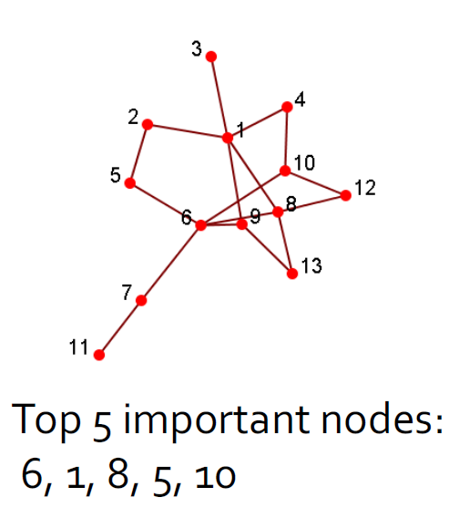 |  |

### 2.4.2. 社团检测(社团也叫社团)
1. 社团是一组节点，它们之间的交互(相对)频繁(也称为组，子组，模块，集群)
2. 社团检测又称分组，聚类，寻找有凝聚力的亚组(社团)，有点类似于聚类任务。
   1. 给出：一个社交网络
   2. 产出：(一些)演员的社团成员
3. 应用
   1. 了解人与人之间的互动
   2. 可视化和导航大型网络
   3. 为其他任务(例如数据挖掘)奠定基础
4. 分组后可视化结果

|                      |                       |
| -------------------- | --------------------- |
|  |  |

### 2.4.3. 分类
1. 用户首选项或行为可以表示为类标签
   1. 是否点击广告
   2. 是否对某些主题感兴趣
   3. 订阅了某些政治观点
   4. 喜欢/不喜欢产品
2. 输入
   1. 社交网络
   2. 网络中一些参与者的标签
3. 输出：网络中剩余参与者的标签
4. 分类预测后可视化

### 2.4.4. 关联预测
1. 给定一个社交网络，预测哪些节点可能会连接
2. 输出(排名)节点对的列表
3. 示例：Facebook中的朋友推荐

### 2.4.5. 病毒式营销/爆发检测

#### 2.4.5.1. 什么是病毒式营销/爆发检测
1. 用户在社交网络中具有不同的社交资本(或网络价值)，因此，人们如何才能最好地利用这一信息？
2. 病毒式营销：找出一组用户来提供优惠券和促销以影响网络中的其他人，从而使我的利益最大化
3. 爆发检测：监控一组节点，这些节点可帮助检测爆发或中断感染传播(例如H1N1流感)
4. 目标：在预算有限的情况下，如何最大程度地提高整体收益？

#### 2.4.5.2. 病毒式营销的例子
1. 查找节点数量最少的整个节点网络的覆盖范围
2. 如何实现它，一个例子：基本贪婪选择：选择使实用程序最大化的节点，删除该节点，然后重复
   1. 首先选择节点1
   2. 然后选择节点8
   3. 最后选择节点7，节点7不是一个有高中心度的结点。

### 2.4.6. 网络建模
1. 大型网络展示了统计模式：
   1. 小世界效果(例如6度的分离度)
   2. 幂律分布(又称无标度分布)
   3. 社团结构(高聚集系数)
2. 模拟网络动力学
   1. 找到一种机制，以便可以复制在大型网络中观察到的统计模式。
   2. 示例：随机图，优先附着过程
3. 用于仿真以了解网络属性
   1. Thomas Shelling的著名模拟：是什么导致白人和黑人隔离
   2. 受攻击的网络稳健性
4. 二八现象：20%的节点上有着80%的重要性
5. 网络模型应用

## 2.5. 社交计算的应用
1. 通过社交网络做广告
2. 行为建模和预测
3. 流行病学研究
4. 协同过滤
5. 人群情绪阅读器
6. 文化趋势监测
7. 可视化
8. 健康2.0

# 3. 社交探测原则

## 3.1. 社团
1. 社团：“具有相对牢固，直接，强烈，频繁或积极联系的演员的子集。”
2. 社团是一组经常相互交流的参与者，例如：参加会议的人
3. 一群没有互动的人不是一个社团，例如：人们在车站等公共汽车，却不互相交谈
4. 人们在社交媒体中形成社团

## 3.2. 社团的例子

## 3.3. 为什么在社交媒体上有社团
1. 人是社会的
2. 社交媒体中的部分互动是对现实世界的一瞥
3. 人们在现实世界以及在线中都与朋友，亲戚和同事保持联系
4. 易于使用的社交媒体使人们能够以前所未有的方式扩展社交生活，很难认识现实世界中的朋友，但更容易在网上找到志趣相投的朋友

## 3.4. 社团探测
1. 社团检测：“根据社交网络属性正式确定强大的社交群体”
2. 一些社交媒体网站允许人们加入群组，是否有必要根据网络拓扑提取群组？
   1. 并非所有站点都提供社团平台
   2. 并非所有人都参加
3. 网络交互可提供有关用户之间关系的丰富信息
   1. 组是隐式形成的
   2. 可以补充其他类型的信息
   3. 帮助网络可视化和导航
   4. 提供其他任务的基本信息
4. 社团定义的主观性

## 3.5. 社团标准分类
1. 条件因任务而异
2. 大致上，社团检测方法可分为4类(非排他性)：
3. 以节点为中心的社团：组中的每个节点都满足某些属性
4. 以团体为中心的社团：考虑整个组内的连接。 该组必须满足某些属性，而无需放大节点级别
5. 以网络为中心的社团：将整个网络分成几个不相交的集合
6. 以等级为中心的社团：构建社团的层次结构

### 3.5.1. 节点为中心的社团探测
1. 节点满足不同的属性
   1. 完全互通：clique
   2. 成员可达性：k-clique，k-clan，k-club
   3. 节点度：k-plex，k-core
   4. 内外关系的相对频率：LS集，Lambda集
2. 在传统社交网络分析中常用

#### 3.5.1.1. 完全互通：clique
1. 三个或更多节点彼此相邻的最大完整子图
2. NP-hard难以找到最大clique
3. 递归修剪：要查找大小为k的集团，请删除那些小于k-1度的节点
4. 非常严格的定义，并且是不稳定
5. 通常以集团为核心或出发点来探索更大的社团

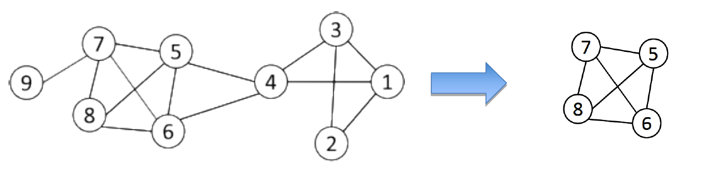

#### 3.5.1.2. Geodesic
1. 可达性通过Geodesic距离进行校准
2. Geodesic：两个节点(12和6)之间的最短路径
   1. 两条路径：12-4-1-2-5-6、12-10-6
   2. 12-10-6是Geodesic
3. Geodesic距离：在两个节点之间的Geodesic距离，例如，d(12，6)= 2，d(3，11)= 5
4. 直径：网络中任意2个节点的最大测地距离，最长路径最短的跳跃

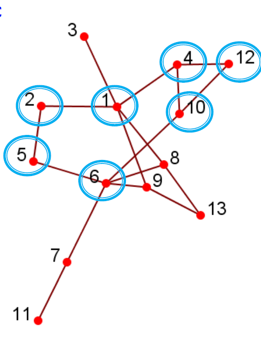

#### 3.5.1.3. 可达性:k-clique、k-club
1. 组中的任何节点都应在k跳中可达
2. k-clique：最大子图，其中任何节点之间的最大Geodesic距离<=k
3. 在子图中k斜面的直径可以大于k
   1. 例如2-clique{12，4，10，1，6}
   2. 在子图d(1，6)= 3中
4. k-club：直径<=k的子结构，{1,2,5,6,8,9}，{12，4，10，1}是2-club

### 3.5.2. 以团体为中心的社团
1. 考虑整个组中的连接，可以使某些节点的连接性低
2. 对于有$V_s$个节点和$E_s$条边是一个密度为$\gamma$的quasi-clique，如果满足

$$
\frac{E_s }{\frac{V_s(V_s - 1)}{2}} \geq \gamma
$$

3. 递归修剪：
   1. 对子图进行采样，找到最大的$\gamma$密集拟似云(结果大小= k)
   2. 删除满足一下条件的结点
      1. 度小于$k\gamma$
      2. 所有的邻居的度都小于$k\gamma$

### 3.5.3. 以网络为中心的社团
1. 要形成一个组，我们需要全局考虑节点的连接。
2. 目标：将网络划分为不相交的集合
   1. 基于节点相似性的组
   2. 基于潜在空间模型的组
   3. 基于块模型近似的组
   4. 基于切割最小化的组
   5. 基于模块化最大化的组

#### 3.5.3.1. 结点相似度
1. 节点相似性由它们的交互模式有多相似来定义
2. 如果两个节点连接到同一组参与者，则在结构上是等效的。例如，节点8和9在结构上等效
3. 组是在等效节点上定义的：过于严格、很少大规模放生、宽松的等价类很难计算
4. 实际上，使用向量相似度：例如，余弦相似度，Jaccard相似度

#### 3.5.3.2. 向量相似度

- Cosine Similarity

$$
similarity = \cos(\theta) = \frac{A*B}{||A||*||B||} \\
sim(5,8) = \frac{1}{\sqrt{2} * \sqrt{3}} = \frac{1}{\sqrt{6}} \\
$$

- Jaccard Similarity

$$
J(A, B) = \frac{|A \cap B|}{|A \cup B|} \\
J(5, 8) = \frac{|\{6\}|}{|\{1, 2, 6, 13\}|} = \frac{1}{4} \\
$$

#### 3.5.3.3. 基于节点相似度的聚类
1. 对于大型网络的实际使用：
   1. 将连接视为特征
   2. 使用余弦或Jaccard相似度计算顶点相似度
   3. 应用经典的k均值聚类算法
2. K均值聚类算法
   1. 每个聚类与一个质心(中心点)相关联
   2. 将每个节点分配给具有最接近质心的群集

#### 3.5.3.4. 潜在空间模型上的组
1. 潜在空间模型：将网络中的节点转换为较低维度的空间，以使节点之间的距离或相似性保持在欧几里得空间中
2. 将k均值应用于S以获取聚类

#### 3.5.3.5. 多维缩放(MDS)
1. 给定一个网络，构造一个接近矩阵来表示节点之间的距离(例如geodesic距离)
2. 令D表示节点之间的平方距离
3. $S \in R^{n * k}$表示低维空间中的坐标

$$
SS^T = -\frac{1}{2} *(I - \frac{1}{n}e*e^T)D(I - \frac{1}{n}e*e^T) = \triangle(D)
$$

4. 客观性:最小化差异$\min||\triangle(D) - SS^T||_F$
5. 我们计算$\Epsilon = diag(\lambda_1, ... , \lambda_k)$的前k个特征值，V前k个特征向量
6. 解决方案:$S = V * \Epsilon^{\frac{1}{2}}$
7. 例子:

#### 3.5.3.6. 块模型近似

1. 客观上，最小化两个矩阵之间的差异

$$
\min\limits_{S, \Sigma}||A - S \Sigma S^T||_F \\
s.t.\ S \in{0, 1}^{n * k}, \Sigma \in R^{k * k} is\ diagonal
$$

2. 挑战：S是离散的，很难去求解
3. 放松：允许S连续满足$S^TS = I_k$
4. 解决方案：使用矩阵A的特征值
5. 后处理：将k均值应用于S以找到分区

#### 3.5.3.7. 最小化切割
1. 小组之间的互动应该很少
2. 剪切：两组节点之间的边数
3. 目标：最小化切割
   1. 限制:经常会找到只有一个结点的社团
   2. 需要去考虑组的大小

$$
cut(C_1, C_2, C_3, ..., C_k) = \sum\limits_{i = 1}\limits^{k}cut(C_i, \overline{C_i})
$$

4. 经常使用的变量
   1. Ratio-cut:在网络中的结点数量
   2. Normalized-cut:在组内的结点的相关性

$$
Ratio-cut(C_1, C_2,... , C_k) = \sum\limits_{i=1}\limits^k\frac{cut(C_i, \overline{C_i}}{|V_i|} \\
Normalized-cut(C_1, C_2, ... , C_k) = \sum\limits_{i = 1}\limits^{k}\frac{cut(C_i, \overline{C_i})}{vol(V_i)}
$$

#### 3.5.3.8. 图拉普拉斯算子
1. 可以被花间为如下的最短路径问题
2. L是（规范化）图拉普拉斯算子

$$
\min\limits_{S \in R^{n * k}} Tr(S^TLS)\ s.t. S^TS = I \\
L = D - A \\
D = \begin{bmatrix}
   d_1 & 0 & ... & 0 \\
   0 & d_2 & ... & 0 \\
   . & . & . & . \\
   . & . & . & . \\
   . & . & . & . \\
   0 & 0 & ... & d_n \\
\end{bmatrix} \\
normalized-L = I - D^{-\frac{1}{2}}AD^{-\frac{1}{2}} \\
$$

3. 解决方案：S是具有最小特征值的L的特征向量（第一个特征除外）
4. 后处理：将k均值应用于S，亦称光谱聚类

#### 3.5.3.9. 模块化最大化
1. 模块化衡量组之间的交互作用，并与组中预期的随机连接进行比较
2. 在具有m个边的网络中，对于度数为$d_i$和$d_j$的两个节点，它们之间的预期随机连接为

$$
\frac{d_i * d_j}{2 * m}
$$

3. 小组中的interaction utility

$$
\sum\limits_{i \in C, j \in C} (A_{ij} - \frac{d_id_j}{2m})
$$

4. 要将组划分为多个组，我们最大化

$$
\max \frac{1}{2m}\sum\limits_C\sum\limits_{i\in C，j\in C} A_{ij} - \frac{d_id_j}{2m}
$$

#### 3.5.3.10. 模块矩阵
1. 模块化最大化也可以用矩阵形式表示

$$
Q=\frac{1}{2m}Tr(S^TBS)
$$

2. B是模块化矩阵

$$
B_{ij} = A_{ij} - \frac{d_id_j}{2m}
$$

3. 解决方案：模块化矩阵的顶部特征向量

#### 3.5.3.11. 矩阵分解形式
1. 对于潜在空间模型，块模型，频谱聚类和模块化最大化
2. 可以表述为

$$
\max(\min)_S\ Tr(S^TXS) \\
s.t. S^TS = I
$$

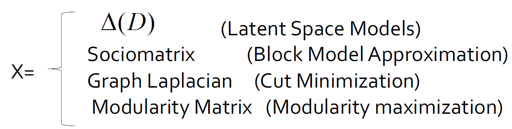

#### 3.5.3.12. 回顾以网络为中心的社团
1. 以网络为中心的社团检测
   1. 基于节点相似性的组
   2. 基于潜在空间模型的组
   3. 基于切割最小化的组
   4. 基于块模型近似的组
   5. 基于模块化最大化的组
2. 目标：将网络节点划分为几个不相交的集合
3. 限制：要求用户事先指定社团数

### 3.5.4. 以等级为中心的社团
1. 目标：基于网络拓扑构建社团的层次结构
2. 便于以不同的分辨率进行分析
3. 代表性方法：
   1. 划分层次聚类
   2. 聚集层次聚类

#### 3.5.4.1. 划分层次聚类
1. 划分层次聚类
   1. 将节点分成几组
   2. 每组进一步分成较小的组
2. 以网络为中心的方法可以应用于分区
3. 一个特定的例子是基于边中心度之间的
4. 边中心度：穿过该边的任何一对节点之间的最短路径数
5. 组间边倾向于具有更大的边中心度

#### 3.5.4.2. 根据边中心度来进行划分簇
1. 逐步删除有最高的边中心度的边
   1. 删除e(2, 4), e(3, 5)
   2. 删除e(4, 6), e(5, 6)
   3. 删除e(1, 2), e(2, 3), e(3, 1)

|                       |                       |
| --------------------- | --------------------- |
|  |  |

#### 3.5.4.3. 聚集层次聚类
1. 将每个节点初始化为社团
2. 选择两个满足特定条件的社团，然后将它们合并为更大的社团
   1. 最大模块化增加
   2. 最大节点相似度

|                       |                       |
| --------------------- | --------------------- |
|  |  |

#### 3.5.4.4. 回顾层次聚类
1. 大多数分层聚类算法输出二叉树
   1. 每个节点都有两个子节点
   2. 可能高度失衡
2. 聚集集群对节点的处理顺序和采用的合并标准非常敏感。
3. 分裂聚类更稳定，但通常计算量更大

## 3.6. 社团探测总结
1. 最佳方法？
2. 根据应用程序，网络，计算资源等的不同而不同。
3. 可扩展性可能是社交媒体网络的关注点
4. 其他研究领域
   1. 定向网络中的社团
   2. 重叠的社团
   3. 社团发展
   4. 组分析和解释

# 4. 图数据挖掘
|                       |                       |
| --------------------- | --------------------- |
| 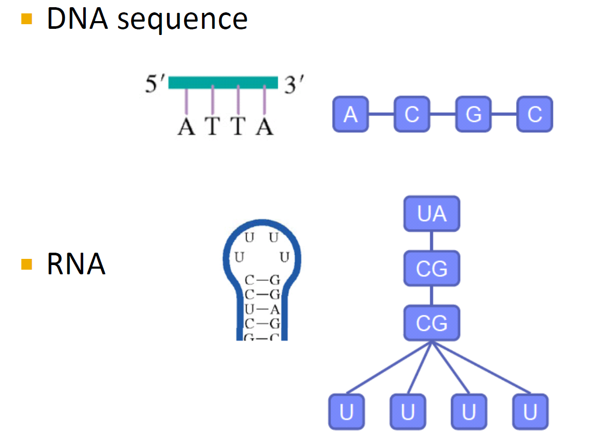 | 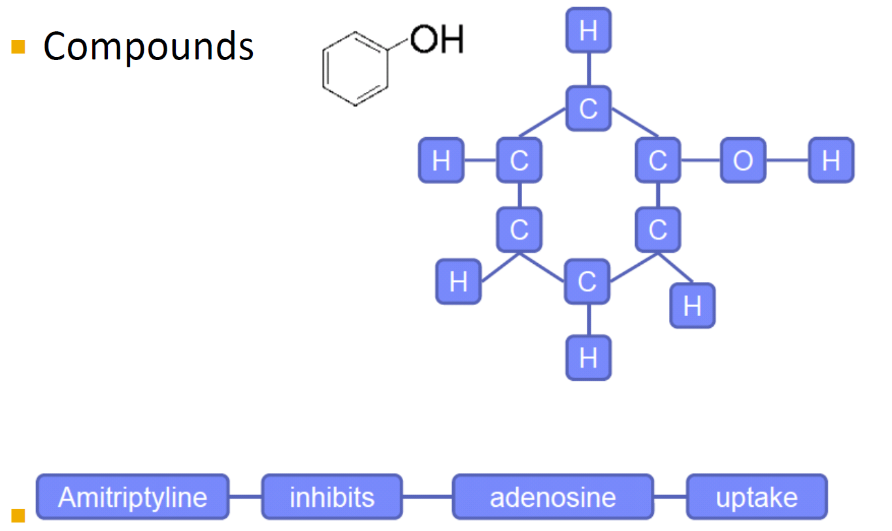 |

## 4.1. 类别任务
1. 图模式挖掘
   1. 挖掘频繁的子图模式
   2. 图形索引
   3. 图相似搜索
2. 图形分类
   1. 基于图模式的方法
   2. 机器学习方法
3. 图聚类：基于链路密度的方法

## 4.2. 图模式挖掘
1. 频繁子图：如果（子）图在给定数据集中的支持（发生频率）不小于最小支持阈值，则该图很频繁
2. 对图g的支持定义为G中以g为子图的图的百分比
3. 图形模式挖掘的应用
   1. 挖掘生化结构
   2. 程序控制流分析
   3. 挖掘XML结构或Web社团
   4. 用于图分类，聚类，压缩，比较和相关性分析的构建块

## 4.3. 示例:频繁子图
|                       |                       |
| --------------------- | --------------------- |
| 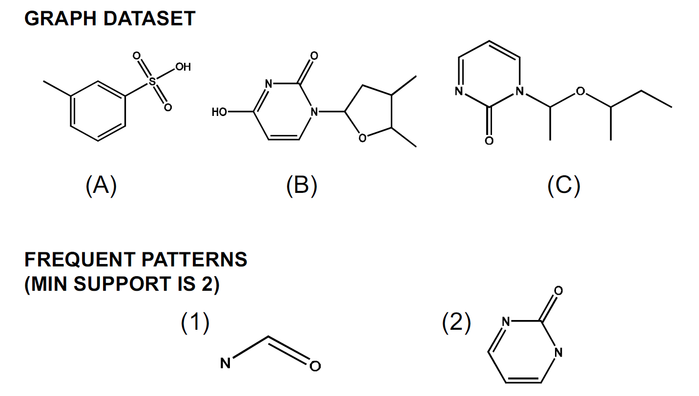 |  |

## 4.4. 图挖掘算法
1. 不完全的光束搜索–贪婪（制服）
2. 归纳逻辑编程（WARMR）
3. 基于图论的方法
   1. 基于先验的方法
   2. 模式增长法

## 4.5. 图挖掘算法的性质
1. 搜索顺序：宽度与深度
2. 生成候选子图：先验与模式增长
3. 消除重复的子图：被动与主动
4. 支持计算：是否嵌入商店
5. 发现花样顺序：path`->`tree`->`graph

## 4.6. 基于先验的方法

### 4.6.1. 例子
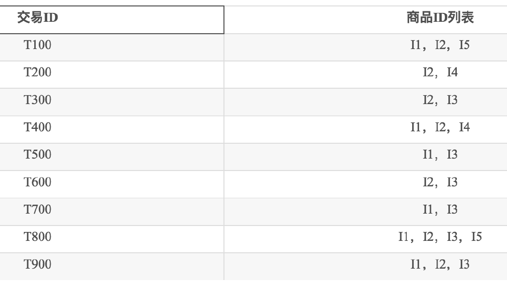

### 4.6.2. 基于先验，广度优先搜索
1. 方法：广度搜索，连接两个图

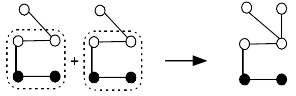

2. 年度股东大会（Inokuchi等）：生成一个带有另外一个节点的新图形

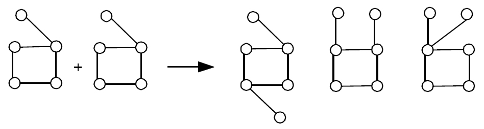

3. FSG（Kuramochi和Karypis）：生成具有更多边的新图

## 4.7. 模式增长算法

## 4.8. 图模式探索问题
1. 如果图是频繁的，则其所有子图都是频繁的：先验属性
2. n边频繁图可能有2n个子图
3. 在AIDS抗病毒筛选数据集中被确认具有活性的422种化合物中，如果最低支持为5％，则有1,000,000个频繁的图形模式

### 4.8.1. 封闭频繁图
1. 频繁图G关闭：如果不存在与G具有相同支持的G的上标
2. 如果某些G的子图具有相同的支持
   1. 不必输出这些子图
   2. 非封闭图
3. 无损压缩：仍确保采矿结果完整

## 4.9. 图搜索
1. 查询图数据库：给定图数据库和查询图，找到包含该查询图的所有图

## 4.10. 可扩展性
1. 天真的解决方案
   1. 顺序扫描（磁盘I / O）
   2. 子图同构测试（NP完全）
2. 问题：可伸缩性是一个大问题
3. 需要索引机制

## 4.11. 索引策略

1. 如果图G包含查询图Q，则G应该包含Q的任何子结构
2. 备注：将查询图的子结构索引到不包含这些子结构的修剪图

### 4.11.1. 索引框架
1. 处理图查询的两个步骤
2. 步骤1.索引构建，枚举图数据库中的结构，在结构和图之间建立反向索引
3. 步骤2.查询处理
   1. 列举查询图中的结构
   2. 计算包含这些结构的候选图
   3. 通过执行子图同构测试来修剪错误肯定答案

### 4.11.2. 为什么结果频繁
1. 我们无法索引（甚至搜索）所有子结构
2. 大型结构很可能会被其子结构索引
3. 增加规模的支持门槛

### 4.11.3. 结构相似查询

### 4.11.4. 子结构相似度度量
1. 基于特征的相似性度量
2. 每个图都表示为一个特征向量

$$
X = {x_1，x_2，...，x_n}
$$

3. 相似性是由它们对应的距离定义的向量
4. 优点
   1. 易于索引
   2. 快速
   3. 粗略的措施

### 4.11.5. 一些更直接的方法
1. 方法1：直接计算数据库中的图和查询图之间的相似度
   1. 顺序扫描
   2. 子图相似度计算
2. 方法2：根据原始查询图形成一组子图查询，并使用精确的子图搜索。代价高昂：如果我们允许在20条边的查询图中遗漏3条边，则可能会生成1,140个子图

### 4.11.6. 索引:精确和模糊查询
1. 精确搜寻
   1. 使用频繁模式作为索引功能
   2. 根据其选择性在数据库空间中选择特征
   3. 建立索引
2. 近似搜索
   1. 难以建立涵盖相似子图的索引
   2. 数据库中子图的爆炸数量
   3. 想法：
      1. 保持索引结构
      2. 在查询空间中选择要素

## 4.12. 图分类问题

### 4.12.1. 基于子结构的图分类问题
1. 基本思路
   1. 提取图子结构，$F = {g_1, ..., g_n}$
   2. 用特征向量$X = {x_1, ..., x_n}$表示图，$x_1$是$g_i$在图中出现的次数。
   3. 建立分类模型
2. 不同的功能和代表性的工作
   1. 指纹
   2. Maccs键
   3. 树和循环模式[Horvath等]
   4. 最小对比度子图[Ting和Bailey]
   5. 频繁的子图[Deshpande等； 刘等]
   6. Graph片段[Wale和Karypis]

### 4.12.2. 直接挖掘判别模式
1. 避免挖掘整个模式
   1. Harmony [Wang和Karypis]
   2. DDPMine [Cheng等]
   3. LEAP [Yan等]
   4. MbT [Fan等]
2. 找到最有区别的模式
   1. 搜索问题
   2. 优化问题
3. 扩展
   1. 挖掘前k个判别模式
   2. 挖掘近似/加权判别模式

### 4.12.3. 图核函数
1. 驱动：
   1. 基于内核的学习方法不需要访问数据点
   2. 它们依赖于数据点之间的内核功能
   3. 可以应用于任何复杂的结构，前提是您可以在它们上定义内核函数
2. 基本思路：
   1. 将每个图形映射到一些重要的模式
   2. 在相应的模式集上定义内核

### 4.12.4. 基于核函数的分类
1. 随机漫步
   1. 基本思想：计算两个图标之间匹配的随机游动
   2. 边缘核函数

$$
K(G_1, G_2) = \sum\limits_{h_1}\sum\limits_{h_2}p(h_1)p(h_2)K_L(l(h_1), l(h_2))
$$

- $h_1$和$h_2$是图$G_1$和$G_2$中的路径
- $p(h_1)$和$p(h_2)$是路径上的可能性分布
- $K_L(l(h_1), l(h_2))$是路径间的核函数

$$
K_L(l_1,l_2)=\begin{cases}
   1 & if\ l1 = l2 \\
   2 & otherwise
\end{cases}
$$

### 4.12.5. 图分类的Boosting方法
> 决策树桩
1. 简单的分类器，其中的最终决定由单个特征决定
2. 规则就是元组$<t, y>$
3. 如果分子包含子结构y，则将其分类为t。
4. Gain

$$
h_{<t, y>}(x) = \begin{cases}
   y & if t \subseteq{x} \\
   -y & otherwise \\
\end{cases}
$$

5. 应用提升

$$
\begin{matrix}
   gain(<t, y>) = \sum\limits_{i=1}\limits^n y_ih_{<t, y>}(x_i) \\
   gain(<t, y>) = \sum\limits_{i=1}\limits^n y_ih_{<t, y>}(x_i)
\end{matrix}
$$

## 4.13. 图聚类问题

### 4.13.1. 图压缩
1. 提取公共子图并通过将这些子图压缩为节点来简化图

### 4.13.2. 图/网络聚类问题
1. 由数据元素的相互关系组成的网络通常具有基础结构。由于关系很复杂，因此很难发现这些结构:如何弄清楚结构？
2. 有了有关谁与谁联系的简单信息，就可以确定具有共同兴趣或特殊关系的个人群体吗？例如，家庭，集团，恐怖分子牢房…

### 4.13.3. 网络的例子
1. 多少个集群？
2. 他们应该是多大？
3. 最好的分区是什么？
4. 是否应将某些观点分开？

### 4.13.4. 社交网络模型
1. 紧密的社会群体或集团中的人认识许多相同的人，不论小组大小
2. 成为枢纽的人认识不同组中的许多人，但不属于单个组，例如，政治人物跨多个团体
3. 离群的人生活在社会的边缘，例如，隐士认识的人很少，不属于任何群体

### 顶点邻居
1. 将G(v)定义为顶点的直接邻域，即个人认识的一群人

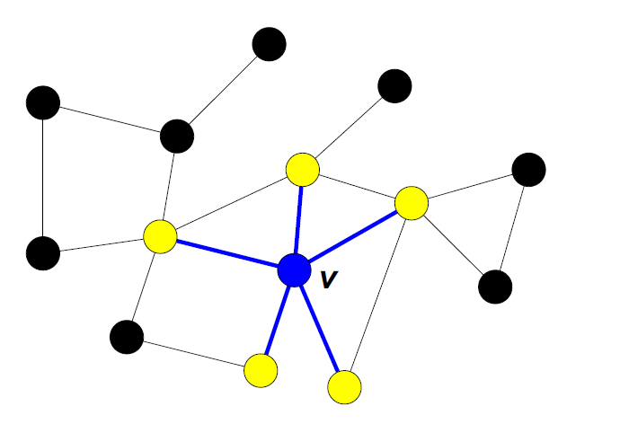

### 结构相似性
1. 所需的特征倾向于通过称为结构相似性的度量来捕获

$$
\sigma(v, w) = \frac{|\Gamma(v) \cap \Gamma(w)|}{\sqrt{|\Gamma(v)}||\Gamma(w)|}
$$

2. 对于集团成员而言，结构相似性很大，而对于中心和离群点而言，结构相似性很小。

### 社团
1. 社区：它是由个人组成的，因此与组外的人相比，组内的人之间的互动更加频繁，在不同上下文中也称为组，群集，内聚子组，模块
2. 社区检测：在网络中发现未明确授予个人组成员身份的组
3. 为什么在社交媒体中使用社区？
   1. 人类是社会的
   2. 易于使用的社交媒体使人们能够以前所未有的方式扩展社交生活
   3. 很难认识现实世界中的朋友，但更容易在网上找到志趣相投的朋友
   4. 节点之间的交互可以帮助确定社区

### 社交媒体的社团
1. 社交媒体中的两种类型的群体
   1. 显式群体：由用户订阅组成
   2. 隐性群体：由社交互动隐式形成
2. 一些社交媒体网站允许人们加入群组，是否有必要根据网络拓扑提取群组？
   1. 并非所有站点都提供社区平台
   2. 并非所有人都愿意努力加入团体
   3. 组可以动态变
3. 网络交互可提供有关用户之间关系的丰富信息
   1. 可以补充其他类型的信息，例如 用户资料
   2. 帮助网络可视化和导航
   3. 提供其他任务的基本信息，例如 建议请注意，以上三点中的每一个都可以成为研究主题。

100页