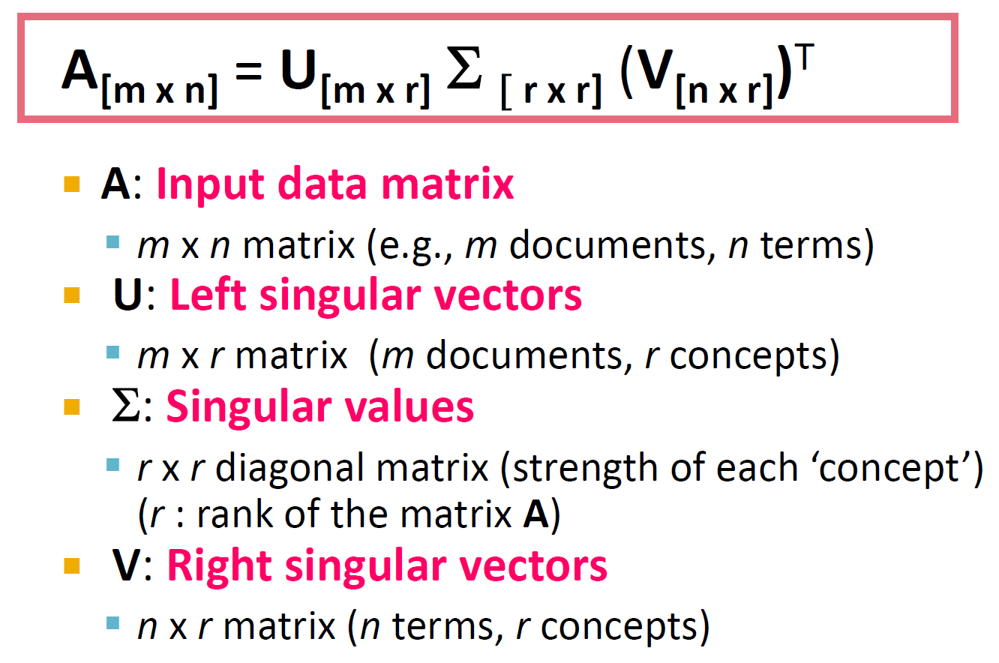
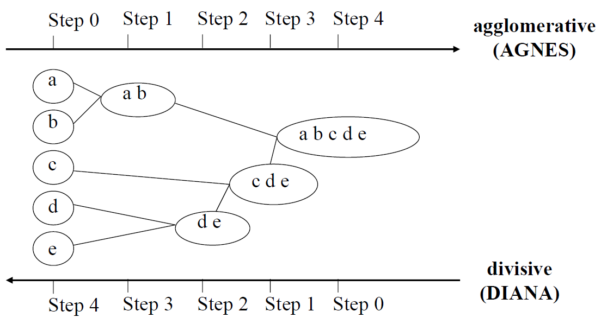
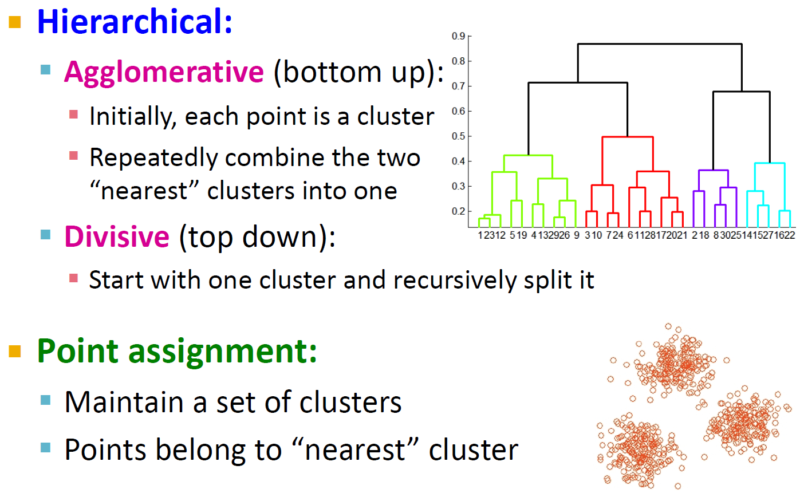

Lecture13-复习课
---

# 1. 数据挖掘是什么？
1. 给定大量数据的情况，三维那张图片，有哪些挑战
2. 发现具有以下特征的模型(模型)
   1. 有效性
   2. 可用性
   3. 出乎意料
   4. 可理解性

# 2. Hadoop生态圈
1. 都是干什么的，特征是什么

2. Hadoop相关Apache项目
   1. Ambari
   2. Avro
   3. Cassandra
   4. Chukwa
   5. HBase
   6. Hive
   7. Mahout
   8. Pig
   9. Spark
   10. Tez
   11. ZooKeeper

# 3. 三种模式的Hadoop
1. 独立式
2. 伪分布式
3. 全分布式

# 4. HDFS架构

1. NAMENODE:服务器位置信息、副本数、TODO
2. datanode：管理存储的数据块、信息上报给namenode
3. 客户端：对外接口，从namenode获取文件信息，然后访问datanode

# 5. HBase
1. 一个数据库
2. 分布式的、非结构化的，稀疏的，面向列的
3. 基于HDFS，山寨版的BigTable，继承了可靠性、高性能、可伸缩性

# 6. Hive
1. 面向列存储，延迟比较高
2. Hive是基于Hadoop的数据仓库工具
   1. 学习成本低
   2. 提供完整的sql查询功能
   3. 可以将结构化的数据文件映射为一张数据库表
   4. 可以将sql语句转换为MapReduce任务进行运行。
   5. 可以通过类SQL语句快速实现简单的MapReduce统计，不必开发专门的MapReduce应用

# 7. PageRank：问题
1. 两个问题
   1. 去掉死节点
   2. 添加心跳

# 8. SVD：定义
1. 计算一两步骤，问中间结果

# 9. 贝叶斯
1. 假设某种疾病的发病率为0.001（1000个⼈中会有⼀个⼈得病），现有⼀种试剂在患者确实得病的情况下，有99%的⼏率呈现为阳性，⽽在患者没有得病的情况下，它有5%的⼏率呈现为阳性（也就是假阳性），如有⼀位病⼈的检验成果为阳性，那么他的得病概率是多少呢？

# 10. ID3
1. 使用所有没有使用的属性并计算与之相关的样本熵值
2. 选取其中熵值最小的属性
3. 生成包含该属性的节点
4. Information Gain
5. 序号是最方便的最大连接

# 11. C4.5
1. C4.5算法是对ID3算法的改进，C4.5克服了ID3的2个缺点：
   1. 用信息增益选择属性时偏向于选择分枝比较多的属性值，即取值多的属性
   2. 不能处理连续属性
2. Information resheld

# 12. KNN算法
1. 令K是最近邻数目，D是训练样例的集合。
2. 对于每个测试样本z=(x',y')，计算z和D中的每个训练样例(x, y)的距离d(x',x)。
3. 选择离z最近的K个训练样例的集合Dz。
4. 样例z的类别为Dz中出现次数最多的样本。
5. 加权决策

# 13. 硬聚类和软聚类
1. 硬聚类：每个文档完全属于一个聚类：更常见，更容易做到
2. 软集群：一个文档可以属于多个集群。
   1. 对于创建可浏览层次结构的应用程序更有意义
   2. 您可能希望将一双运动鞋分为两类：（i）运动服装和（ii）鞋子
   3. 您只能使用软集群方法来做到这一点。

# 14. K-Means优缺点
1. 长处
   1. 相对有效：O(tkn)，其中n是对象，k是聚类，t是迭代。 通常，k，t << n。
   2. 通常以局部最优值终止。 可以使用诸如模拟退火和遗传算法之类的技术找到全局最优值
2. 弱点
   1. 仅在定义均值时适用（分类数据是什么？）
   2. 需要预先指定k，即簇数
   3. 嘈杂的数据和异常值的问题
   4. 不适合发现具有非凸形状的聚类
3. 停止可能性：
   1. 确定运行多少轮
   2. 中心节点稳定不变

# 15. 层次方法聚类
1. 使用距离矩阵作为聚类标准。 此方法不需要输入簇数k，但是需要终止条件
2. 两个方向：
   1. 聚合的
   2. 划分的

3. 计算两个类簇的距离

4. 簇的最近对
   1. 定义最接近的集群对的许多变体
   2. 单链接：最相似的余弦相似度（单链接）
   3. 完整链接：“最远”点的相似度，最小余弦相似度
   4. 质心(centorid)：质心最接近余弦的聚类，真实存在？中心可能不是实际点
   5. 平均链接：元素对之间的平均余弦

- 更多见PPT21-30

# 16. 基于内容的推荐
1. 是什么
2. 优点
3. 缺点

# 17. 协同过滤
1. 找到你的朋友圈，然后推荐给你
2. 优点
3. 缺点：问题

# 18. 为什么选择Spark？

## 18.1. Spark生态系统
1. Spark Streaming处理一些实时数据

## 18.2. 功能

## 18.3. 集群管理框架

# 19. NoSQL的几种类型

## 19.1. neo4j

## 19.2. cypher

# 20. 社会计算

## 20.1. 社会媒体的特点

## 20.2. 社会计算和任务挖掘
1. 每一项任务的关注点是什么?重要

# 21. 社团检测