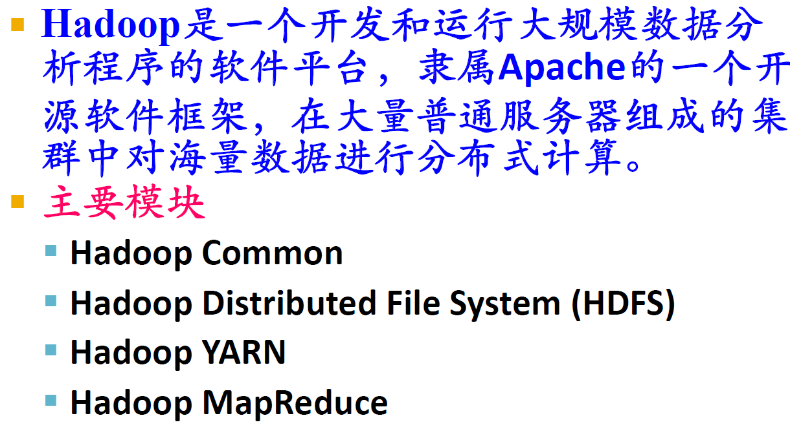
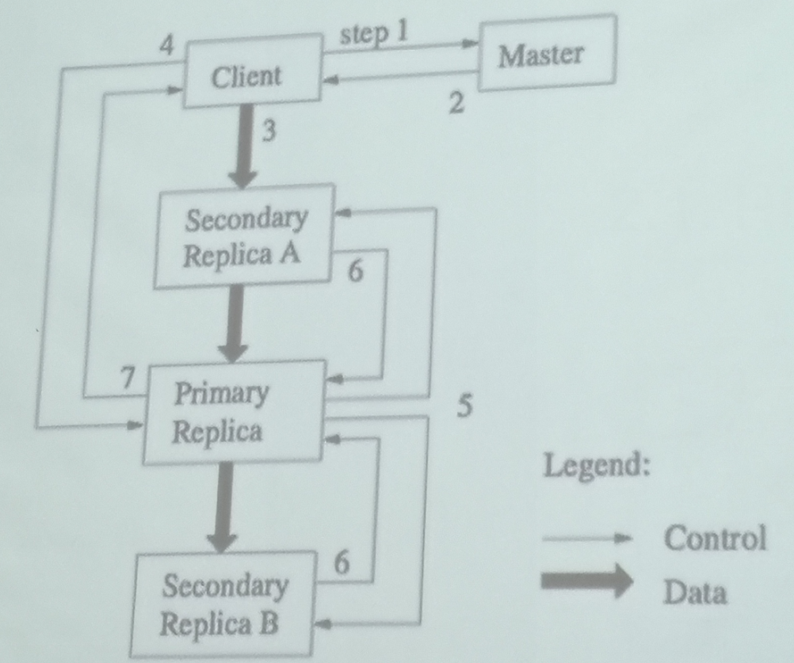

Lecture2-大数据平台
---

# 1. Hadoop

## 1.1. Hadoop计算过程

## 1.2. Hadoop发展简史
1. Hadoop起源于Apache Nutch，后者是一个开源的网络搜索擎，本身也是由Lucene项目的一部分。
2. Nutch项目开始于2002年，一个可工作的抓取工具和搜索系统很快浮出水面。
3. 2004年，Google发表了论文，向全世界介绍了MapReduce。
4. 2005年初，Nutch的开发者在Nutch上有了一个可工作的MapReduce应用，到当年年中，所有主要的Nutch算法被移植到使用MapReduce和NDFS来运行。
5. Nutch中的NDFS和MapReduce实现的应用远不只是搜索领域。
6. 在2006年2月，他们从Nutch转移出来成为一个独立的Lucene子项目，成为Hadoop。
7. 在2008年2月，雅虎宣布其搜索引擎产品部署在一个拥有1万个内核的Hadoop集群上。
8. 2008年4月，Hadoop打破世界纪录，成为最快排序1TB数据的系统。运行在一个910节点的群集，Hadoop在209秒内排序了1TB的数据（还不到三分半钟），击败了前一年的297秒冠军。同年11月，谷歌在报告中生成，它的MapReduce实现执行1TB数据的排序只用了68秒。在2009年5月，有报道宣称Yahoo的团队使用Hadoop对1TB的数据进行排序只花了62秒时间。

## 1.3. Hadoop的作用与功能
1. Hadoop采用了分布式存储方式，提高了读写速度，并扩大了存储容量。采用MapReduce 来整合分布式文件系统上的数据，可保证分析和处理数据的高效。与此同时，Hadoop 还采用存储冗余数据的方式保证了数据的安全性。
2. Hadoop中HDFS 的高容错特性，以及它是基于Java 语言开发的，这使得Hadoop可以部署在低廉的计算机集群中，同时不限于某个操作系统。Hadoop 中HDFS 的数据管理能力，MapReduce 处理任务时的高效率，以及它的开源特性，使其在同类的分布式系统中大放异彩，并在众多行业和科研领域中被广泛采用。

## 1.4. MapReduce和传统关系型数据库的比较

## 1.5. 结论
1. 在更新一小部分数据库记录的时候，传统RDBMS采用的B树效果很好。但在更新大部分数据库数据的时候，B树的效率就没有MapReduce的效率高，因为它需要使用排序/合并来重建数据库
2. RDBMS适合点查询和更新，MapReduce适合批处理
3. RDBMS适合持续更新的数据集， MapReduce适合数据被一次写入多次读取的应用
4. RDBMS只能处理结构化数据，MapReduce对于非结构化或半结构化数据非常有效（避免规范化带来的非本地读问题）。
5. 二者互相融合是一种趋势

## 1.6. 优点
1. Hadoop 是一个能够对大量数据进行分布式处理的软件框架，并且是以一种可靠、高效、可伸缩的方式进行处理的，具有以下优点：
   1. Hadoop 是可靠的：因为它假设计算元素和存储会失败，因此它维护多个工作数据副本，确保能够针对失败的节点重新分布处理。
   2. Hadoop 是高效的：因为它以并行的方式工作，通过并行处理加快处理速度。Hadoop 还是可伸缩的，能够处理PB 级数据。
   3. Hadoop成本低：依赖于廉价服务器：因此它的成本比较低，任何人都可以使用。
   4. 运行在Linux平台上：Hadoop带有用Java 语言编写的框架，因此运行在Linux 生产平台上是非常理想的。
   5. 支持多种编程语言：Hadoop 上的应用程序也可以使用其他语言编写，比如C++。

## 1.7. Hadoop生态圈

1. ZooKeeper:调度管理组件
2. Oozie:堆栈
3. Pig:对MapReduce进行抽象(可以理解成接口，为其他生态成员调用)
4. Hive:类似于SQL的高级语言，直接在Hadoop上进行查询
5. Sqoop:迁移工具，主要进行迁移，数据集成
6. Flume:
7. Mahout可能会用到

## 1.8. Hadoop体系结构

## 1.9. Hadoop开发流程

## 1.10. Hadoop与分布式开发
1. MapReduce 计算模型非常适合在大量计算机组成的大规模集群上并行运行。每一个map 任务和每一个reduce 任务均可以同时运行于一个单独的计算节点上，可想而知，其运算效率是很高的，那么这样的并行计算是如何做到的呢？
   1. 数据分布存储
   2. 分布式并行计算
   3. 本地计算
   4. 任务粒度
   5. 数据分割（Partition）
   6. 数据合并（Combine）
   7. Reduce
   8. 任务管道

# 2. GFS与HDFS

1. GFS:谷歌第一架马车
2. name node在Hadoop 1.0中挂掉会导致系统挂了

## 2.1. HDFS上的数据存储操作

## 2.2. HDFS架构
1. 使用了主从数据库
2. Client是用户访问数据的接口

## 2.3. HDFS的冗余存储

## 2.4. HDFS基本操作

# 3. MapReduce

1. 操作
   1. Map
   2. Reduce

# 4. 数据流

1. pipe mind
2. 数据流进行处理
3. 将mapper和reducer放到单一节点上提高计算效率

# 5. 并行原理
1. 数据分布式存储
2. 分布式并行计算
3. 本地计算:是一种减少带宽消耗的方法
4. 任务粒度:粒度下降，大的数据切分成小的数据，一个单位的数据尽量小于一个Block的大小，在一个节点上。
5. 数据分割
6. 数据合并(combine):可以理解成为是和reducer一致的东西
7. Reduce
8. 任务管道