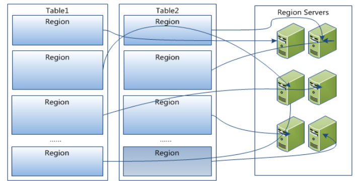
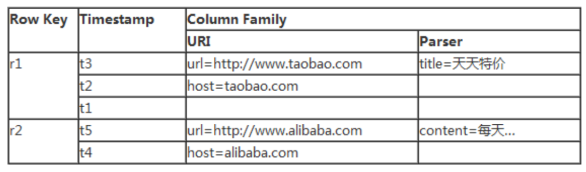
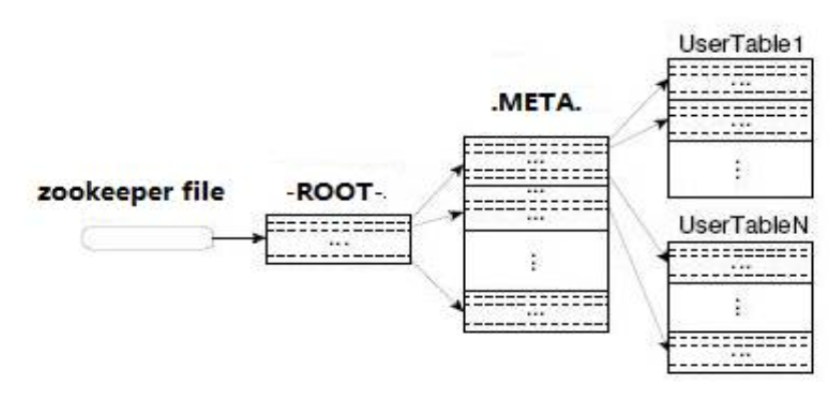
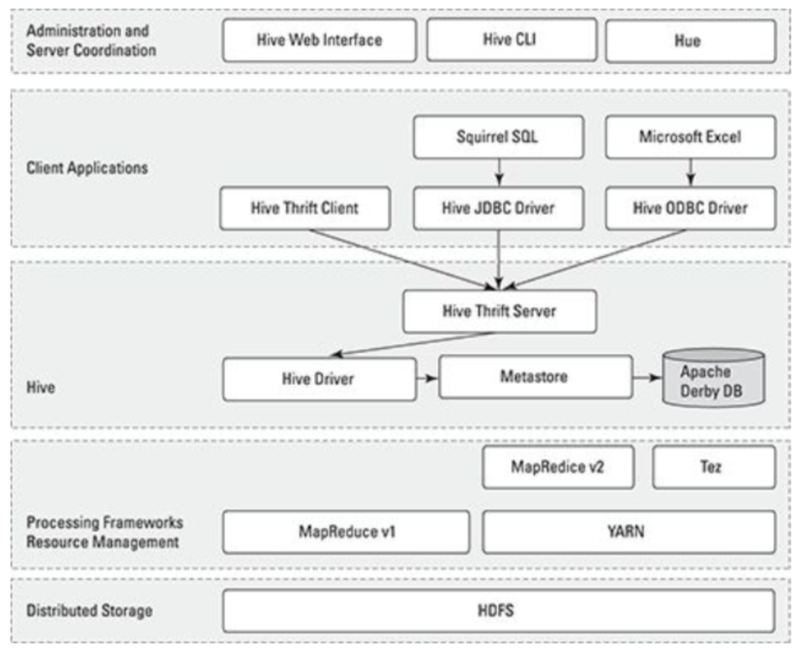
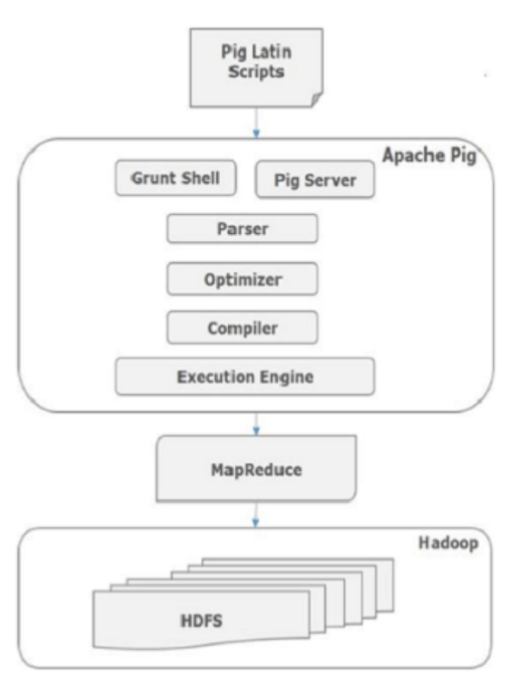

Lecture3-大数据存储和处理
---

# 1. 常见存储方式
1. 关系型数据库
2. NoSQL:泛指非关系型数据库，比如MongoDB
3. 全文检索框架:Elasticsearch(图片)

## 1.1. 存储的区别
1. row store:行式存储，大数据量查询，如果没有索引，则会遍历
2. column store:列式存储，查，可以大量的压缩空间
3. index based:位图索引

> 位图索引的例子

| 行号 | 姓名 |
| ---- | ---- |
| 1    | 男   |
| 2    | 女   |
| 3    | 女   |
| 4    | 男   |
| 5    | 女   |
| 6    | 男   |

4. 位图索引结果:“男”：100101，“女”：011010

## 1.2. 不同形式存储的对比
| ID  | name     | age | sex | aihao    |
| --- | -------- | --- | --- | -------- |
| 1   | 小明     | 21  | 男  | 女       |
| 2   | 隔壁老王 | 25  |     | 隔壁孩子 |

1. MySQL形式存储

```
1,小明,21,男,女;  2,隔壁老王, 25, , 隔壁孩子
```
2. HBase的形式存储

```
<1, name>,小明
<1, age>, 21
...
<2, name>, 隔壁老王
```
3. 传统表中使用alter来修改表结构，而Hase直接插入就可以修改表结构

## 1.3. ES方式
| 文档id | 文档内容                                                    |
| ------ | ----------------------------------------------------------- |
| doc1   | how are you?fine, thank you, and you?I fine too, thank you! |
| doc2   | good morning,LiLei,good morning,Hanmeimei                   |

> ES的存储(倒排索引)的结果如下

| dictionary | posting-list    |
| ---------- | --------------- |
| fine       | -> doc1         |
| Hanmei     | -> doc2         |
| good       | -> doc2         |
| LiLei      | -> doc2         |
| ...        | ...             |
| you        | -> doc1 -> doc2 |

- 应该把查询频率高的单词放在前面(越高越前)
- ES默认将文档存储到一个位置，也可以配置不存储文档信息
- TF-IDF算法:详见`Tec1-TF-IDF算法.md`

## 1.4. 如何选择
1. 列存储:
   1. 基于一列或者比较少的列计算的时候
   2. 经常关注一张表某几列而非整表数据的时候
   3. 数据表拥有非常多的列的时候
   4. 数据表列有非常多行数据并且需要聚集计算的时候
   5. 数据表列有非常多的重复数据，有利于高度压缩
2. 行存储:
   1. 关注整张表的内容，或者需要经常更新数据
   2. 需要经常读取某行数据
   3. 不需要聚集运算，或者快速查询需求
   4. 数据表本身数据行并不多
   5. 数据表的列本身有太多唯一的数据

## 1.5. 读写的区别


## 1.6. 聚簇索引和非聚簇索引
> 非聚集索引


> 聚集索引


- 物理存储的最小的单位是块(Block)

## 1.7. MySQL
1. 查询:`Select (tuple) from database`
2. 插入:`Insert into database value`
3. 更新:`Update database set xxx = xxx where statement`
4. 删除:`Delete from database where xxx`

## 1.8. HBase对LSM的实现
- HBase假设内存非常大，有限使用内存存储
- 有数据更新不是立马更新，而是先驻留数据，积累到一定条目后归并排序，然后追加到磁盘的队伍中去
- 日志结构
- 可以显著减少磁盘开销，一次性大量写入，减少随机的IO
- 不能命中会导致较多的磁盘消耗

## 1.9. HBase的实现
1. 查询
2. 插入
3. 更新&删除:看做一个插入操作，使用时间戳和Delete标识来标识

> memstore:插入时优先放置到这里，驻存内存，到了一定程度后再刷新到storeFile、插入都是写入操作

|     |     |
| --- | --- |
| key | 10  |
| key | 11  |
| ... | ..  |
| key | 99  |

> storeFile

|     |     |
| --- | --- |
| key | 20  |
| key | 21  |
| ... | ..  |
| key | 50  |

> storeFile

|     |     |
| --- | --- |
| key | 30  |
| key | 32  |
| ... | ..  |
| key | 100 |

## 1.10. ES的方式
- 一个Node是一个进程
- 容灾的话就是多副本容灾

## 1.11. ES的操作
1. 插入:和HBase相似，不是写入即可查询，建立index需要比较大的开销
2. 读取:
3. 更新&删除:

## 1.12. 容灾
1. MySQL:单节点:
   1. 数据层面操作
   2. 日志层面操作
2. HBase & HDFS：分布式文件系统，每一个节点操作类似MySQL的单节点
3. ES各节点备份

# 2. Hadoop介绍
1. Hadoop:一个Apache基金会开发的开源软件框架，支持在由普通计算机组成的集群中运行海量数据的分布式计算，他可以让应用程序轻松扩展到上千个节点和PB级别的数据。
2. 手机图片

## 2.1. Google 三大论文
1. MapReduce
2. GFS
3. Big Table

## 2.2. Doug Cutting山寨项目
1. MapReduce
2. HDFS
3. HBase

## 2.3. Hadoop核心
1. MapReduce
   1. Map:任务的分解
   2. Reduce:结构的汇总
2. HDFS
   1. NameNode:
   2. DataNode:
   3. Client:

## 2.4. MapReduce
1. MapReduce是一种并行编程模型，其实是分治算法的一种实现，适用于大规模数据集的并行计算
   1. map:(k1,v1)->list(k2,v2)
   2. reduce:(k2,list(v2)) -> (k3, v3)
2. 示例:曹冲称象
3. 过程:Input -> Map -> Sort -> Combine -> Partition -> Reduce -> Output


## 2.5. 大数据处理层次架构


## 2.6. HDFS的基本概念
1. Block
2. NameNode & Secondary NameNode
3. Datanode

## 2.7. HDFS架构


### 2.7.1. Block
1. 64M by default，v2.0->128M
2. Data & metadata


3. Replication
4. One-write-many-read

### 2.7.2. NameNode
1. 可以看做是分布式文件系统中的管理者，存储文件系统的metadata，主要负责管理文件系统的命名空间，集群配置信息，存储块的赋值
2. 两个文件
   1. EditLog
   2. FSImage
3. 两个映射
   1. Filename -> BlockSequence(FsImage)
   2. Block -> DatanodeList(BlockReport)
4. 单点风险

### 2.7.3. Secondary Namenode
1. 不是备用NameNode，是秘书
2. 合并和保存EditLog、FSImage
   1. Checkpoint.period
   2. Checkpoint.size
  
### 2.7.4. Datanode
1. 文件存储的基本单位。它存储文件块在本地文件系统中，保存了文件块的meta-data，同时周期性的发送所有存在的文件块的报错给Namenode

### 2.7.5. HDFS文件读写
1. 读文件：读取完之后会校验(Check Sum)，未通过则表示错误


2. 写文件:复制的策略，冗余数据放置在机柜中，跨机柜要经过交换机等设备


# 3. HBase
1. HBase以谷歌的BigTable为模型，并用Java编写
2. HBase是在HDFS上开发，提供了一种容错的方式存储大量的稀疏数据
3. 一个HBase系统包括一组表，每个表包含行和列，就像传统的数据库一样。每个表都必须有一个定义为主键的元素，所有对HBase表的访问尝试都必须使用这个主键。一个HBase Column表示一个对象属性。

## 3.1. 什么是HBase
1. 一个数据库
2. 分布式的、非结构化的、稀疏的、面向列的
3. 基于HDFS，山寨版的BigTable，继承了可靠性、高性能、可伸缩性

## 3.2. HBase架构


## 3.3. HBase角色
1. ZooKeeper
   1. 一个高效的、可扩展的协调系统
   2. Hadoop的子项目，不属于HBase
2. HMaster
   1. 管理网络对Table的增、删、改、查操作
   2. 管理HRegionServer负载均衡
3. HRegionServer
   1. 管理一系列HRegion
   2. Region读写的场所



4. HRegion
   1. 对应Table的Region
   2. HStore和HLog
5. HStore
   1. 对应了Table中的一个Column Family的存储
   2. MemStore
   3. StoreFile(HFile)
6. StoreFile
   1. Compact
   2. Split


## 3.4. HBase数据模型




## 3.5. 数据导入


## 3.6. 访问接口


# 4. Hive
1. Hive是基于Hadoop的数据仓库工具
2. 学习成本低
3. 提供完整的sql查询功能
4. 可以将结构化的数据文件映射为一张数据库表
5. 可以将sql语句转换为MapReduce任务进行运行。
6. 可以通过类SQL语句快速实现简单的MapReduce统计，不必开发专门的MapReduce应用

## 4.1. Hive体系结构


## 4.2. Hive运维要点
1. Hive相当于一套Hadoop的访问接口，运维如下几个问题需要注意
   1. 使用单独的数据库存储元数据
   2. 定义合理的表分区和键
   3. 设置合理的bucket数据量
   4. 进行表压缩
   5. 定义外部表使用规范
   6. 合理的控制Mapper，Reducer数量

# 5. Pig


## 5.1. Pig组成组成


## 5.2. Pig与SQL区别
1. 使用延迟评价
2. 使用ETL
3. 能够在管道中任何时刻存储数据
4. 支持管道分裂


