Lecture4-链接分析
---

[TOC]

# 1. 新型数据:图数据

| 社交网络            | 媒体网络            |
| ------------------- | ------------------- |
|  | 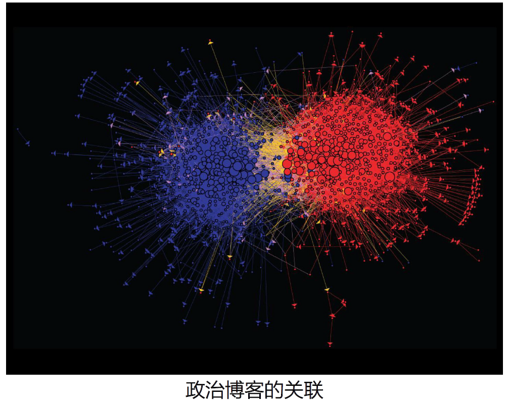 |
| 信息网络            | 信息网络            |
| 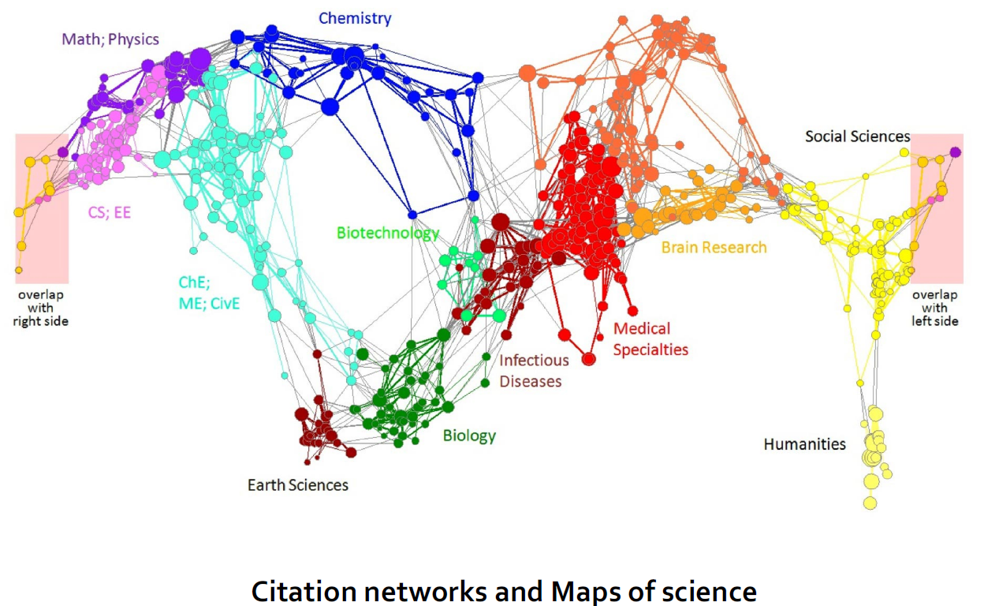 | 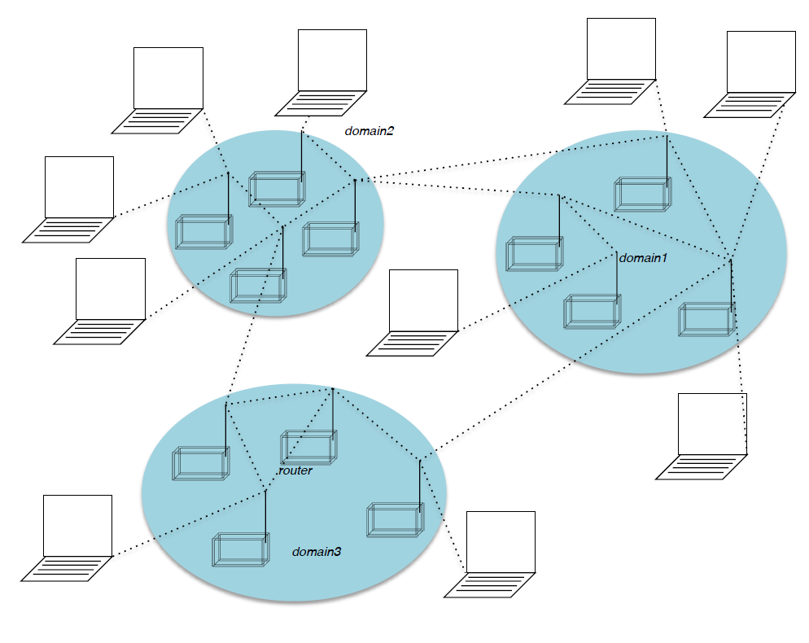 |
| 技术网络            |                     |
| 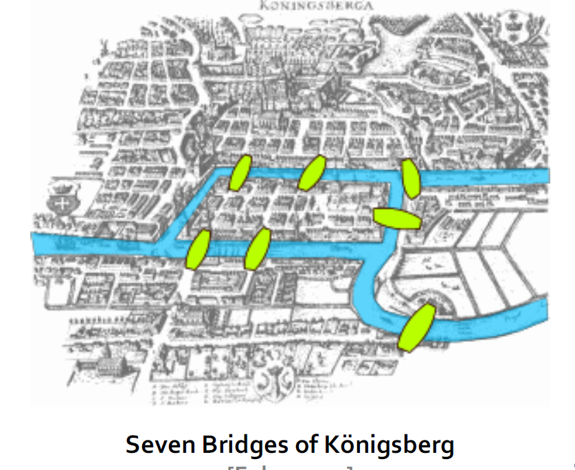 |                     |

# 2. 图数据形态的网络

## 2.1. 网络的有向图表示
| 图形 | 含义   |
| ---- | ------ |
| 节点 | 网页   |
| 边   | 超链接 |

## 2.2. 如何组织网络

### 2.2.1. 方式一:网页索引(人工编辑)
Yahoo、DMOZ、LookSmart

### 2.2.2. 方式二:网络搜索
1. 信息检索调查:在一个小而可信的集合中找到相关文档
2. 被搜索集合:新闻报纸、文章、引用等等。
3. 缺陷:网络是巨大的，充满不可信、过时和随机的东西
4. 网络搜索中的挑战
   1. 网络中存在多个来源的数据，那么我们相信哪一个来源的数据呢？可信的网页彼此互相引用和连接
   2. 查询数据的最佳回答是什么？没有单个的最佳答案，实际关于数据的页面往往指向许多"数据"

#### 2.2.2.1. 在图中作节点排序
1. 所有的网页的重要性是不平等的
2. 在网络图节点的连接中有极高的多变性，我们通过链接结构来对页面进行排序。

#### 2.2.2.2. 链接分析算法
1. 我们将要集中介绍一下三种链接分析方法来计算图中节点的重要性。
   1. Page Rank 算法
   2. Topic-Specific(Personalized) Page Rank 算法
   3. Web Spam Detection Algorithms 算法

#### 2.2.2.3. 链接投票
1. 解决方法:链接投票，页面拥有的入链权重和越大越重要，来自重要(高权重)的链接权重更大，地推问题
2. 考虑来自外部网站的链接:
   1. `www.stanford.edu`有23400个链接
   2. `www.joe-schmoe.com`有1个链接
3. 所有入链都是等权重的吗？不是，来自重要的链接权重更大，递推问题

# 3. Page Rank 算法
- Page Rank算法示意图:

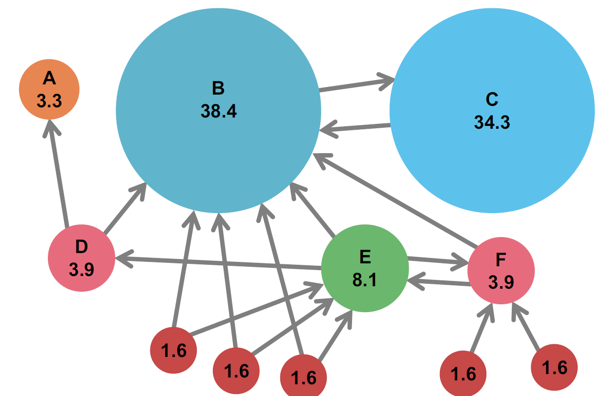

## 3.1. Page Rank的简单递推公式
1. 所有链接的投票权重与其源网页的**权重**成比例
2. 页面j的权重为$r_j$，拥有n个出链，则每个出链有的投票权重为$r_{j_{out}} = \frac{r_j}{n}$
3. 页面j自身的权重$r_j$为其入链权重之和
4. Page Rank网络局部示意:

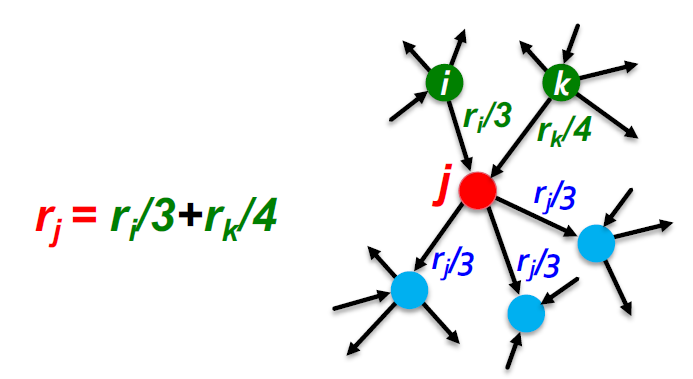

## 3.2. Page Rank:流模型
1. 来自**重要页面**的连接权重较大
2. 被其他页面指向的页面是相对重要的的
3. 为页面j定义"rank":$r_{j}$

$$
r_{j} = \sum\limits\limits_{i->j} \frac{r_i}{d_i}\\ d_i是结点i的出度
$$

| 图示意              | 本式没有特解         |
| ------------------- | -------------------- |
| 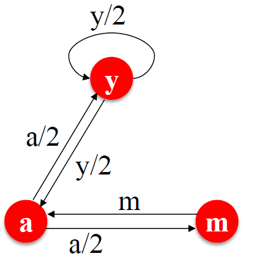 |  |

## 3.3. 简单流等式的求解
1. 上面的右图的式子没有特解，附加约束条件:
   1. 求解流等式:$r_y + r_a + r_m = 1$
   2. 得到结果为:$r_y = \frac{2}{5}, r_a = \frac{2}{5}, r_m = \frac{1}{5}$
2. 高斯法消去只适用于小规模的例子，我们需要其他方法来应对大规模的Web图

## 3.4. PageRank的矩阵等式(核心)
> $r^{(0)}$:给定四个网页的初始的PR值

### 3.4.1. 随机邻接矩阵M
1. 页面i有$d_i$个出链
2. 如果i`->`j，则$M_{ji} = \frac{i}{d_i}$，不然$M_{ji}=0$，列所有元素和为1

### 3.4.2. 排序向量r
1. 每一页有一个条目的向量
2. $r_i$是页面i的出链权重，$d_i$是出链的个数

$$\sum\limits_{i}r_i = 1 \\
r_j = \sum\limits_{i->j}\frac{r_i}{d_i} \\
流等式:r = M * r
$$

### 3.4.3. 特征向量等式

1. 由上式可知，排序向量r是随机邻接矩阵M的特征向量
   1. 其第一个或主要特征向量，对应的特征值为1
   2. M的最大特征值为1，因为M为列随机(非负项)
   3. 我们知道r是单位长度，并且每一列和为1，$M*r$ <= 1
   4. 我们可以高效解出r，这种方法叫Power iteration

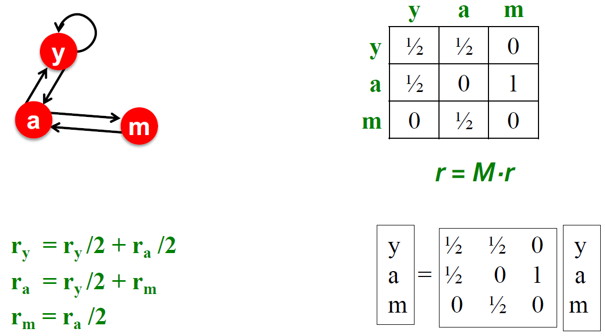

## 3.5. Power iteraion方法
1. 如果给定一个有n个节点的网络图(节点是页，边是超链接)
2. Power iteration算法描述
   1. 假设这里有N个网络节点
   2. 初始化:$r^{(0)} = [\frac{1}{N}, ..., \frac{1}{N}]^{T}$
   3. 计算:$r^{(t + 1)} = M * r^{(t)}$，重复操作直到满足停止条件
   4. 停止条件:$|r^{(t + 1)} - r^{(t)}| < \varepsilon$

### 3.5.1. 使用power iteration方法求解之前的例子

### 3.5.2. Power Iteration方法原理
1. 查找主要特征向量（对应于最大特征值的向量)的方法
$$
r^{(1)} = M * r ^{(0)} \\
r^{(2)} = M^{2} * r ^{(0)} \\
r^{(3)} = M^{3} * r ^{(0)} \\
... \\
r^{(n)} = M^{n} * r ^{(0)} \\
$$

1. 证明:序列:$M * r ^{(0)}$、$M^{2} * r ^{(0)}$、$M^{3} * r ^{(0)}$、...、$M^{k} * r ^{(0)}$、...接近M的主要特征向量
   1. 假设矩阵M有n个线性独立特征变量$x_1,x_2,...,x_n$,对应的特征变量为$\lambda_1,\lambda_2,...,\lambda_n$,并且$\lambda_1>\lambda_2>...>\lambda_n$
   2. 向量$x_1,x_2,...,x_n$构成一组基向量，所以我们可以写成$r ^{(0)} = c_1 * x_1 + c_2 * x_2 + ... + c_n * x_n$
   3. 所以我们进行计算可得:$M^k * r ^{(0)} = c_1 * \lambda^k_1 * x_1 + c_2 * \lambda^k_2* x_2 + ... + c_n * \lambda^k_n* x_n$
   4. 提出$\lambda^k_1$:$M^k * r ^{(0)} =\lambda^k_1 * ( c_1 * x_1 + c_2 * (\frac{\lambda_2}{\lambda_1})^k * x_2 + ... + c_n * (\frac{\lambda_n}{\lambda_1})^k * x_n)$
   5. 由于之前的假设，可知$\frac{\lambda_2}{\lambda_1,\frac{\lambda_3}{\lambda_1},... < 1}$
   6. $\lim\limits_{k\to\infty}\frac{\lambda_i}{\lambda_1}^k = 0$
   7. $M^{k} * r ^{(0)} \approx c_1 * \lambda^k_1 *  x_1$
2. 从上面证明的最后结论我们可以知道，如果c1等于0，那么这个方法不能收敛
 
## 3.6. Random Walk 算法
1. 假设我们有一个随机网络游标
   1. 在任何时间t，游标在第i个节点上
   2. 在时间t+1，游标移动到i的随机一个外链上
   3. 最终结束到连接i节点的j节点上
   4. 重复以上的过程
2. $p(t)$是页面上的概率分布

### 3.6.1. 平稳分布
1. 时间上满足等式：$p(t+1) = M * p(t)$
2. 当满足等式：$p(t+1) = M * p(t) = p(t)$的时候$p(t)$是Random Walk的一个平稳分布
3. 结合之前矩阵形式的等式，我们可以知道r就是Random Walk的平稳分布

### 3.6.2. 存在性和唯一性
随机游走理论（又称马尔可夫过程)的主要结果是：对于满足某些条件的图，平稳分布是唯一的，并且无论在时间t = 0时的初始概率分布如何，最终都会达到平稳分布

## 3.7. PageRank的问题
1. PageRank是否收敛？
2. PageRank是否按照我们设想的方式收敛了？
3. 结果是否有效可信？
4. 有些点是死胡同？
5. 有的网络拓扑形成了图结构(爬虫陷阱)？

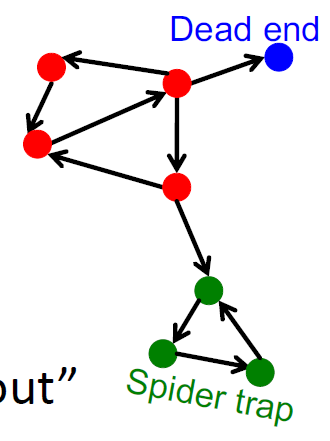

### 3.7.1. 收敛判定
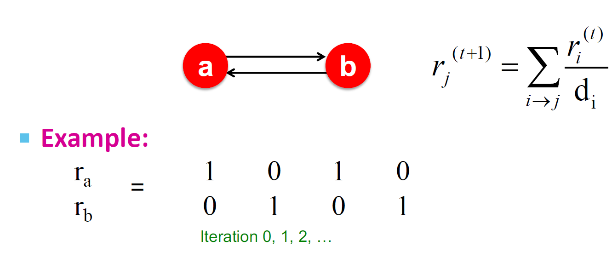

### 3.7.2. 是否收敛至期待水平
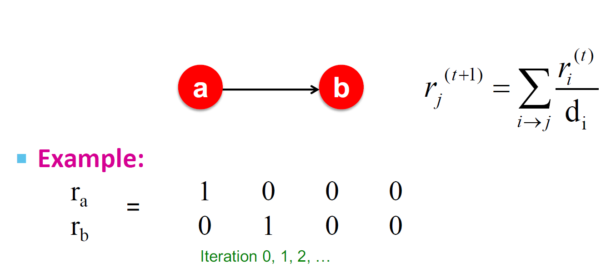

### 3.7.3. 死胡同(Dead end)
1. 随意漫步"无处可去"，这些页面导致权重被泄露
3. 归根结底:该矩阵不是列随机的，因此无法满足我们的初始假设

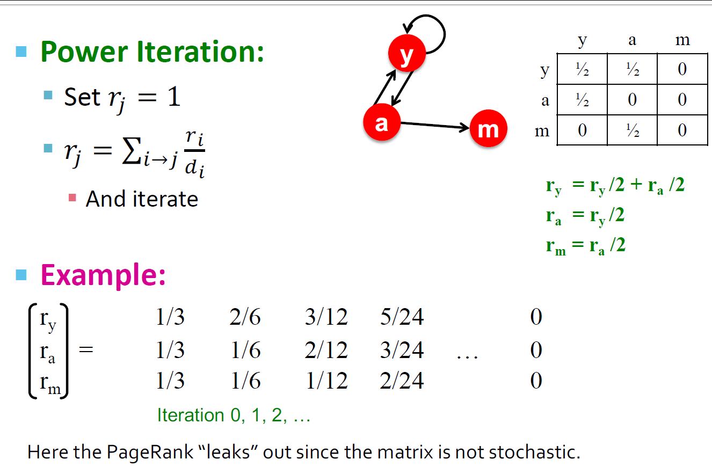

> 解决方案:使用Teleport!当无处可去时，总是通过传送使矩阵列成为随机的,调整dead-ends的权重，使其有随机的概率到图上的任意一个点。

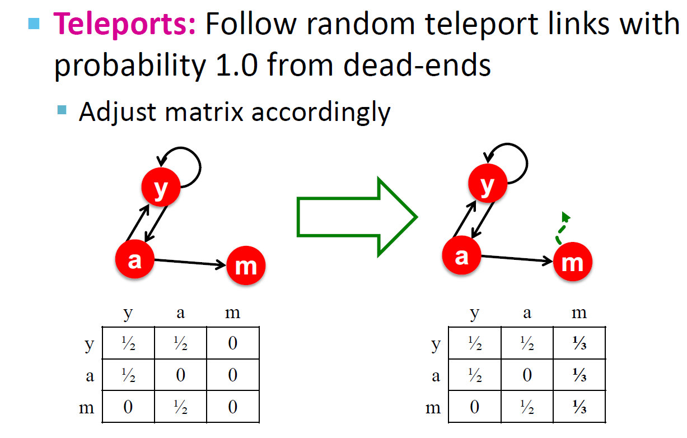

> 另一种解决方案(裁剪方案，考试使用)

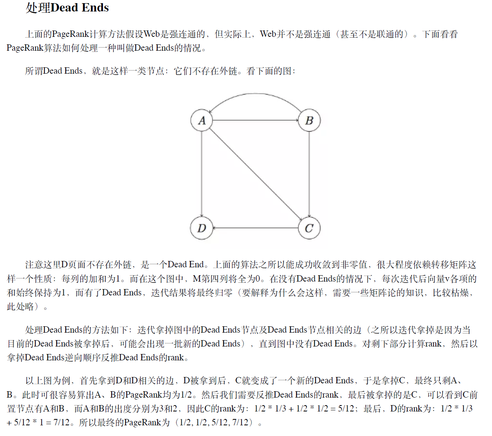

### 3.7.4. 爬虫陷阱
1. 所有的出链形成了一个环状结构，随机游走将被困在环中
2. 这个不是一个问题，但是不是我们想要的结果:这个环吸收走了模型的所有的重要性

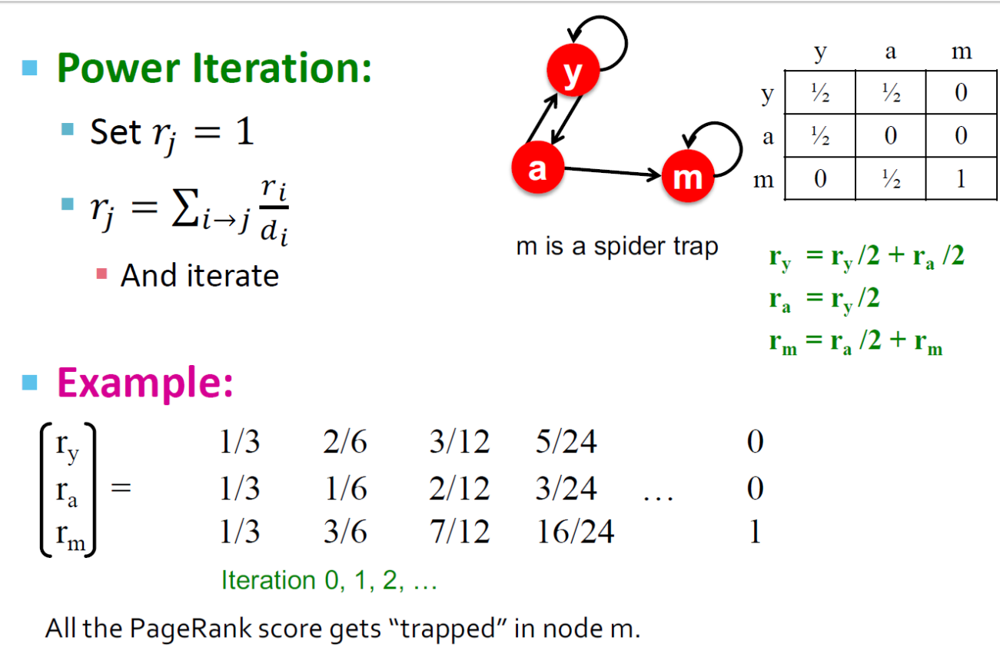

## 3.8. 爬虫陷阱的解决方案:Teleports
1. Google针对Spider Traps的解决方案：在每个时间步，随机冲浪者都有两个选择
   1. 对于概率$\beta$:选择随机一个出链行走
   2. 对于概率$1 - \beta$:选择随机一个点行走
   3. 概率$\beta$往往在0.8-0.9之间进行选择，经验上会选择0.85，但是我们可以通过神经网络学习来确定$\beta$的值
2. 冲浪者将在几步之内将其传送出Spider Traps

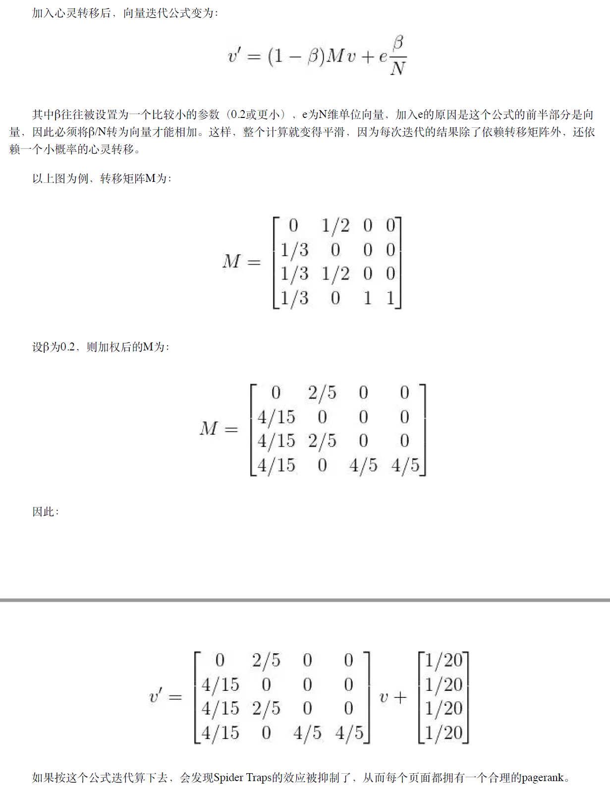

## 3.9. 整体的解决方案:Random Teleports
1. Google的解决方案是对于所有情况，每一步，随机冲浪者都有两个选择
   1. 对于概率$\beta$:选择随机一个出链行走
   2. 对于概率$1 - \beta$:选择随机一个点行走
2. PageRank等式的修正:$r_j = \sum\limits\limits_{i-j} \beta * \frac{r_i}{d_i} + (1 - \beta) * \frac{1}{N}$
3. 该公式假定/没有dead ends。 我们可以预处理矩阵/删除所有dead ends，也可以从dead ends中以概率1.0显式地跟随随机传送链接。
4. $A = \beta M + (1 - \beta)[\frac{1}{N}]_{N * N}$
5. 然后我们求解一个递归问题:$r = A * r$
6. Power Iteration方法仍然适用
7. Random Teleports例子($\beta = 0.8$)

## 3.10. 问题:大规模网络计算会导致内存不足
假设N = 1,000,000,我们很直观的可以感受到需要存储的数据数量极大

### 3.10.1. 矩阵公式(Random Teleport的等价形式)
1. 从i到每隔一页添加一个传送链接并将传送概率设置为 $\frac{1 - \beta}{N}$
2. 降低跟踪每个出站链接的可能性从$\frac{1}{|d_i|}$到$\frac{\beta}{|d_i|}$
3. 等价于对每一个节点的权乘以$(1- \beta)$，然后均匀地重新分配

### 3.10.2. 方程式重排
$$
r = A * r \\
A_{ji} = \beta*M_{ji} + \frac{1 - \beta}{N} \\
r_j = \sum\limits_{i = 1}\limits^{N}[\beta*M_{ji} + \frac{1 - \beta}{N}] * r_i \\
r_j = \sum\limits_{i = 1}\limits^{N}\beta * M_{ji}* r_i + \frac{1 - \beta}{N} * \sum\limits_{i = 1}\limits^{N}r_i \\
r_j = \sum\limits_{i = 1}\limits^{N}\beta * M_{ji}* r_i + \frac{1 - \beta}{N} \\
$$
> 所以:$r = \beta*M*r + [\frac{1-\beta}{N}]_N$

### 3.10.3. 稀疏矩阵公式
$$
r = \beta*M*r + [\frac{1-\beta}{N}]_N
$$

1. $[\frac{1-\beta}{N}]_N$是一个N维$\frac{1-\beta}{N}$的列向量(常量)
2. M是一个**稀疏矩阵**
3. 过程我们可以规划为如下
   1. 计算$r^{new} = \beta * M * r^{old}$
   2. $r^{new} = r^{new} + [\frac{1-\beta}{N}]_N$
4. 注意在上面这个过程中，如果$\sum\limits_{j}r_{j}^{new} < 1$，我们需要对$r^{new}$进行格式化，使其和为1(这种情况是M包含dead-ends)

### 3.10.4. 稀疏矩阵编码
1. 仅使用非零条目对稀疏矩阵进行编码
2. 假设有1,000,000条数据，4 * 10 * 1 billion = 40GB对于内存是不现实的，但是对于磁盘是可以的

### 3.10.5. 稀疏矩阵算法
1. 我们假设RAM可以将$r^{new}载入到磁盘$，存储$r^{old}$和矩阵M在磁盘中
2. power-iteration的一个步骤
   1. 初始化:$r^{new} = \frac{1-\beta}{N}$
   2. 对于页面i(出度为$d_i$)
      1. 从内存中加载:$i,d_i,dest_1,...,dest_{d_i},r^{old}(i)$
      2. 对于$j = 1 ... d_i$
         - $r^{new}(dest_j) += \frac{\beta r^{old}}{d_i}(i)$

### 3.10.6. 基于块更新的算法
1. 进一步减少空间消耗，将$r^{new}$重新切分成k块，来适配内存，为每一块扫描M和$r^{old}$

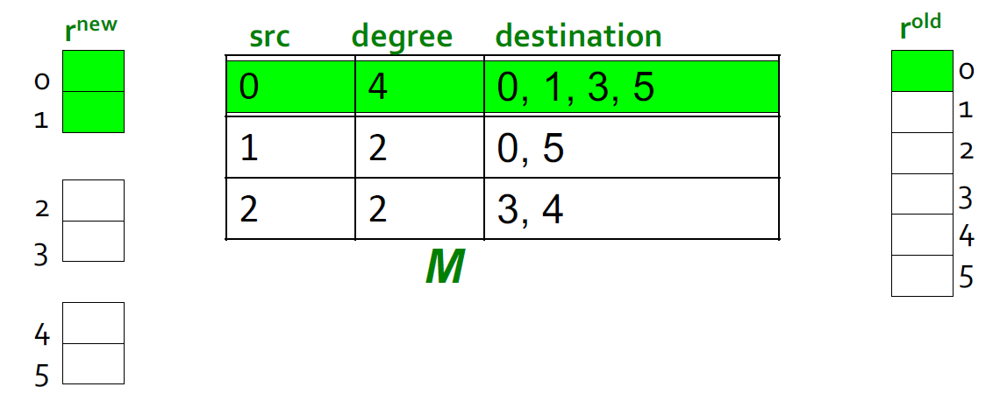

2. 块更新消耗:
   1. k次扫描M和$r^{old}$
   2. 每次Power iteration的消耗:$k(|M| + |r|) + |r| = k|M| + (k+1)|r|$
3. 我们有没有做的更好了呢?
   1. M相对于r更加大(大约有10-20x)，所以我们可以避免每一个迭代读k次

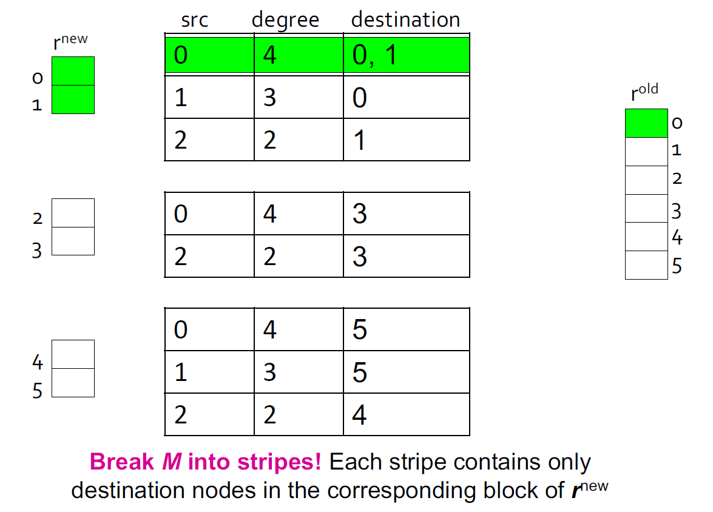

## 3.11. PageRank完整算法
1. 输入
   1. 一个有向图G，可以有Spider Traps和Dead ends
   2. 参数$\beta$
2. 输出:PageRank vector $r^{new}$
3. 过程
   1. 初始化:$r_{j}^{old} = \frac{1}{N}$
   2. 重复以下步骤直到收敛:$\sum\limits_{j}|r_j^{new} - r_j^{old}| > \varepsilon$
      1. $\forall j: r_j^{'new} = \sum\limits_{i->j}\beta\frac{r_i^{old}}{d_i}$
      2. $\forall j: r_j^{'new} = 0$，if in-degree of j is 0
      3. 现在，重新插入的PageRank：
         1. $\forall j: r_j^{new} = r_j^{'new} + \frac{1 - S}{N}\ where\ S = \sum\limits_jr_{j}^{'new}$
      4. $r^{old} = r^{new}$
4. 如果图形没有死角，则泄漏的PageRank数量为1-β。 但是因为我们有死胡同，PageRank的泄漏量可能更大。 我们必须通过计算S来明确说明这一点。
5. 一次迭代的消耗:2|r| + |M|

# 4. Topic-Sensitive PageRank
其实上面的讨论我们回避了一个事实，那就是"网页重要性"其实没一个标准答案，对于不同的用户，甚至有很大的差别。例如，当搜索"苹果"时，一个数码爱好者可能是想要看iphone的信息，一个果农可能是想看苹果的价格走势和种植技巧，而一个小朋友可能在找苹果的简笔画。理想情况下，应该为每个用户维护一套专用向量，但面对海量用户这种方法显然不可行。所以搜索引擎一般会选择一种称为Topic-Sensitive的折中方案。Topic-Sensitive PageRank的做法是预定义几个话题类别，例如体育、娱乐、科技等等，为每个话题单独维护一个向量，然后想办法关联用户的话题倾向，根据用户的话题倾向排序结果。

## 4.1. 算法步骤

### 4.1.1. 确定话题分类
一般来说，可以参考Open Directory（DMOZ)的一级话题类别作为topic。目前DMOZ的一级topic有：Arts（艺术)、Business（商务)、Computers（计算机)、Games（游戏)、Health（医疗健康)、Home（居家)、Kids and Teens（儿童)、News（新闻)、Recreation（娱乐修养)、Reference（参考)、Regional（地域)、Science（科技)、Shopping（购物)、Society（人文社会)、Sports（体育)。

### 4.1.2. 网页topic归属
这一步需要将每个页面归入最合适的分类，具体归类有很多算法，例如可以使用TF-IDF基于词素归类，也可以聚类后人工归类，具体不再展开。这一步最终的结果是每个网页被归到其中一个topic。

### 4.1.3. 分topic向量计算
1. 在Topic-Sensitive PageRank中，向量迭代公式为

$$
v' = (1- \beta)Mv + s\frac{\beta}{|s|}
$$

2. 首先是单位向量e变为了s。s是这样一个向量：对于某topic的s，如果网页k在此topic中，则s中第k个元素为1，否则为0。注意对于每一个topic都有一个不同的s。而|s|表示s中1的数量。
3. 还是以上面的四张页面为例，假设页面A归为Arts，B归为Computers，C归为Computers，D归为Sports。那么对于 Computers这个topic，s就是：

$$
s = \begin{bmatrix}
   0 \\
   1 \\
   1 \\
   0 \\
\end{bmatrix}
$$

- 而lsl=2，因此，迭代公式为

# 5. 针对PageRank的Spam攻击与反作弊
1. Link Spam:造出来很多空页来提高自己的页的rank值
2. 反作弊：
   1. 检测拓扑
   2. TrustRank：如果比可信网站的rank高太多那么有理由认为是有问题的