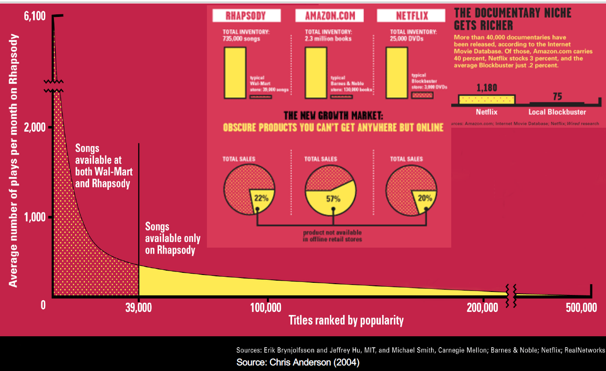
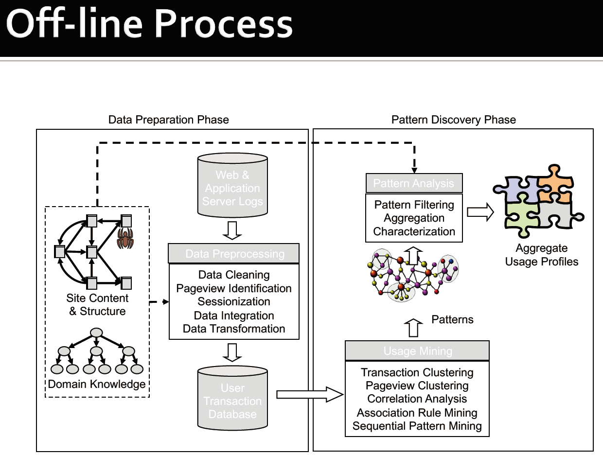
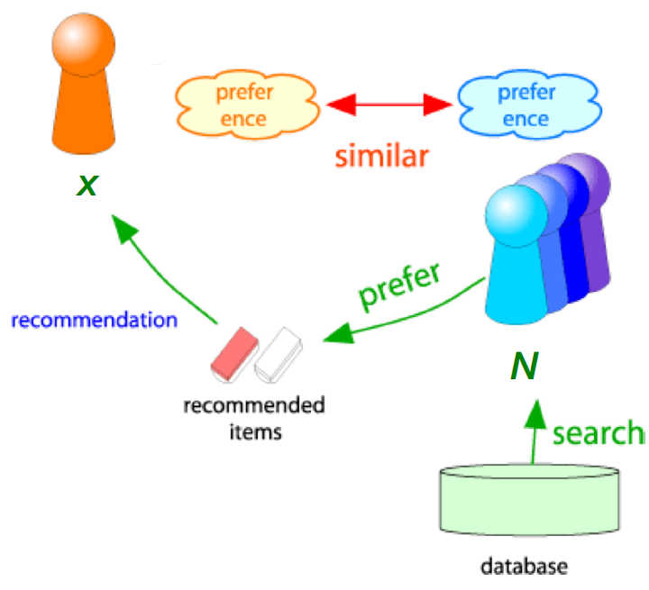
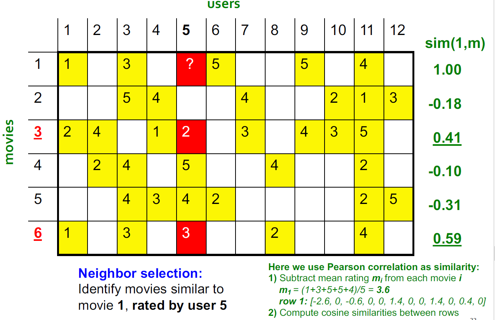
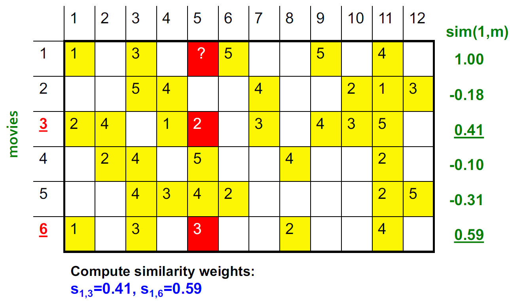
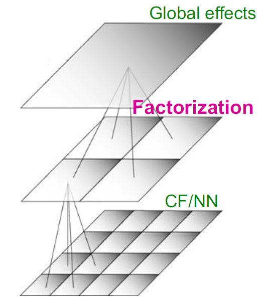
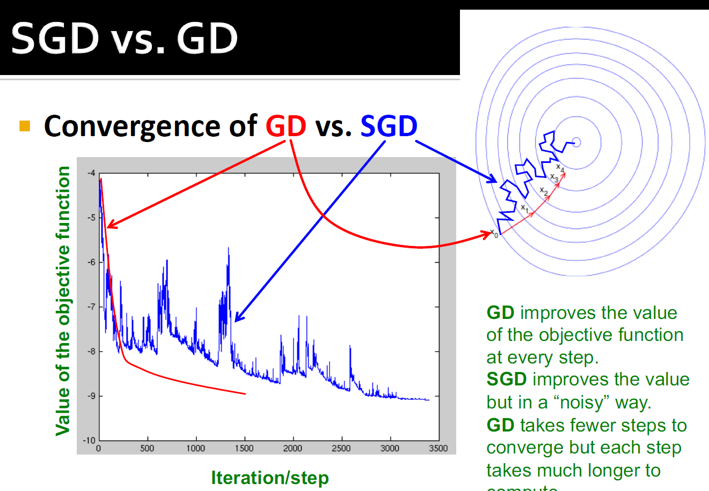
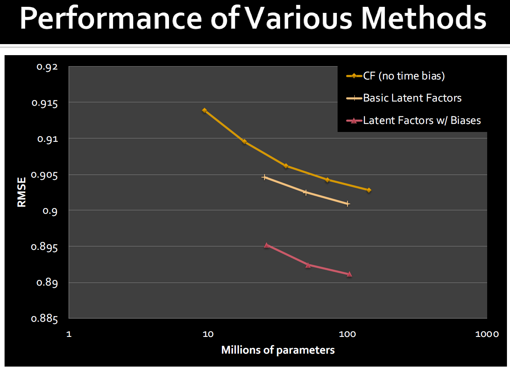
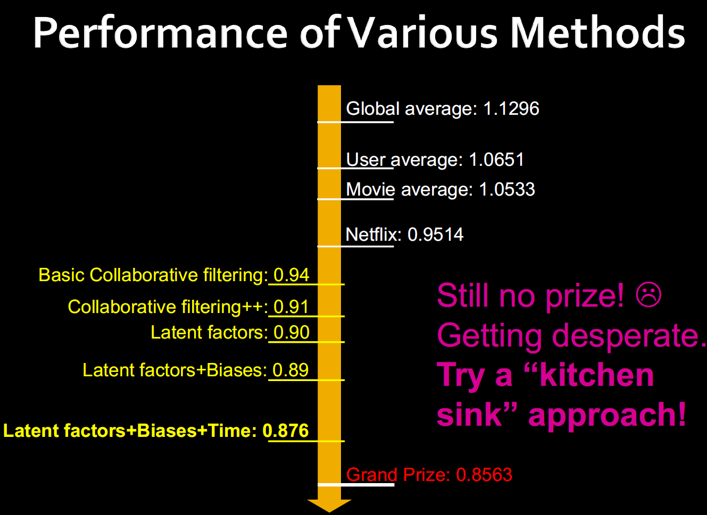

Lecture8-推荐系统
---

# 1. 引入:推荐系统的例子
1. 京东推荐系统
2. 推荐产品和食物
3. 两个客户:
   1. 客户X:购买了CD1和CD2
   2. 客户Y:搜索了CD1，那么推荐系统将会根据从客户X处收集到的信息推荐给客户CD2 

# 2. 推荐与推荐系统
1. 用户执行物品搜索，推荐系统根据情况返回推荐结果

## 2.1. 什么是推荐系统
1. 推荐系统是提供推荐给用户的系统
   1. 过多的信息(信息过载)
   2. 用户有太多的选择
2. 根据用户的口味，来推荐用户不同的商品
   1. 协助用户发现信息
   2. 减少搜索和导航的时间

## 2.2. 从缺乏到丰富
1. 货架空间是稀缺的传统商品零售商，同样的还有电视网络、电影院
2. Web使有关产品信息的成本接近零传播：从稀缺到丰富
3. 更多选择需要更好的过滤器：推荐引擎

| 长尾模式            | 实体和线上          |
| ------------------- | ------------------- |
|  |  |

## 2.3. 推荐分类
1. 编辑和策划
   1. 收藏夹列表
   2. “基本”项目清单
2. 简单的集合：前10名，最受欢迎，最近上传
3. 针对个人用户：亚马逊，Netflix等…

## 2.4. 推荐系统的一般模型
1. $X$是消费者集合
2. $S$是物品集合
3. 使用函数:$u: X * S \to R$
   1. $R$是评分集合
   2. $R$是一套完全有序的集合
   3. 比如，0-5星，0-1分
4. Utility Matrix

## 2.5. 用户和物品的对比

## 2.6. 个性化
1. 个性化 = 用户匹配系统
2. 交互式基于用户个人数据情况而个性化展开的
   1. 个性化网页
   2. 个性化指导
   3. 个性化推荐

## 2.7. 和BDA的联系
环境智能 = 普适计算 + 智能接口(比如个性化)

## 2.8. 用户信息
> 从简单到复杂
1. 人口统计学信息:年龄、性别、低于
2. 兴趣、偏好、专业级别
3. 购买记录、观察行为
4. 打分
5. ...
6. 计算生活日志

### 2.8.1. 用户信息的来源
1. 用户直接的输入(如调查问卷)
2. 通过系统非显式收集到
   1. 观察/记录用户行为
   2. 学习/推理用户的兴趣/偏好/级别
3. 集合使用所有的方法
4. 其他的维度:公有/私有

## 2.9. 用户信息的获取
1. 格式:
   1. 原数据
   2. 概括(发现模式 & 生成)
      1. 统计性机器学习方法
      2. 基于ML方法的知识
   3. 保持以上两种的方式(在时间上去重新学习或者适应)，保持原数据的有效时间
2. 其他人介入过程可能会导致信息的误收集，比如虽然你很喜欢，但是别人阻止了你，导致你知识很多次浏览，最终没有形成最后的购买行为。

## 2.10. 推荐过程中的关键问题
1. 收集矩阵的“已知”评分：如何收集Utility Matrix中的数据。
2. 从已知评级中推断未知评级：主要对高未知等级感兴趣，我们对了解自己不喜欢的东西并不感兴趣。
3. 评估外推方法：如何衡量推荐方法的成功/绩效。
4. 冷启动问题:对于长时间的系统没有影响，但是对于短时间(刚开始)的系统有着比较重要的预测作用。
5. 完成模型转换:用户往往没有直接的输入，不会直接表达兴趣。
6. 模糊的信息:比明确的资料要糟糕，有很多的用户、网页，并且用户的资料信息比较短。
7. 隐藏的网页:在互联网部分很多的网页是通过数据库查询而获取的，其重要性很难通过日志显示出来，不能无差别的推荐物品。

### 2.10.1. 用户评分的收集

#### 2.10.1.1. 显式收集
1. 最精确的评分:用户直接打分，通常使用1到5或者1到7的李克特反应量表
2. 相关研究
   1. 最佳粒度:表示10分支在电影中被更好地接受了。
   2. 在讨论的笑话推荐器中选择了更细粒度的制式
   3. Gold Berg等使用了连续刻度（从-10到+10）和图形输入栏
      1. 离散化不会造成精度损失
      2. 可以更精细地捕获用户首选项
      3. 用户实际上“喜欢”图形交互方法
   4. 多维等级（每部电影的多重等级，例如演员和声音的等级）
3. 主要问题
   1. 用户并不总是愿意为许多项目评分：可用评分的数量可能太少>评分矩阵稀疏->推荐质量较差
   2. 如何刺激用户给更多物品评分？

#### 2.10.1.2. 非显式收集
1. 从用户行为中学习到评分
   1. 通常是通过嵌入了推荐系统的网上商店或应用程序收集
   2. 比如客户购买行为，许多推荐系统会解释为高评级(好评)
2. 评价指标:点击次数、浏览量、在某些页面上花费的时间、下载量
3. 隐式评价可以不断收集，不需要用户方面的额外做什么
4. 主要问题
   1. 不能确定用户行为是否被正确解释
   2. 例如，用户可能不喜欢他或她购买的所有书籍；用户也可能已经为别人买了一本书
5. 除了显式的评价外，还可以使用隐式评价，但是往往是处于经验结论。

### 2.10.2. 从已知评级中推断未知评级
1. 核心问题:Utility Matrix是稀疏的
   1. 大多数用户不会给大多数物品打分，导致了很多的缺项
   2. 冷启动
      1. 新物品没有评分
      2. 新用户没有足迹
2. 实现推荐系统的三个方法
   1. 基于内容的推荐系统(多)
   2. 基于协同的推荐系统(多)
   3. 基于潜在因子的推荐系统

## 2.11. 网络个性化过程
1. 生成用户模型
   1. 使用的不是一个用户而是一个集群的用户
   2. 是一个离线过程
   3. 步骤
      1. 聚类用户交易行为等
      2. 聚类物品或页面浏览路径
      3. 关联挖掘规则
      4. 序列化发现模式
2. 提供推荐服务
   1. 在线过程
   2. 结合用户的动态进程，提供动态内容

## 2.12. 用户建模
1. 根据用户的应用和使用来划分用户模型：跨应用程序可重用
2. 大多数还是理论的，并不实际
3. 最新状态:每一个应用有他自己的用户模型来完成其特定的任务

# 3. 基于协同的推荐系统
1. 协同过滤:利用其他用户的数据来为用户 完成推荐

## 3.1. 协同过滤过程
1. 我们考虑用户X
2. 查找评级与用户X评级“相似”的N个其他用户的集合
3. 根据N个用户的评分来估算X的评分，并决定是否推荐给用户X

## 3.2. 协同过滤(Collaborative Filtering, CF)
- 协同果过滤是推荐的最杰出方法
  - 由大型商业电子商务网站使用
  - 很好理解，存在各种算法和变体
  - 适用于许多领域（书籍，电影，DVD等）
- 方法：使用“人群的智慧”推荐物品基本假设和想法
- 假设：在用户通过隐式或显式的方式完成对目录项进行评分，并且过去口味相似的客户在未来也有大可能口味相似

## 3.3. 基于用户的最近邻协同过滤
1. 基本技巧：给定活跃用户X和用户X尚未看到的商品i
   1. 找到一组过去喜欢与X相同的商品并且对商品i进行了评分的用户Y（同龄人/最近的邻居）
   2. 使用推荐系统进行预测，例如预测用户X给商品i的评分会是多少
   3. 对用户X没看过的所有商品执行此操作，并给用户X推荐评分最高的商品
2. 基本假设和想法：如果用户过去具有相似的口味，将来他们也会具有相似的口味。用户偏好会随着时间的推移保持稳定和一致

### 3.3.1. 寻找相似的用户
1. 我们让$r_x$作为用户x的评分向量
2. Jaccard相似度
   1. $J(A,B) = \frac{|A\cap B|}{|A \cup B|}$
   2. 问题是忽略了评分的价值
   3. 我们把$r_x$和$r_y$作为集合
      1. $r_x = \{1, 4, 5\}$
      2. $r_y = \{1, 3, 4\}$
3. 余弦相似度:问题是把没有评分的部分作为负面情况
   1. $sim(x,y) = cos(r_x, r_y) = \frac{r_x * r_y}{||r_x||*||r_y||}$
   2. 我们把$r_x$和$r_y$作为点
      1. $r_x = \{1, 0, 0, 1, 3\}$
      2. $r_y = \{1, 0, 2, 2, 0\}$ 
4. 皮尔逊相关系数，$S_{xy}$指的是物品和用户x、y的相似性：$\overline{r_x}$和$\overline{r_y}$是x和y的均值评分

$sim(x,y) = \frac{\sum\limits_{s \in S_{xy}}(r_{xs} - \overline{r_x})(r_{ys} - \overline{r_y})}{\sqrt{\sum\limits_{s \in S_{xy}}(r_{xs} - \overline{r_x})^2 }\sqrt{\sum\limits_{s \in S_{xy}}(r_{ys} - \overline{r_y})^2}}$

### 3.3.2. 相似矩阵例子

- 直观地我们想要说明:$Sim(A, B) > Sim(A, C)$
  - Jaccard相似度：$Sim(A, B) = \frac{1}{5} < Sim(A, C) = \frac{2}{4}$
  - 余弦相似度：$Sim(A, B) = 0.380 > Sim(A, C) = 0.322$
    - 认为缺失的评分为0，问题:默认是负面评论
      - A = {4, 0, 0, 5, 1, 0, 0}
      - B = {5, 5, 4, 0, 0, 0, 0}
      - C = {0, 0, 0, 2 ,4 ,5, 0}
      - $Sim(A, B) = 0.380 > Sim(A, C) = 0.322$
    - 解决默认负面评论：减去（行）平均值
      - $Sim(A, B) =  0.092 > Sim(A, C) = -0.559$

## 3.4. 评分预测
1. 从相似性指标到推荐：
   1. 设$r_x$为用户x评分的向量
   2. 设N为与x最相似的，对项目i评分的k个用户的集合
   3. 对用户x的项目s的预测：($S_{xy}$是$sim(x,y)$的缩写)
2. 以下为几种分数预测策略：

$$
r_{xi} = \frac{1}{k}\sum\limits_{y\in N} r_{yi} \\
\ \\
r_{xi} = \frac{\sum\limits_{y\in N}s_{xy} * r_{yi}}{\sum\limits_{y\in N} s_{xy}}
$$

## 3.5. 物品-物品协同过滤
- 到目前为止：我们完成了用户-用户的协作过滤
- 但是我们还有另一种观点：物品
  - 对于物品i，找到其他类似的物品
  - 根据类似物品的评级估算物品i的评级
  - 可以使用与用户-用户模型相同的相似性指标和预测功能

$$
r_{xi} = \frac{\sum\limits_{j \in N(i; x)} s_{ij} * r_{xj}}{\sum\limits_{y \in N(i; x)}S_{ij}}
$$

1. $s_{ij}$是物品i和j之间的相似度
2. $r_{xj}$是用户x对物品j的评分
3. $N(i;x)$是设置由用户x评分与i相似的项目

### 3.5.1. 物品-物品协同过滤的例子

|   |  |
| -------------------- | -------------------- |
|  |  |
|  |                      |

### 3.5.2. 更加普遍的协同过滤
- 我们定义项$i$和$j$的相似度为$s_{ij}$
- 选择k个最近的邻居$N(i; x)$:与用户$x$最相似的项目，由用户$x$评分
- 将等级$r_{xi}$估计为加权平均值：

$$
Before:r_{xi} = \frac{\sum\limits_{y\in N}s_{xy} * r_{yi}}{\sum\limits_{y\in N} s_{xy}} \\
\ \\
After: r_{xi} = b_{xi} + \frac{\sum\limits_{j \in N(i; x)} s_{ij} * (r_{xj} - b_{xj})}{\sum\limits_{j \in N(i; x)}s_{ij}} \\
\ \\
b_{xi} = \mu + b_x + b_i
$$

- $\mu$:电影整体平均收视率
- $b_x$:用户x的评分偏差 = (用户x的平均评分)- $\mu$
- $b_i$:电影i的评分偏差

## 3.6. 对于物品-物品的协同过滤和用户-用户的协同过滤

- 在实际生活中，我们可以观察到物品-物品通常比用户-用户更好地工作
- 为什么？物品更简单，用户有多种口味

## 3.7. 数据稀疏性问题
1. 冷启动问题：如何推荐新商品？向新用户推荐什么？
2. 直接的方法
   1. 要求/强迫用户对一组项目进行评分
   2. 在初始阶段使用另一种方法(例如，基于内容的，人口统计学的或只是非个性化的)
   3. 默认投票：为只有两个要比较的用户之一进行评分的项目分配默认值(Breese等，1998)
3. 备择方案
   1. 使用更好的算法(超越最近的邻域方法)
   2. 例：
      1. 在最近邻居方法中，足够相似的邻居的集合可能太小而无法做出好的预测
      2. 假设邻居的“传递性”

## 3.8. 协同过滤的优点
适用于任何种类的物品：无需选择功能
1. 隐式收集:不需要明确的用户打分和用户交互
2. 大量数据:使用不同的数据来保护用户隐私
3. 如果我们大规模地使用用户数据，那么协同过滤更加有效。
4. 基于内容、知识的推荐方法是很难使用在网络数据上

## 3.9. 协同过滤的缺点
- 冷启动：系统中需要足够的用户才能找到匹配项
- 稀疏度：
  - 用户/评分矩阵稀疏
  - 很难找到评分相同的用户
- 最初评分：
  - 无法推荐以前未评级的项目
  - 新项目，神秘项目
- 人气偏见：
  - 无法向有独特品味的人推荐产品
  - 倾向于推荐热门商品

# 4. 基于内容的推荐系统
1. 核心思想:向用户推荐他自己之前高度评价相似的商品
2. 例子:
   1. 电影推荐:推荐由相同演员、导演和主演的电影
   2. 网络、博客和新闻:推荐由相似内容的其它网站

## 4.1. 推荐过程

## 4.2. 物品资料
1. 为每个物品创建一个物品资料
2. 物品资料是一组特征（向量）
   1. 电影：作者，标题，演员，导演，…
   2. 文本：文档中的一组“重要”词
3. 如何选择重要功能？以文本挖掘为例，我们通常使用启发式方法为TF-IDF算法
   1. 词：功能
   2. 文档：项目

## 4.3. 用户资料
1. 用户资料的可能形式
   1. 特定物品资料的加权平均值
   2. 差异：权重与平均评分的差异
2. 预测启发式：给定用户资料x和项目资料i，估算余弦相似度为$u(x,i) = cos(x,i) = \frac{x*i}{||x|| * ||i||}$

## 4.4. 基于内容方法的优点
1. 无需其他用户的数据：无冷启动或稀疏问题
2. 可以向口味独特的用户推荐
3. 可以推荐不受欢迎的新商品
4. 能够提供解释：可以通过列出导致推荐项目的内容功能来提供推荐项目的说明
5. 需要设置衰减机制来模拟喜好的变更

## 4.5. 基于内容方法的缺点
1. 很难找到合适的功能：例如图像，电影，音乐
2. 对新用户的建议：如何建立用户档案？
3. 过度专业化
   1. 绝不推荐用户资料之外的项目
   2. 人们可能有多种兴趣
   3. 无法利用其他用户的质量判断

## 4.6. 讨论和总结
1. 与基于协同过滤的推荐方法相反，基于内容的推荐方法不需要用户数据即可工作
2. 提出的方法旨在基于**显式或隐式反馈**来学习用户兴趣偏好的模型：从用户行为中获取隐式反馈可能会出现问题
3. 评估表明，借助机器学习技术可以实现良好的推荐准确性：这些技术不需要用户社区
4. 存在推荐列表包含太多相似物品的危险
   1. 所有学习技术都需要一定数量的训练数据
   2. 一些学习方法倾向于过度拟合训练数据
5. 在商业环境中很少发现基于纯内容的系统

# 5. 基于知识的推荐系统
> 往往是基于情景或者限制条件

## 5.1. 基本的I/O关系
1. 基于知识的推荐系统:会告诉用户为什么会推荐给你这个

## 5.2. 为什么我们需要基于知识的推荐系统
1. 可用评分较低的产品：也就是可能其他用户都不喜欢，但是你可能会喜欢。
2. 时间跨度起着重要作用:时间变化会影响用户的口味
  1. 五年的计算机评级
  2. 用户生活方式或家庭情况的变化
3. 客户想要明确定义他们的需求：“汽车的颜色应该是黑色的”

## 5.3. 基于知识的推荐系统
1. 基于约束
   1. 基于明确定义的推荐规则
   2. 履行推荐规则
2. 基于案例
   1. 基于不同类型的相似性度量
   2. 检索与指定要求相似的物品
3. 两种方法的推荐过程相似
   1. 用户指定要求
   2. 系统尝试确定解决方案
   3. 如果找不到解决方案，则需要用户自行更改要求

# 6. 基于约束的推荐系统
1. 基于知识
   1. 通常在用户模型和物品属性之间进行折中
   2. 变量：用户模型功能（需求），物品功能（目录）
   3. 约束集
      1. 逻辑含义（如果用户要求A，那么建议的物品应具有特征B）
      2. 硬约束和软约束/加权约束
      3. 解决方案偏好
2. 得出一组推荐项
   1. 满足一系列适用约束
   2. 约束的适用性取决于当前的用户模型
   3. 概要-推理的透明线

# 7. 混合方法
- 实施两个或更多不同的推荐人并结合预测：也许使用线性模型
- 将基于内容的方法添加到协作过滤中
  - 新物品问题的物品资料
  - 应对新用户问题的人口统计数据

# 8. 重要并且实际的建议

## 8.1. 评估
|                      |                      |
| -------------------- | -------------------- |
|  |  |

- 将预测与已知评级进行比较
  - 均方根误差（RMSE）:$\sqrt{\sum\limits_{xi}(r_{xi} - r_{xi}^*)^2}$，其中$r_{xi}$为预测值，$r_{xi}^* $是x在i上的真实评级
  - 预测前10位
  - 排序相关性：Spearman相关性在系统和用户完整排名之间
- 另一种方法:0/1模型
  - 承保范围：系统可以预测的项目/用户数
  - 精度：预测的准确性
  - 接收器工作特性（ROC）：误报与误报之间的折衷曲线

## 8.2. 错误矩阵
1. 仅仅关注准确率有时候会丢失重点
   1. 预测多样性
   2. 预测上下文
   3. 预测顺序
2. RMSE可能会惩罚一种对高评级有效而对其他不利的方法

## 8.3. 复杂度和速度
- 昂贵的步骤是找到k个最相似的客户：$O(|X|)s$
- 在运行时执行成本太高：可以预先计算
- 朴素的预计算需要时间$O(k * |X|)$：X:客户群
- 我们已经知道该怎么做！
  - 高维（LSH）的近邻搜索
  - 聚类
  - 降维

## 8.4. 添加数据
1. 利用所有数据
   1. 请勿尝试减少数据大小以使精美算法发挥作用
   2. 处理大数据的简单方法最有效
2. 添加更多数据例如，在流派上添加IMDB数据

# 9. Netflix比赛
1. 训练集:
   1. 1亿评分，480,000用户，17,770电影
   2. 使用了六年的数据:2000-2005
2. 测试集
   1. 最后2,800,000用户的评分信息
   2. 评估效果:RMSE(Root Mean Square Error):$=\frac{1}{|R|}\sqrt{\sum\limits_{(i, x)\in R}(\hat{r_{xi}} - r_{xi})^2}$
   3. Netflix系统RMSE:0.9514
3. 比赛:
   1. 2,700+团队
   2. 1,000,000奖励给为Netfix达到10%提升的团队

|                      |                      |
| -------------------- | -------------------- |
|  |  |

## 9.1. BellKor 推荐系统
1. Netfix挑战的获胜者
2. 数据的多尺度建模：将数据的顶级“区域”建模与精致的本地视图结合起来：
   1. 全球：用户/电影的总体偏差
   2. 因式分解：解决“区域性”影响
   3. 协同过滤：提取局部模式

### 9.1.1. 局部建模和全局提升
1. 全局上
   1. 平均影片评分为3.7星
   2. 电影第六感比平均分要高0.5星
   3. Joe打分比平均分低0.2星
   4. 可以推断出来:Joe给电影第六感打分4星
2. 局部邻居(CF/NN):Joe不喜欢相关的电影Signs，最终推断 出来Joe会给电影第六感打分3.8分

### 9.1.2. CF:协同过滤
- 最早和最受欢迎的协作过滤方法
- 从“相似”电影（项目-项目变体）中获得未知的评级
- 定义项目i和j的相似性度量$s_{ij}$
- 选择k个最近的邻居，计算等级：$N(i; x)$：与x评级最相似的项

$$
\hat{r_{xi}} = \frac{\sum\limits_{j \in N(i; x)}s_{ij} * r_{xj}}{\sum\limits_{j \in N(i; x)} s_{ij}}
$$

1. $s_{ij}$:项目i和j的相似性
2. $r_{xj}$:用户x对项目j的评级
3. $N(i; x)$:与x评分的与项目i相似的项目集
4. 实际上，如果我们能得到更好的估计
模型偏差：

$$
\hat{r_{xi}} = b_{xi} + \frac{\sum\limits_{j \in N(i; x)} s_{ij} * (r_{xj} - b_{xj})}{\sum\limits_{j \in N(i; x)}s_{ij}} \\
b_{xi} = \mu + b_x + b_i
$$

- 问题/问题：
  - 相似性度量是“任意的”
  - 成对相似性忽略了用户之间的相互依赖性
  - 取加权平均值可能是限制
- 解决方案：代替$s_{ij}$，使用我们直接根据数据估算的$w_{ij}$

### 9.1.3. 想法:使用权重$w_{ij}$来修正
1. 使用权重和而不是权重均值

$\hat{r_{xi}} = b_{xi} + \sum\limits_{j \in N(i;x)} w_{ij}(r_{xj} - b{xj}）$

2. 注意点
   1. $N(i; x)$：用户x评分与电影i类似的电影的集合
   2. $w_{ij}$是插值权重（一些实数），我们允许$\sum\limits_{j \in N(i;x)} w_{ij} \neq 1$
   3. $w_{ij}$模拟电影对之间的对应（不取决于用户x）
3. 如何设置$w_{ij}$
4. 误差矩阵:
   1. $\frac{1}{|R|}\sqrt{\sum\limits_{(i, x)\in R}(\hat{r_{xi}} - r_{xi})^2}$
   2. 或者等效SSE：$\sum\limits_{(i, x)\in R}(\hat{r_{xi}} - r_{xi})^2$
5. 找到$w_{ij}$在训练集上最小化SSE
6. $w_{ij}$可以根据x和其他所有对i进行评级的用户来学习/估算

## 9.2. 优化推荐问题
1. 目标:完成好的推荐
   1. 使用RMSE量化优势：
   2. 降低RMSE => 更好的建议
2. 希望对用户尚未看到的项目提出好的建议。实际做不到！
3. 假设建立一个可以在已知（用户，物品）评分上正常运行的系统，并希望该系统也能很好地预测未知评分
4. 想法：让我们设置值w，使其在已知（用户，商品）评分上正常运行
5. 如何找到这样的值w？
6. 想法：定义目标函数并解决优化问题
7. 找到可将训练数据上的SSE降至最低的$w_{ij}$！

$J(W) = \sum\limits_{x, i}([b_{xi} + \sum\limits_{j \in N(i; x)} w_{ij}(r_{xj} - b_{xj})]-r_{xi})^2$

## 9.3. 差值权重
1. 我们有一个优化问题，如何解决呢？梯度下降法
   1. 迭代直到收敛:$w\leftarrow w - \eta \triangledown_w j$
   2. 收敛是指:$|w_{new} = w_{old}| \leq \epsilon$
   1. $\triangledown_w j$是梯度

$$
\triangledown_w j = [\frac{\delta J(w)}{\delta w_{ij}}] = 2\sum\limits_{x, i}([b_{xi} + \sum\limits_{j \in N(i; x)} w_{ij}(r_{xj} - b_{xj})]-r_{xi})(r_{xi} - b_{xj}) \\
for\ j \in \{N(i;x),\forall i, \forall x\} \\
else\ \frac{\delta J(w)}{\delta w_{ij}} = 0
$$

- 我们为每一个电影i，计算到$r_{xi}$,对于每一个电影$j \in N(i;x)$，我们计算梯度

- 到目前为止，$\widehat{r_{xi}} = b_{xi} + \sum\limits_{j \in N(i;x)} w_{ij}(r_{xj} - b_{xj})$\
  - 权重$w_{ij}$是来自其作用的，不使用任意相似性度量($w_{ij} \neq s_{ij}$)
  - 明确说明相邻电影之间的相互关系
- 之后：明确考虑潜在因子模型之间的相互关系，提取邻近电影的“区域”相关性

# 10. 不同方法的表现

# 11. 潜在因素模型(比如SVD)

- “SVD” on Netflix data: $R \approxeq Q*P^T$

- 现在，假设我们可以将评分矩阵R近似为“薄” $Q*P^T$的乘积:R缺少条目，但现在暂时忽略吧！基本上，我们希望重建误差在已知等级上要小一些，而我们不在乎缺失值上的值

## 11.1. 找到潜在因素

### 11.1.1. 潜在因素模型
1. 我们的布标是找到P和Q满足:$\min\limits_{P, Q}\sum_{(i, x) \in R}(r_{xi} - q_i * p_x)^2$

### 11.1.2. 回到最初的问题
1. 目标:我们想要在位置的测试集上最小化SSE
2. 想法：最小化培训数据上的SSE
   1. 想要大k（因子数）来捕获所有信号
   2. 但是，当k> 2时，测试数据的SSE开始上升
3. 这是过度拟合的经典示例：
   1. 自由度太大（自由参数太多），模型开始拟合噪声：这太适合培训数据，因此不能很好地推广到看不见的测试数据

### 11.1.3. 处理缺失值
1. 为了解决过度拟合问题，我们引入了正则化：
   1. 在有足够数据的情况下允许丰富模型
   2. 在缺乏数据的地方大幅度缩水

$$
\min\limits_{P, Q} \sum\limits_{training}(r_{xi} - q_ip_x)^2 + [\lambda_1\sum_{x}||p_x||^2 +\lambda_2\sum\limits_{i}||q_i||^2]
$$

2. $\lambda_1,\lambda_2$是用户设置的正则化参数
3. 我们不在乎目标函数的“原始”值，但我们关注的是达到目标最小值的P，Q

### 11.1.4. 正则化的作用
|  |  |
| -------------------- | -------------------- |
|  |  |

### 11.1.5. 随机梯度下降
1. 我们想要找到这样子的矩阵P和Q满足:

$$
\min\limits_{P,Q}\sum\limits_{traing}(r_{xi} - q_{i}p_{x})^2 + [\lambda_{1}\sum\limits_{x}||p_x||^2 + \lambda_2\sum\limits_{i}||q_i||^2]
$$

2. 梯度下降算法
   1. 初始化矩阵P和Q(使用SVD，假设缺失的评分是0)
   2. 进行梯度下降
      1. $P \leftarrow P - \eta \triangledown P$
      2. $Q \leftarrow Q - \eta \triangledown Q$
      3. $\triangledown Q$是矩阵Q的梯度/倒数
         1. $\triangledown D = [\triangledown q_{if}]$ 并且 $q_{if}=\sum_{x, i} - 2(r_{xi} - q_ip_x)p_{xf} + 2\lambda_2q_{if}$
         2. $q_{if}$是矩阵Q的qi行的条目f
   3. 我们可以发现计算梯度是慢的
3. 梯度下降与随机梯度下降
   1. 观察到:$\triangledown Q = [\triangledown q_{if}] where \triangledown q_{if} = \sum\limits_{x, i} - 2(r_{xi} - q_{if}p_{xf}p_{xf} + 2\lambda q_{if} = \sum\limits_{x,i}\triangledown Q(r_{xi})$，$q_{if}$是矩阵Q的qi行的条目f
   3. $Q = Q - \eta \triangledown Q = Q - \eta[\sum\limits_{x,i} \triangledown Q(x_{xi})]$
   4. 而不是评估所有等级的梯度，而是针对每个单独的等级对其进行评估，并迈出一步
4. GD:$Q = Q - \eta[\sum\limits_{x,i} \triangledown Q(x_{xi})]$
5. SGD:$Q = Q - \mu\triangledown Q(r_{xi})$，收敛更快！需要更多步骤，但每个步骤的计算速度都更快
6. GD在每一步都提高了目标函数的值。 SGD以“嘈杂”的方式提高了价值。GD收敛所需的步骤更少，但计算所需的时间更长。 实际上，SGD快得多！

- 随机梯度下降法步骤:
  - 使用SVD，假设缺失值为空，初始化P和Q
  - 然后遍历等级（如有必要，多次）并更新系数：
  - 对于每一个$r_{xi}$
    - 计算代价：$\epsilon_{xi} = 2(r_{xi} - q_i * p_x)$
    - 更新：$q_i \leftarrow q_i + \mu_1(\epsilon_{xi} p_x - \lambda_2 q_i$
    - 更新：$p_x \leftarrow p_x + \mu_2(\epsilon_{xi} q_i - \lambda_1 p_x$
    - $\mu$为学习率
  - 对于每一个$r_{xi}$执行，直到收敛

## 11.2. 扩展潜在因子模型以包括偏差

### 11.2.1. 建模偏差和相互作用

- $\mu$:整体平均打分
- $b_x$:用户x的偏差
- $b_i$:电影i的偏差

### 11.2.2. 基线预测器
- 基线预测我们期望用户x对电影i的评分，即使没有估计x对ior等电影的态度

### 11.2.3. 将所有的数据放在一起
$r_{xi} = \mu(Overall\ mean\ rating) + b_x(Bias\ for\ user\ x$ + $b_i(Bias\ for\ movie\ i) + q_i * p_x(User-Movie\ Interaction)$

- 例：
  - 平均评级：μ= 3.7
  - 您是一位重要的评论者：您的评分比平均值低1星：bx = -1
  - 《星球大战》的平均评级比普通电影高0.5：bi = + 0.5
  - 对《星球大战》的预测评分：= 3.7-1 + 0.5 = 3.2

### 11.2.4. 适配新模型
1. 解决问题:

$$
\min_{Q,P}\sum_{(x, i)\in R}(r_{xi}  - (\mu + b_x + b_i + q_i * p_x))^2 + (\lambda_1\sum\limits_{i}||q_i||^2 + \lambda_2\sum\limits_{x}||p_x||^2 + \lambda_3\sum\limits_x||b_x||^2 + \lambda_4\sum\limits_i||b_i||^2)
$$

- 随机梯度下降以查找参数
- 注意：两个偏差$b_x$，$b_i$以及相互作用$q_i$，$p_x$均被视为参数（我们对其进行估算）

## 11.3. 不同方法的性能比较

|                      |                      |
| -------------------- | -------------------- |
|  |  |

# 12. The Netflix Chanllenge:2006-09

## 12.1. 用户的时间偏向
- 电影平均收视率突然上升（2004年初）
  - Netflix的改进
  - GUI改进
  - 评级的含义已更改
- 电影时代
  - 用户无缘无故喜欢新电影
  - 老电影天生就比新电影好

## 12.2. 用户时间偏向和影响
1. 最初的模型:$r_{xi} = \mu + b_x + b_i + q_i*p_x$
2. 为模型添加时间依赖:$r_{xi} = \mu + b_x(t) + b_i(t) + q_i*p_x$
   1. 使得参数$b_x, b_i$依赖于时间
   2. 通过线性趋势参数化时间依赖性
   3. 每个Bin对应连续10周(b_i(t) = b_i + b_{i, Bin(t)})
3. 添加时间以来到因素上去:$p_x(t)$用户根据时间t相关的喜欢变量

|  |  |
| -------------------- | -------------------- |
|  |                      |

## 12.3. 最新30天
- Ensemble团队成立
  - 排行榜上的其他团队组成一个新团队
  - 依靠结合他们的模型
  - 快速获得合格分数超过10％
- 贝尔（BellKor）
  - 继续在分数上取得小进步
  - 意识到他们与Ensemble有直接竞争关系
- 策略
  - 两支球队都认真监控排行榜
  - 唯一确定改进的方法是提交一组预测
  - 这会提醒另一支球队您的最新分数

## 12.4. DDL前24个小时
- 每天最多提交1次：在过去24小时内只能提交1份最终作品
- 在截止日期前24小时：奥地利BellKor小组成员注意到（偶然），Ensemble的得分略高于BellKor的得分
- 两支球队最后24小时疯狂
  - 最终优化需要大量的计算机时间
  - 经过仔细校准，在截止日期前约一个小时结束
- 最终提交
  - BellKor故意提前40分钟提交
  - The Ensemble在20分钟后提交最终作品,每个人都在等待