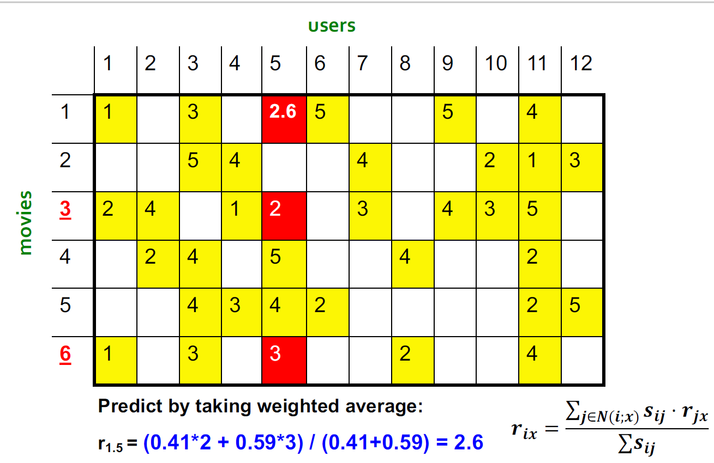
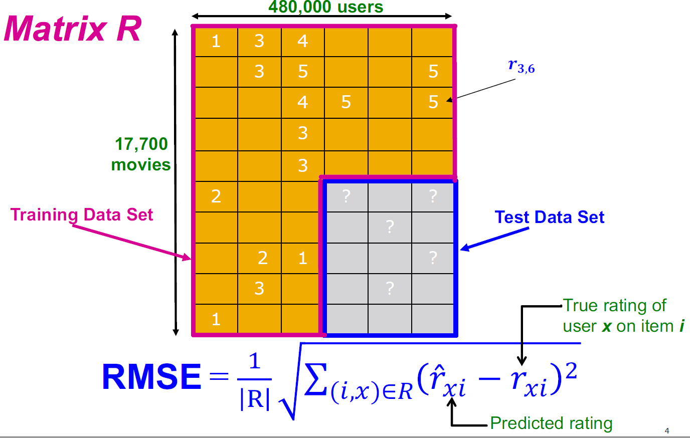

Lecture8-推荐系统
---

# 1. 引入:推荐系统的例子
1. 京东推荐系统
2. 推荐产品和食物
3. 两个客户:
   1. 客户X:购买了CD1和CD2
   2. 客户Y:搜索了CD1，那么推荐系统将会根据从客户X处收集到的信息推荐给客户CD2

# 2. 推荐
1. 用户执行物体搜索，推荐系统根据情况返回推荐结果

## 2.1. 什么是推荐系统
1. 推荐系统是提供推荐给用户的系统
   1. 过多的信息(信息过载)
   2. 用户有太多的选择
2. 根据用户的口味，来推荐用户不同的商品
   1. 协助用户发现信息
   2. 减少搜索和导航的时间

## 2.2. 从缺乏到丰富
1. 货架空间是稀缺的传统商品零售商，同样的还有电视网络、电影院
2. Web使有关产品信息的成本接近零传播：从稀缺到丰富
3. 更多选择需要更好的过滤器
   1. 推荐引擎
   2. 稀薄空气如何使畅销书籍《接触虚空》

## 2.3. 长尾模式

## 2.4. 实体和线上

## 2.5. 推荐分类
1. 编辑和策划
   1. 收藏夹列表
   2. “基本”项目清单
2. 简单的集合
   1. 前10名，最受欢迎，最近上传
3. 针对个人用户
   1. 亚马逊，Netflix等…

## 2.6. 推荐系统一般模型
1. $X$是消费者集合
2. $S$是物体集合
3. 使用函数:$u: X * S \to R$
   1. $R$是评分集合
   2. $R$是一套完全有序的集合
   3. 比如，0-5星，0-1分
4. Utility Matrix

# 3. 推荐系统概念

## 3.1. 用户和物体的对比

## 3.2. 个性化
1. 个性化 = 用户匹配系统
2. 交互式基于用户个人数据情况而个性化展开的
   1. 个性化网页
   2. 个性化指导
   3. 个性化推荐

## 3.3. 和BDA的联系
环境智能 = 普适计算 + 智能接口(比如个性化)

## 3.4. 用户信息
> 从简单到复杂
1. 人口统计学信息:年龄、性别、低于
2. 兴趣、偏好、专业级别
3. 购买记录、观察行为
4. 打分
5. ...
6. 计算生活日志

### 3.4.1. 用户信息的来源
1. 用户直接的输入(如调查问卷)
2. 通过系统非显式收集到
   1. 观察/记录用户行为
   2. 学习/推理用户的兴趣/偏好/级别
3. 集合使用所有的方法
4. 其他的维度:公有/私有

## 3.5. 用户信息的获取
1. 格式:
   1. 原数据
   2. 概括(发现模式 & 生成)
      1. 统计性机器学习方法
      2. 基于ML方法的知识
   3. 保持以上两种的方式(在时间上去重新学习或者适应)，保持原数据的有效时间
2. 他人插入过程可能会导致信息的误收集

## 3.6. 关键问题
1. 收集矩阵的“已知”评分：如何收集Utility Matrix中的数据
2. 从已知评级中推断未知评级：主要对高未知等级感兴趣，我们对了解自己不喜欢的东西并不感兴趣
3. 评估外推方法：如何衡量推荐方法的成功/绩效
4. 冷启动问题:
   1. 对于长时期的资料不起作用
   2. 必须可以对短期资料进行预测
5. 转换模型
   1. 用户没有直接的输入
   2. 不能直接的表达兴趣
6. 模糊的
   1. 比明确的资料要更糟
   2. 很多的用户
   3. 很多的物品或网页
   4. 资料信息更短
7. 隐藏网络
   1. 很多的网页是通过数据库查询提供的
   2. 网页的重要性不能通过日志显示出来
   3. 不能推荐无差别的物体

### 3.6.1. 收集评分

#### 3.6.1.1. 显式收集
1. 让用户打分可能是最精确的评分
2. 最常用（1至5、1至7的李克特反应量表）
3. 研究课题
   1. 最佳粒度 表示10点制在电影dom中被更好地接受了。在讨论的笑话推荐器中选择了更细粒度的制式
   2. Goldberg等。 （2001），其中使用了连续刻度（从-10到+10）和图形输入栏
      1. 离散化不会造成精度损失
      2. 可以更精细地捕获用户首选项
      3. 用户实际上“喜欢”图形交互方法
   3. 多维等级（每部电影的多重等级，例如演员和声音的等级）
4. 主要问题
   1. 用户并不总是愿意为许多项目评分：可用评分的数量可能太少>评分矩阵稀疏->推荐质量较差
   2. 如何刺激用户给更多物品评分？

#### 3.6.1.2. 非显式收集
1. 从给用户行为中学习到评分:购买行为意味着高评级
2. 通常由嵌入了推荐系统的网上商店或应用程序收集
3. 例如，当客户购买商品时，许多推荐系统会将此行为解释为好评
4. 评价指标:点击次数，浏览量，在某些页面上花费的时间，下载
5. 隐式评价可以不断收集，不需要用户方面的额外努力
6. 主要问题
   1. 不能确定用户行为是否被正确解释
   2. 例如，用户可能不喜欢他或她购买的所有书籍；用户也可能已经为别人买了一本书
7. 除了显式的评价外，还可以使用隐式评价。解释的正确性问题

### 3.6.2. 从已知评级中推断未知评级
1. 核心问题:Utility Matrix是稀疏的
   1. 大多数用户不会给大多数物体打分
   2. 冷启动
      1. 新物体没有评分
      2. 新用户没有足迹
2. 实现推荐系统的三个方法
   1. 基于内容的推荐系统:主要
   2. 基于协同的推荐系统:主要
   3. 基于潜在因子的推荐系统

## 3.7. 协同过滤方法的优点
1. 不需要明确的用户打分和用户交互
2. 通过更有效的使用不同步数据来保护用户隐私
3. 大量用户数据使得协同过滤更加有效:如果我们大规模的使用它
4. 基于内容、基于知识的方法很难使用在网络数据上

## 3.8. 网络个性化过程
1. 生成聚集用户模型
   1. 不是一个用户而是一个集群的用户
   2. 离线过程过程
   3. 步骤
      1. 聚类用户交易
      2. 聚类物品或页面浏览路径
      3. 关联挖掘规则
      4. 序列化发现模式
2. 提供推荐
   1. 在线过程
   2. 结合用户的动态进程，提供动态内容

- online-process

## 3.9. 用户建模
1. 根据用户的应用和使用来划分用户模型：跨应用程序可重用
2. 大多数还是理论的，并不实际
3. 最新状态:每一个应用有他自己的用户模型来完成其特定的任务

# 4. 基于内容的推荐系统
1. 核心思想:向客户推荐商品x与以前被x高度评价的商品相似
2. 例子:
   1. 电影推荐:推荐由相同演员、导演和主演的电影
   2. 网络、博客和新闻:推荐由相似内容的其它网站

## 4.1. 推荐过程

## 4.2. 物体资料
1. 为每个物体创建一个物体资料
2. 物体资料是一组特征（向量）
   1. 电影：作者，标题，演员，导演，…
   2. 文本：文档中的一组“重要”词
3. 如何选择重要功能？
   1. 文本挖掘中通常使用的启发式方法是TF-IDF（术语频率*反文档频率）
      1. 词：功能
      2. 文档：项目

## 4.3. TF-IDF
1. $f_{ij}$是术语（功能）的频率i在文档中（项目）j

$TF_{ij} = \frac{f_{ij}}{max_{k}f_{kj}}$

2. $n_i$是提及术语i的文档数
3. $N$是文档总数

$IDF_i = \log\frac{N}{n_i}$

4. TF-IDF评分:$w_{ij} = TF_{ij} * IDF_i$
5. 文档资料:TF-IDF分数最高的一组单词，以及它们的分数

## 4.4. 用户资料和预测
1. 用户个人资料的可能形式
   1. 额定物体资料的加权平均值
   2. 差异：权重与平均评分的差异
2. 预测启发式：给定用户资料x和项目资料i，估算$u(x,i) = cos(x,i) = \frac{x*i}{||x|| * ||i||}$

## 4.5. 基于内容方法的优点
1. 无需其他用户的数据：无冷启动或稀疏问题
2. 可以向口味独特的用户推荐
3. 可以推荐不受欢迎的新商品：没有一流的问题
4. 能够提供解释：可以通过列出导致推荐项目的内容功能来提供推荐项目的说明
5. 需要设置衰减机制来模拟喜好的变更

## 4.6. 基于内容方法的缺点
1. 很难找到合适的功能：例如图像，电影，音乐
2. 对新用户的建议：如何建立用户档案？
3. 过度专业化
   1. 绝不推荐用户资料之外的项目
   2. 人们可能有多种兴趣
   3. 无法利用其他用户的质量判断

## 4.7. 讨论和总结
- 与协作方法相反，基于内容的技术不需要用户社区即可工作
- 提出的方法旨在基于显式或隐式反馈来学习用户兴趣偏好的模型：从用户行为中获取隐式反馈可能会出现问题
- 评估表明，借助机器学习技术可以实现良好的推荐准确性：这些技术不需要用户社区
- 存在推荐列表包含太多相似项目的危险
  - 所有学习技术都需要一定数量的训练数据
  - 一些学习方法倾向于过度拟合训练数据
- 在商业环境中很少发现基于纯内容的系统

# 5. 基于协同的推荐系统
1. 协同过滤:利用其他用户的质量判断

## 5.1. 协同过滤过程
1. 我们考虑用户X
2. 查找评级与x评级“相似”的其他用户的N个集合
3. 根据N个用户的评分来估算x的评分

## 5.2. 协同过滤(Collaborative Filtering, CF)
- 推荐的最杰出方法
  - 由大型商业电子商务网站使用
  - 很好理解的，存在各种算法和变体
  - 适用于许多领域（书籍，电影，DVD等）
- 方法：使用“人群的智慧”推荐项目基本假设和想法
- 用户对目录项进行评分（隐式或显式）：过去口味相似的客户将来也会口味相似

## 5.3. 基于用户的最近邻协同过滤
- 基本技巧：给定“活跃用户”（爱丽丝）和爱丽丝尚未看到的商品
  - 找到一组过去喜欢与Alicein相同的商品并且对商品i进行了评分的用户（同龄人/最近的邻居）
  - 使用，例如 如果爱丽丝会喜欢第i项，则可以预测他们的平均评分
  - 对Alice没看过的所有商品执行此操作，并推荐评分最高的
- 基本假设和想法：如果用户过去具有相似的口味，将来他们也会具有相似的口味。用户偏好会随着时间的推移保持稳定和一致

## 5.4. 找到相似的用户
1. 我们让$r_x$作为用户x的评分向量
2. Jaccard相似度
   1. $J(A,B) = \frac{|A\cap B|}{|A \cup B|}$
   2. 问题是忽略了评分的价值
   3. 我们把$r_x$和$r_y$作为集合
      1. $r_x = \{1, 4, 5\}$
      2. $r_y = \{1, 3, 4\}$
3. 余弦相似度:问题是把没有评分的部分作为负面情况
   1. $sim(x,y) = cos(r_x, r_y) = \frac{r_x * r_y}{||r_x||*||r_y||}$
   2. 我们把$r_x$和$r_y$作为点
      1. $r_x = \{1, 0, 0, 1, 3\}$
      2. $r_y = \{1, 0, 2, 2, 0\}$ 
4. 皮尔逊相关系数，$S_{xy}$指的是物体和用户x、y的相似性
   1. $\overline{r_x}$和$\overline{r_y}$是x和y的均值评分

$sim(x,y) = \frac{\sum\limits_{s \in S_{xy}}(r_xs - \overline{r_x})(r_ys - \overline{r_y})}{\sqrt{\sum\limits_{s \in S_{xy}}(r_xs - \overline{r_x})^2 \sqrt{\sum\limits_{s \in S_{xy}}(r_ys - \overline{r_y})^2}}}$

## 5.5. 相似矩阵例子

- 直观地我们想要：sim（A，B）> sim（A，C）
  - Jaccard相似度：1/5 <2/4
  - 余弦相似度：0.386> 0.322
    - 认为缺失的评分为“负面”
    - 解决方案：减去（行）平均值，sim A,B vs A,C: 0.092 > -0.55
    - 注意余弦模拟。是数据以0为中心时的相关性

## 5.6. 评分预测
1. 从相似性指标到建议：
   1. 设$r_x$为用户x评分的向量
   2. 设N为与x最相似的，对项目i评分的k个用户的集合
   3. 对用户x的项目s的预测：($S_{xy}$是$sim(x,y$的缩写)

$$
r_{xi} = \frac{1}{k}\sum\limits_{y\in N} r_{yi} \\ 
r_{xi} = \frac{\sum\limits_{y\in N s_{xy} * r_{yi}}}{\sum\limits_{y\in N} s_{xy}}
$$

## 5.7. 物品-物品协同过滤
- 到目前为止：用户-用户协作过滤
- 另一种观点：项目
  - 对于项目i，找到其他类似的项目
  - 根据类似项目的评级估算项目i的评级
  - 可以使用与用户-用户模型相同的相似性指标和预测功能

$$
r_{xi} = \frac{\sum\limits_{j \in N(i; x)} s_{ij} * r_{xj}}{\sum\limits_{y \in N(i; x)}S_{ij}}
$$

1. $s_{ij}$是物体i和j之间的相似度
2. $r_{xj}$是用户u对物体j的评分
3. $N(i;x)$是设置由x评分与i相似的项目

### 5.7.1. 例子

|   |  |
| -------------------- | -------------------- |
|  |  |
|  |                      |

### 5.7.2. CF:Common Practice
- 定义项i和j的相似度$s_{ij}$
- 选择k个最近的邻居N（i; x）:与x最相似的项目，由x评分
- 将等级$r_{xi}$估计为加权平均值：

$$
r_{xi} = b_{xi} + \frac{\sum\limits_{j \in N(i; x)} s_{ij} * (r_{xj} - b_{xj})}{\sum\limits_{j \in N(i; x)}s_{ij}} \\
b_{xi} = \mu + b_x + b_i
$$

- $\mu$:电影整体平均收视率
- $b_x$:用户x的评分偏差 = （用户x的平均评分）- $\mu$
- $b_i$:电影i的评分偏差

## 5.8. 对于物体-物体和用户-用户

- 在实践中，已经观察到物体-物体通常比用户-用户更好地工作
- 为什么？物体更简单，用户有多种口味

## 5.9. 数据稀疏性问题
- 冷启动问题：如何推荐新商品？向新用户推荐什么？
- 直接的方法
  - 要求/强迫用户对一组项目进行评分
  - 在初始阶段使用另一种方法（例如，基于内容的，人口统计学的或只是非个性化的）
  - 默认投票：为只有两个要比较的用户之一进行评分的项目分配默认值（Breese等，1998）
- 备择方案
  - 使用更好的算法（超越最近的邻域方法）
  - 例：
    - 在最近邻居方法中，足够相似的邻居的集合可能太小而无法做出好的预测
    - 假设邻居的“传递性”

## 5.10. 协同过滤的优点
适用于任何种类的物品：无需选择功能

## 5.11. 协同过滤的缺点
- 冷启动：系统中需要足够的用户才能找到匹配项
- 稀疏度：
  - 用户/评分矩阵稀疏
  - 很难找到评分相同的用户
- 最初评分：
  - 无法推荐以前未评级的项目
  - 新项目，神秘项目
- 人气偏见：
  - 无法向有独特品味的人推荐产品
  - 倾向于推荐热门商品

# 6. 混合方法
- 实施两个或更多不同的推荐人并结合预测：也许使用线性模型
- 将基于内容的方法添加到协作过滤中
  - 新物体问题的物体资料
  - 应对新用户问题的人口统计数据

# 7. 重要并且实际的建议

## 7.1. 评估
|                      |                      |
| -------------------- | -------------------- |
|  |  |

- 将预测与已知评级进行比较
  - 均方根误差（RMSE）:$\sqrt{\sum\limits_{xi}(r_{xi} - r_{xi}^*)^2}$，其中$r_{xi}$为预测值，$r_{xi}^* $是x在i上的真实评级
  - 预测前10位
  - 排序相关性：Spearman相关性在系统和用户完整排名之间
- 另一种方法:0/1模型
  - 承保范围：系统可以预测的项目/用户数
  - 精度：预测的准确性
  - 接收器工作特性（ROC）：误报与误报之间的折衷曲线

## 7.2. 错误矩阵
1. 仅仅关注准确率有时候会丢失重点
   1. 预测多样性
   2. 预测上下文
   3. 预测顺序
2. RMSE可能会惩罚一种对高评级有效而对其他不利的方法

## 7.3. 复杂度和速度
- 昂贵的步骤是找到k个最相似的客户：$O(|X|)s$
- 在运行时执行成本太高：可以预先计算
- 朴素的预计算需要时间$O(k * |X|)$：X:客户群
- 我们已经知道该怎么做！
  - 高维（LSH）的近邻搜索
  - 聚类
  - 降维

## 7.4. 添加数据
1. 利用所有数据
   1. 请勿尝试减少数据大小以使精美算法发挥作用
   2. 处理大数据的简单方法最有效
2. 添加更多数据例如，在流派上添加IMDB数据

# 8. Netflix比赛
1. 训练集:
   1. 1亿评分，480,000用户，17,770电影
   2. 使用了六年的数据:2000-2005
2. 测试集
   1. 最后2,800,000用户的评分信息
   2. 评估效果:RMSE(Root Mean Square Error):$=\frac{1}{|R|}\sqrt{\sum\limits_{(i, x)\in R}(\hat{r_{xi}} - r_{xi})^2}$
   3. Netflix系统RMSE:0.9514
3. 比赛:
   1. 2,700+团队
   2. 1,000,000奖励给为Netfix达到10%提升的团队

|                      |                      |
| -------------------- | -------------------- |
|  |  |

## 8.1. BellKor 推荐系统
1. Netfix挑战的获胜者
2. 数据的多尺度建模：将数据的顶级“区域”建模与精致的本地视图结合起来：
   1. 全球：用户/电影的总体偏差
   2. 因式分解：解决“区域性”影响
   3. 协同过滤：提取局部模式

### 8.1.1. 局部建模和全局提升
1. 全局上
   1. 平均影片评分为3.7星
   2. 电影第六感比平均分要高0.5星
   3. Joe打分比平均分低0.2星
   4. 可以推断出来:Joe给电影第六感打分4星
2. 局部邻居(CF/NN):Joe不喜欢相关的电影Signs，最终推断 出来Joe会给电影第六感打分3.8分

### 8.1.2. CF:协同过滤
- 最早和最受欢迎的协作过滤方法
- 从“相似”电影（项目-项目变体）中获得未知的评级
- 定义项目i和j的相似性度量$s_{ij}$
- 选择k个最近的邻居，计算等级：$N(i; x)$：与x评级最相似的项

$$
\hat{r_{xi}} = \frac{\sum\limits_{j \in N(i; x)}s_{ij} * r_{xj}}{\sum\limits_{j \in N(i; x)} s_{ij}}
$$

1. $s_{ij}$:项目i和j的相似性
2. $r_{xj}$:用户x对项目j的评级
3. $N(i; x)$:与x评分的与项目i相似的项目集
4. 实际上，如果我们能得到更好的估计
模型偏差：

$$
\hat{r_{xi}} = b_{xi} + \frac{\sum\limits_{j \in N(i; x)} s_{ij} * (r_{xj} - b_{xj})}{\sum\limits_{j \in N(i; x)}s_{ij}} \\
b_{xi} = \mu + b_x + b_i
$$

- 问题/问题：
  - 相似性度量是“任意的”
  - 成对相似性忽略了用户之间的相互依赖性
  - 取加权平均值可能是限制
- 解决方案：代替$s_{ij}$，使用我们直接根据数据估算的$w_{ij}$

### 8.1.3. 想法:使用权重$w_{ij}$来修正
1. 使用权重和而不是权重均值

$\hat{r_{xi}} = b_{xi} + \sum\limits_{j \in N(i;x)} w_{ij}(r_{xj} - b{xj}$

2. 注意点
   1. $N(i; x)$：用户x评分与电影i类似的电影的集合
   2. $w_{ij}$是插值权重（一些实数），我们允许$\sum\limits_{j \in N(i;x) w_{ij} \neq 1$
   3. $w_{ij}$模拟电影对之间的对应（不取决于用户x）
3. 如何设置$w_{ij}$
4. 误差矩阵:
   1. $\frac{1}{|R|}\sqrt{\sum\limits_{(i, x)\in R}(\hat{r_{xi}} - r_{xi})^2}$
   2. 或者等效SSE：$\sum\limits_{(i, x)\in R}(\hat{r_{xi}} - r_{xi})^2$
5. 找到$w_{ij}$在训练集上最小化SSE
6. $w_{ij}$可以根据x和其他所有对i进行评级的用户来学习/估算

## 8.2. 优化推荐问题
1. 目标:完成好的推荐
   1. 使用RMSE量化优势：
   2. 降低RMSE => 更好的建议
2. 希望对用户尚未看到的项目提出好的建议。实际做不到！
3. 假设建立一个可以在已知（用户，物品）评分上正常运行的系统，并希望该系统也能很好地预测未知评分
4. 想法：让我们设置值w，使其在已知（用户，商品）评分上正常运行
5. 如何找到这样的值w？
6. 想法：定义目标函数并解决优化问题
7. 找到可将训练数据上的SSE降至最低的$w_{ij}$！

$J(W) = \sum\limits_{x, i}([b_{xi} + \sum\limits_{j \in N(i; x)} w_{ij}(r_{xj} - b_{xj})]-r_{xi})^2$

## 8.3. 差值权重
1. 我们有一个优化问题，如何解决呢？梯度下降法
   1. 迭代直到收敛:$w\leftarrow w - \eta \triangledown_w j$
   2. 收敛是指:$|w_{new} = w_{old}| \leq \epsilon$
   1. $\triangledown_w j$是梯度

$$
\triangledown_w j = [\frac{\delta J(w)}{\delta w_{ij}}] = 2\sum\limits_{x, i}([b_{xi} + \sum\limits_{j \in N(i; x)} w_{ij}(r_{xj} - b_{xj})]-r_{xi})(r_{xi} - b_{xj}) \\
for\ j \in \{N(i;x),\forall i, \forall x\} \\
else\ \frac{\delta J(w)}{\delta w_{ij}} = 0
$$

- 我们为每一个电影i，计算到$r_{xi}$,对于每一个电影$j \in N(i;x)$，我们计算梯度
- 14页

# 9. 基于知识的推荐系统
- 情景或者限制条件

## 9.1. 基本的I/O关系
1. 基于知识的推荐系统:告诉我什么满足我的需求

## 为什么我们需要基于知识的推荐系统
1. 可用评分较低的产品
2. 时间跨度起着重要作用
  1. 五年的计算机评级
  2. 用户生活方式或家庭情况的变化
3. 客户想要明确定义他们的需求：“汽车的颜色应该是黑色的”

## 基于知识的推荐系统
1. 基于约束
   1. 基于明确定义的推荐规则
   2. 履行推荐规则
2. 基于案例
   1. 基于不同类型的相似性度量
   2. 检索与指定要求相似的项目
3. 两种方法的相反推荐过程相似
   1. 用户指定要求
   2. 系统尝试确定解决方案
   3. 如果找不到解决方案，则用户更改要求

## 基于约束的推荐系统
1. 基于知识的
   1. 通常在用户模型和项目属性之间进行折中
   2. 变量：用户模型功能（需求），物体功能（目录）
   3. 约束集
      1. 逻辑含义（如果用户要求A，那么建议的项目应具有特征B）
      2. 硬约束和软约束/加权约束
      3. 解决方案偏好
2. 得出一组推荐项
   1. 满足一系列适用约束
   2. 约束的适用性取决于当前的用户模型
   3. 概要-推理的透明线