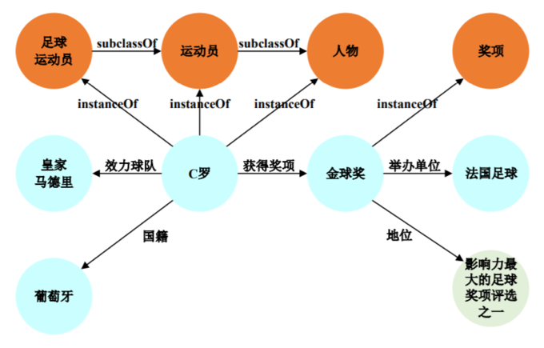

Lecture9-Spark与数据分析
---

# 1. 复习
1. MapReduce
   1. 轻松编写应用程序，以可靠，容错的方式在大型集群上并行处理大量数据
   2. 负责安排任务，监视任务并重新执行失败的任务
2. HDFS和MapReduce：在同一组节点上运行à计算节点和存储节点相同（使数据接近计算）à高吞吐量
3. YARN＆MapReduce：一个主资源管理器，每个节点一个从属节点管理器，每个应用程序一个AppMaster

# 2. 数据处理的目标
1. 低延迟（交互式）历史数据查询：做出更快的决策，例如，确定网站运行缓慢的原因并进行修复
2. 对实时数据（流）的低延迟查询：启用对实时数据的决策，例如，实时检测和阻止蠕虫（蠕虫可能在1.3秒内感染100万台主机）
3. 先进的数据处理：实现“更好”的决策，例如，异常检测，趋势分析

# 3. 今天的开源分析框架
1. 主要针对大型磁盘数据集：非常适合批处理，但速度较慢

# 4. 目标
- 易于组合批处理，流式处理和交互式计算
- 易于开发复杂的算法
- 与现有开源生态系统（Hadoop / HDFS）兼容

# 5. 支持互动和流媒体压缩
1. 积极使用内存
2. 为什么？
   1. 内存传输率>>磁盘或SSD
   2. 许多数据集已经适合内存
      1. Facebook，Yahoo！和Bing群集中超过90％的工作输入适合内存
      2. 例如1TB = 10亿条记录@每个1KB
3. 内存密度（仍）随摩尔定律增长：即将推出的RAM / SSD混合存储器

4. 增加并行度，为什么？减少每个节点的工作量–改善延迟
5. 技术：
   1. 实现高局部性的低延迟并行调度程序
   2. 优化的并行通信模式（例如，随机播放，广播）
   3. 从故障和缓解混乱中有效恢复