Lecture9-知识图谱
---
1. 作业在YAGO上完成

# 1. 知识图谱
1. 知识图谱概念
2. 知识图谱内涵
3. 知识图谱优势
4. 知识图谱价值
5. 典型知识图谱

# 2. 知识图谱概念
1. 知识图谱(Knowledge Graph)本质上是一种**大规模语义网络** (semantic network)，富含实体(entity)、概念(concepts) 及其之间的各种语义关系 (semantic relationships)
2. 作为一种语义网络，是大数据时代知识表示的重要方式之一
3. 作为一种技术体系，是大数据时代知识工程的代表性进展
4. 知识图谱示例子。知识图谱富含实体、概念、属性、关系等信息

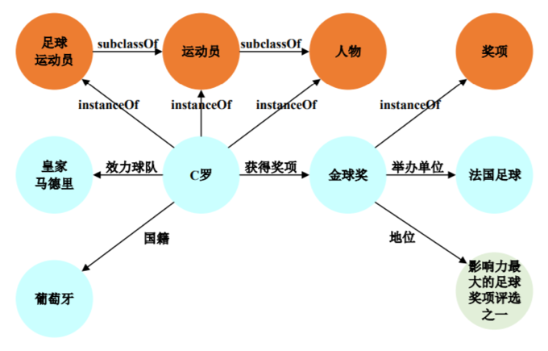

## 2.1. 知识图谱分类
1. 领域（行业）知识图谱 (Domain specific Knowledge Graph)：聚焦于特定领域或者行业的知识图谱
2. 企业知识图谱(Enterprise knowledge graph)：贯穿企业各业务部门的知识图谱

## 2.2. 知识图谱的源头

## 2.3. 知识图谱应用
1. 2012年5月，Google收购Metaweb 公司，并正式发布知识图谱
2. 搜索核心需求： 让搜索通往答案
   1. 无法理解搜索关键词
   2. 无法精准回答
3. 根本问题
   1. 缺乏大规模背景知识
   2. 传统知识表示难以满足需求

# 3. 知识图谱内涵
1. 开放和封闭的知识图谱:开放是可以添加知识进来，而封闭的则不可以
2. 定义本体:在作知识图谱之前一定要先明确是开放还是封闭的

## 3.1. KG组成：Node-Entity
1. Entity/Objects/Instances:维基百科：实体就是东西,它本身，作为主体或作为对象存在，实际上或潜在地，具体地或抽象地，物理地或非物理地存在。
2. Concept:概念
   1. 在形而上学，尤其是本体论中，概念是存在的基本类别。
   2. 类别的（心理）表示
3. Category:类别有共同点的实体组；
4. Type/class:类型/类别，WIKITIONARY：基于共享特征的分组； 一类。

## 3.2. KG组成：Node-Entity例子
1. Date：特朗普 出生日期 1946年6月14日
2. String：特朗普 简介“唐纳德·特朗普(Donald Trump)，第45任美国总统，1946 年6月14日生于纽约，美国共和党籍政治家”
3. Numeric：特朗普 年龄 71

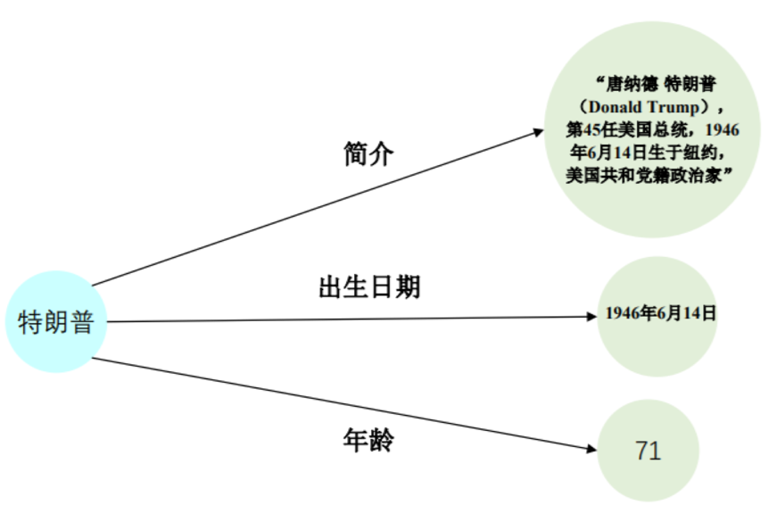

- 每一个信息都是node，这个node是可以被重用的，比如年龄71的点

## 3.3. KG组成：Edge
1. Relation:
   1. 侧重实体(indvidual)之间的关系
   2. 例子:
      1. 坐着：坐在桌子上的苹果
      2. 更高：华盛顿纪念碑比白宫高
2. Property/Attribute/Quality(属性)
   1. 描述对象的特征/质量
   2. 例子：对象的大小，颜色，重量，成分等

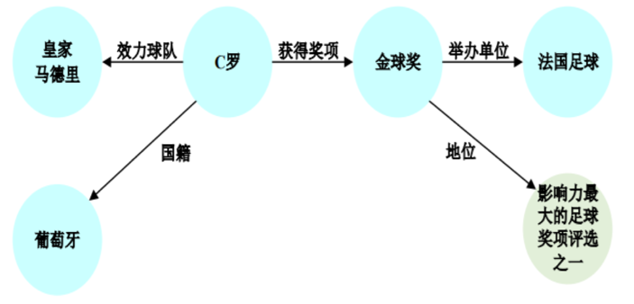

# 4. 知识图谱源起
  
## 4.1. 知识工程(KE)的缘起-Symbolism，符号主义
1. 符号主义的主要观点
   1. 认知即计算
   2. 知识是信息的一种形式,是构成智能的基
   3. 知识表示、知识推理、知识运用是人工智能的核心

2. 物理符号系统
   1. 物理符号系统具有一般智能操作的必要和充分手段
   2. 可以将思维视为根据正式规则对信息进行操作的设备。
3. GOFAI（老式人工智能，由John Haugeland提出），专注于此类高水平符号，例如`<dog>`和`<tail>`
4. AI System = Knowledge + Reasoning

## 4.2. 代表人物和时间节点

- KE（知识工程）是一门工程学科，涉及将知识集成到计算机系统中，以解决通常需要高水平专业知识的复杂问题。 参考维基百科
- 知识工程是以知识为处理对象，研究知识系统的知识表示、处理和应用的方法和开发工具的学科的方法和开发工具的学科

- 传统知识工程在规则明确、边界清晰、应用封闭的应用场景取得了巨大成功

## 4.3. 传统KE的基本特点
1. 自上而下:严重依赖专家和人的干预
   1. 规模有限
   2. 质量存疑

## 4.4. 传统KE的主要挑战:知识获取困难
1. 隐性知识、过程知识等难以表达，专家不一定愿意分享出来
   1. 如何表达做蛋炒饭的知识？
   2. 老中医看病用到了哪些知识。
2. 领域知识的形式化表达较为困难。
3. 专家知识不可避免地存在主观性，比如都是做一个方向的，表达方式、研究路径可能不一致。
4. 不同专家之间知识可能存在不一致性。
5. 知识表达难以完备，缺漏是常态。

## 4.5. 传统KE的主要挑战:知识应用困难
1. 应用易于超出预先设定的知识边界
2. 很多应用需要常识的支撑
3. 难以处理异常情况
4. 难以处理不确定性推理
5. 知识更新困难

- Example:`Can pig fly?`
- Rule:鸟是可以飞的

> 行业应用中的知识需求难以封闭于预设的领域知识边界内

## 4.6. 互联网应用催生大数据世代知识工程(BigKE)
1. 大规模开放性应用
   1. 永远不知道用户下一个搜索关键字是什么
   2. “创造101”、“吃鸡”、“纸片人”、“蛙儿”
2. 精度要求不高:搜索引擎从来不需要保证每个搜索的理解和检索都是正确的
3. 应用/推理简单
4. 大部分搜索理解与回答只需要实现简单的推理
   1. 简单推理：姚明的身高是多少，一跳就可以解决
   2. 复杂推理：姚明老婆的婆婆的儿子有多高，几跳才可以解决
5. 互联网时代的大规模开放性应用需要全新的知识表示，谷歌知识图谱诞生，知识工程迈入大数据时代

|                      |                      |
| -------------------- | -------------------- |
| 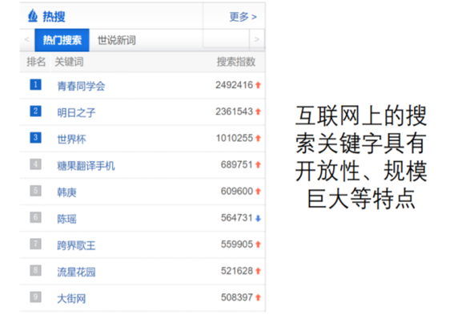 | 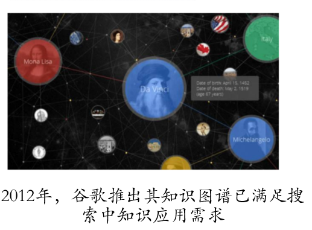 |

## 4.7. 数据驱动的大规模自动化知识获取
1. 自下而上：网页文本、搜索日志、购买记录

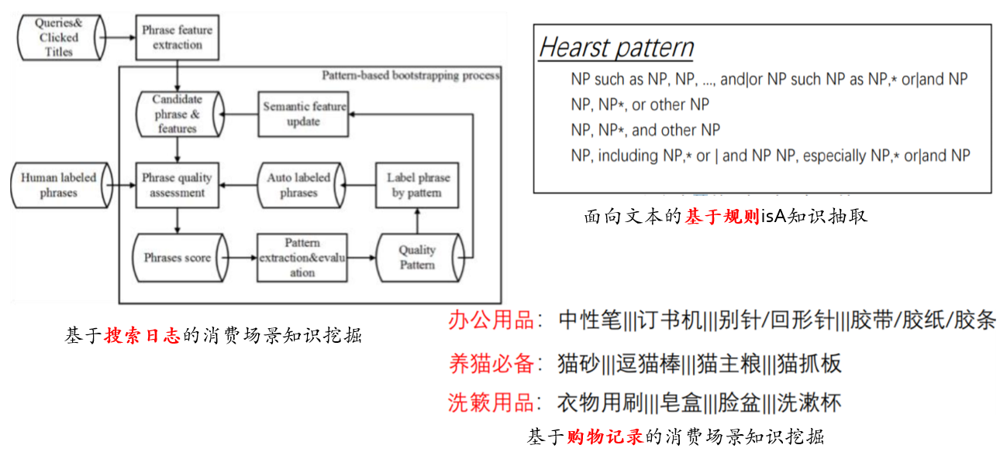

## 4.8. 大数据时代的机遇——众包技术
1. 众包与群智成为大规模知识获取的一条新路径
2. 案例1: 基于知识问答验证码的知识获取:复旦大学知识工场实验室提供知识验证码服务，通过众包的方式对现有知识进行验证

2. 案例2:基于众包的Taxonomy构建，DBpedia通过众包方式构建了DBpedia Ontology

## 4.9. 大数据世代的机遇——高质量UGC
1. Web2.0时代到未，产生大量的高质量UGC(User Generated Content)
   1. 提供获得得广大用户一致认可的高质量数据源
   2. 维基百科, 百度百科
2. 为自动挖掘知识提供了高质量数据源
3. 为构建抽取模型提供了高质量样本

# 5. 知识图谱优势

## 5.1. 大规模
1. 对实体和概念的更大覆盖

## 5.2. 语义丰富
1. 覆盖更多语义关系

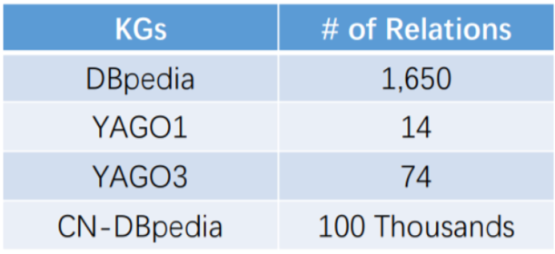
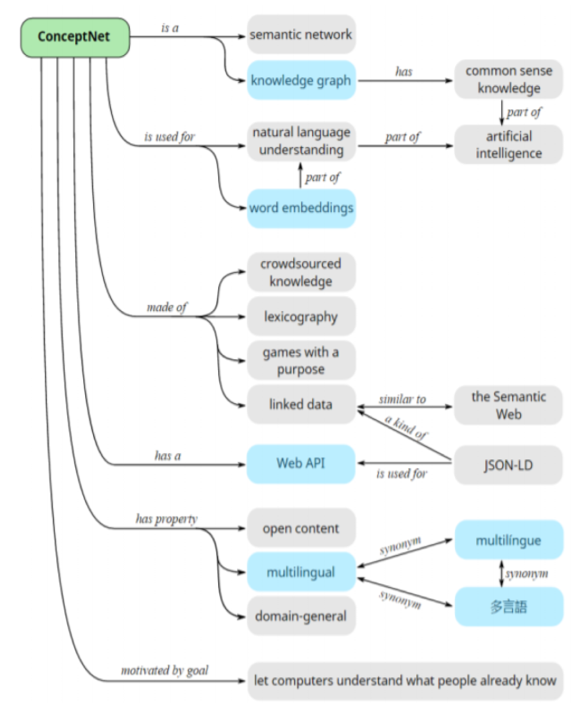

1. 高质量数据
   1. 大数据：多种来源的交叉验证
   2. 众包：质量保证

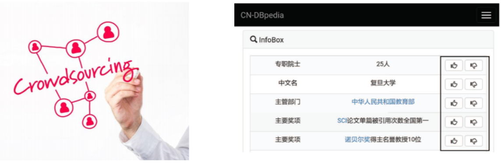

## 5.3. 友好的结构
1. 结构化的组织
   1. 通过RDF
   2. 按图

|                      |                      |
| -------------------- | -------------------- |
|  |  |

# 6. 越来越多的知识图谱应运而生
|                      |                      |
| -------------------- | -------------------- |
| 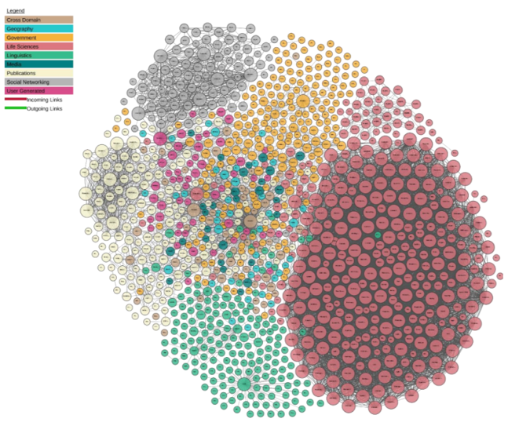 |  |

# 7. 知识图谱的价值

## 7.1. 未来已至:人类已经进入智能时代
1. **大数据的日益积累、计算能力的快速增长**为人类进入智能时代奠定了基础
2. 大数据为智能技术的发展带来了前所未有的数据红利
3. 机器**计算智能、感知智能**达到甚至超越人类

## 7.2. 智能化升级与转型
1. 智能化升级与转型已经成为各行各业的普遍诉求
2. 从信息化走向智能化是必然趋势
3. AI+成为AI赋能传统行业的基本模式
4. 战略意义
   1. 全方位、深度渗透到各行各业、各个环节
   2. 颠覆性影响，重塑行业形态，甚至社会形态

## 7.3. 认知智能是智能化的关键

- 理解与解释是后深度学习时代人工智能的核心使命之一

## 7.4. 知识图谱使能认知智能
1. 机器理解数据的本质：建立从数据到知识库中实体、概念、关系的映射
2. 机器解释现象的本质：利用知识库中实体、概念、关系解释现象的过程

## 7.5. 知识图谱使能机器语言认知
1. 对机器的语言理解需要知识库
   1. 大规模
   2. 语义丰富
   3. 友好的结构
   4. 高质量
2. 传统知识表示不能满足这些要求，但是KG可以
   1. 本体
   2. 语义网络/框架
   3. 文字
3. NLP + KB = NLU，NLP =自然语言处理，NLU =自然语言理解

## 7.6. 知识图谱使能可解释人工智能

> 解释取决于人类认知的基本框架；概念、属性、关系是认知的基石。

## 7.7. 知识引导成为解决问题的主要方式

- 数据驱动利用统计模式解决问题
- 单纯依赖统计模式难以有效解决很多实际问题

## 7.8. 知识将显著增强机器学习能力
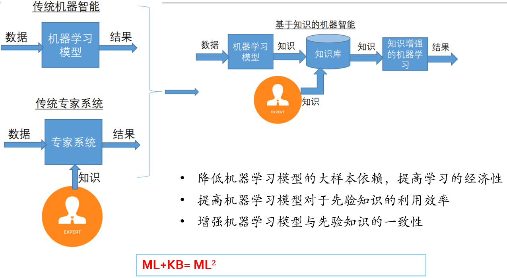

1. 降低机器学习模型的大样本依赖，提高学习的经济性
2. 提高机器学习模型对于先验知识的利用效率
3. 增强机器学习模型与先验知识的一致性

## 7.9. 知识将成为比数据更为重要的资产
1. 大数据时代是得数据者得天下
2. 人工智能时代是得知识者得天下
3. 数据是石油，知识就是石油的萃取物
4. Knowledge is power in AI

# 8. 典型知识图谱

## 8.1. 知识图谱分类
1. 自动化程度
2. 数据来源结构化程度
3. 跨语言
4. 通用/specific

## 8.2. Cyc
1. 简介:常识知识图谱
2. 特点:通过人工方法将上百万条人类常识编码成机器可用的形式，用以进行智能推断
3. 规模:目前ResearchCyc知识图谱中包含了700 万条断言（事实和规则），涉及 63 万个概念，38000 种关系
4. http://www.cyc.com/

## 8.3. WordNet
1. 简介:基于认知语言学的英语词典
2. 样例:S: (n) car, auto, automobile, machine, motorcar (a motor vehicle with four wheels; usually propelled by an internal combustion engine) "he needs a car to get to work"
3. 特点:以同义词集合( synset )作为一个基本单元
4. 规模:

## 8.4. ConceptNet
1. 简介:大型的多语言常识知识库
2. 特点:知识来源丰富
   1. 众包(Crowd-Sourcing)
   2. 资源（例如Wiktionary 和Open Mind Common Sense)
   3. 带目的的游戏（如Verbosity 和 nadya.jp)
   4. 专家创建的资源(如WordNet 和JMDict)

3. http://conceptnet.io/

## 8.5. Freebase/Wikidata
1. 简介:
   1. Freebase 所有知识采用结构化的表示形式，可由机器和人编辑
   2. Wikidata是维基百科的姐妹工程，同样可由机器和人自由编辑
   3. 2016年8月31日，Freebase宣布关闭， 所有数据汇入Wikidata
2. 样例：“Donald Trump”
3. 特点
   1. 众包构建
   2. 结构化三元组
4. 统计：Wikidata目前包含49,915,906个实体

## 8.6. DBpedia
1. 从维基百科页面中自动抽取出结构化的知识，构建而成的大型通用百科图谱
2. 样例:A

3. 特点
   1. 多语
   2. 自动构建
4. 统计
   1. 共收录有 127 种不同语言共计2800万实体
   2. 其中英文实体数量最大，为 467 万
5. http://wiki.dbpedia.org/

## 8.7. Google KG
1. 简介：谷歌知识图谱于2012 年发布，被认为是搜索引擎的一次重大革新
2. 样例："Nanjing University"
3. 特点：
   1. 规模巨大
   2. 用于增强搜索引擎的搜索能力
4. 统计：5700万实体，180亿关系

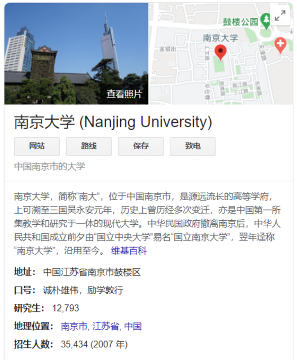

# 9. 领域知识图谱

## 9.1. NoKG(Not Only KG)

## 9.2. DKG与GKG的区别
1. DKG和GKG在知识表示、获取与应用等方面有着显著差异

IMG

## 9.3. DKG和GKG的关系
1. DKG是从GKD通过隐喻获得的，IMG
2. GKG对于DKG有着显著支撑作用，IMG

## 9.4. 为何需要符号化表示的知识图谱
1. 符号表示与分布式表示是两种重要的知识表示形式
2. 已经有两条边了，我们需要通过知识图谱推理补齐第三条边

IMG * 2

## 9.5. 将领域知识赋予机器，解放人类脑力
1. 领域知识的积累与沉淀是智能化的必经路径

IMG

## 9.6. 领域知识图谱系统的生命周期

IMG

## 9.7. DKG如何构建

IMG

- 实体发现可能会用到分类聚类方法

## 9.8. DKG的评价
1. 质量准
2. 规模全
3. 实时新

## 9.9. DKG如何存储
1. 数据库选型依据:
   1. 操作复杂度

IMG

## 9.10. DKG如何查询
1. SPARQL
2. SQL

IMG

## 9.11. DKG应用
1. 搜索
2. 推荐
3. 问答
4. 解释
5. 决策

## 9.12. DKG落地案例
1. 农业知识图谱开源项目

## 9.13. DKG还存在哪些挑战
1. 知识表示
2. 知识获取
3. 知识应用

# 10. 知识图谱问答

## 10.1. IBM Watson
1. 目前应用于医疗行业

## 10.2. 智能搜索