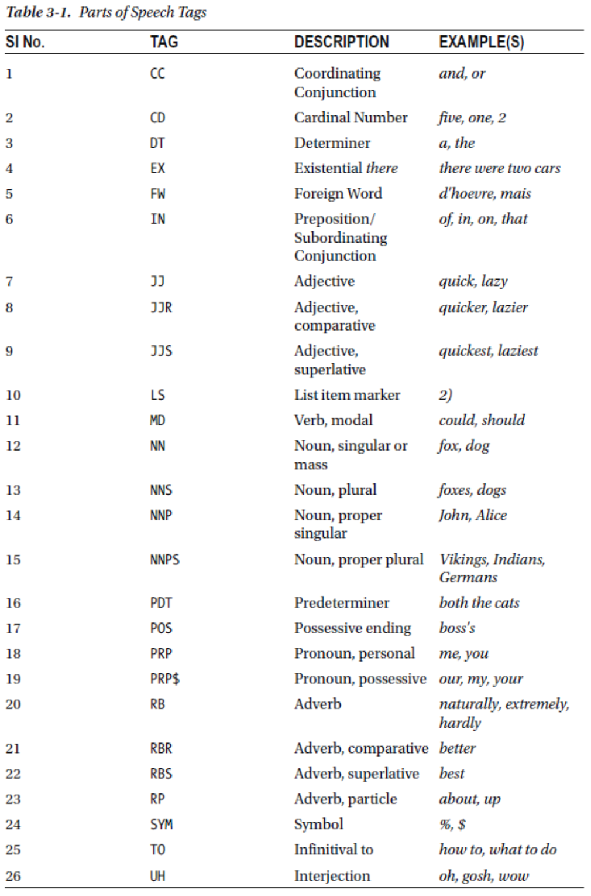
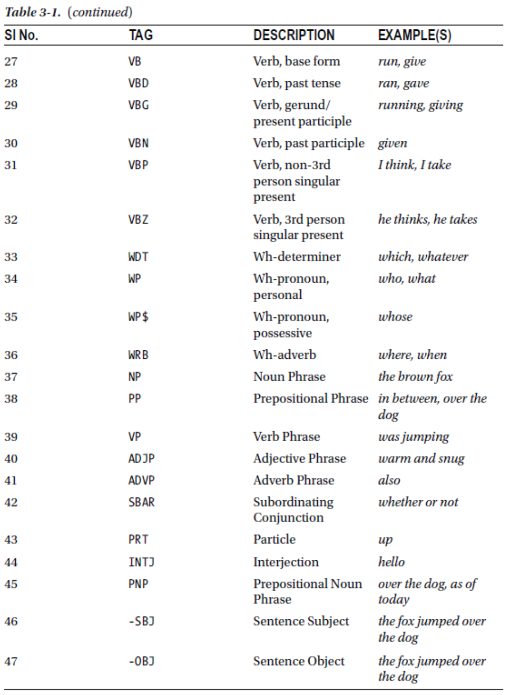

Tec6-文本预处理和关键词处理
---
- 本文是英文处理
- 全部代码附在文末

# 1. 文本预处理

## 1.1. 文本内容处理
1. 首先去除大小写:`line = line.lower()`
2. 然后去除特殊字符:`line = re.sub('[\W_]+', " ", line)`
3. 之后去除对本实验没有意义的数字:`line = re.sub('[0-9]', " ", line)`
4. 排除掉中文字符:`line = re.sub(r'[\u4e00-\u9fa5]', "", line)`

## 1.2. 文本分词
1. 文本分词的导入:`from nltk import word_tokenize`
2. 文本分词的处理:`words = word_tokenize(line)`

## 1.3. 停用词处理
1. 加载停用词表并且完成对分词后的文本进行处理

```py
temp_words = word_tokenize(line)
for word in temp_words:
    if word in stopwords:
        continue
    words.append(word)
```

## 1.4. 词干提取

## 1.5. 词形还原
1. 词形还原是文本预处理中很重要部分
2. 词形还原就是去掉单词的词缀，提取单词的主干部分，通常提取后的单词会是字典中的单词。
3. 和词干提取的不同：提取后的单词不一定会出现在单词中
4. 本文选用了nltk中包含的WordNet所提供的稳健的词形还原的函数。

### 1.5.1. 根据词形获取原单词
```py
from nltk.stem import WordNetLemmatizer

wnl = WordNetLemmatizer()
# lemmatize nouns
print(wnl.lemmatize('cars', 'n')) # cars
print(wnl.lemmatize('men', 'n')) # man

# lemmatize verbs
print(wnl.lemmatize('running', 'v')) # run
print(wnl.lemmatize('ate', 'v')) # eat

# lemmatize adjectives
print(wnl.lemmatize('saddest', 'a')) #sad
print(wnl.lemmatize('fancier', 'a')) # fancy
```

- `lemmatize`需要两个参数，第一个参数是单词，第二个参数是本单词的词形，返回结果为词形还原后的结果
- 问题:指定单词的词形很重要，不然词形还原结果不好。

### 1.5.2. 获取单词的词形
- 在NLP中，使用Parts of Speech(POS)技术实现。在nltk中，可以使用nltk.pos_tags()获取单词在句子中的词形

```py
sentence = 'The brown fox is quick and he is jumping over the lazy dog'
import nltk
tokens = nltk.word_tokenize(sentence)
tagged_sent = nltk.pos_tag(tokens)
print(tagged_sent)
# [('The', 'DT'), ('brown', 'JJ'), ('fox', 'NN'), ('is', 'VBZ'), ('quick', 'JJ'), ('and', 'CC'), ('he', 'PRP'), ('is', 'VBZ'), ('jumping', 'VBG'), ('over', 'IN'), ('the', 'DT'), ('lazy', 'JJ'), ('dog', 'NN')]
```

|  |  |
| ------------------- | ------------------- |

# 2. nltk_data下载失败
- 错误代码
```
LookupError: 
**********************************************************************
  Resource punkt not found.
  Please use the NLTK Downloader to obtain the resource:

  >>> import nltk
  >>> nltk.download('punkt')
  
  For more information see: https://www.nltk.org/data.html

  Attempted to load tokenizers/punkt/english.pickle

  Searched in:
    - 'C:\\Users\\user_name/nltk_data'
    - 'D:\\Anaconda\\nltk_data'
    - 'D:\\Anaconda\\share\\nltk_data'
    - 'D:\\Anaconda\\lib\\nltk_data'
    - 'C:\\Users\\user_name\\AppData\\Roaming\\nltk_data'
    - 'C:\\nltk_data'
    - 'D:\\nltk_data'
    - 'E:\\nltk_data'
    - ''
**********************************************************************
```

> 问题分析:`nltk.download()`无法下载，需要自己下载安装

1. <a href = "http://www.nltk.org/nltk_data/">nltk_data的下载链接</a>
2. 下载后的解压结果放置到以下任意文件中，注意解压文件夹格式
   1. `punkt`:`nltk_data/tokenizers/punkt`
   2. `taggers`:`nltk_data/averaged_perceptron_tagger`
   3. `wordnet`:`nltk_data/corpora/wordnet`
   4. `stopwords`:`nltk_data/corpora/stopwords`

```
- 'C:\\Users\\user_name/nltk_data'
- 'D:\\Anaconda\\nltk_data'
- 'D:\\Anaconda\\share\\nltk_data'
- 'D:\\Anaconda\\lib\\nltk_data'
- 'C:\\Users\\user_name\\AppData\\Roaming\\nltk_data'
- 'C:\\nltk_data'
- 'D:\\nltk_data'
- 'E:\\nltk_data'
```

# 3. 文本关键提取(使用jieba)

## 3.1. 什么是jieba
- jieba较多的应用在中文文本的自然语言处理，比较常用到的是分词
- jieba分词模式:
  - 精确模式，试图将句子最精确地切开，适合文本分析。
  - 全模式，可以把句子中所有的可以分词的词语都扫描出来，速度非常快，但是不能解决歧义问题。
  - 搜索引擎模式，在精确模式的基础上，对长词再次切分，提高召回率，适合用于搜索引擎分词。
- 支持繁体分词
- 支持自定义词典
- MIT授权协议

## 3.2. jieba分词方法

| 方法                               | 描述                                                                                                          | 备注                      |
| ---------------------------------- | ------------------------------------------------------------------------------------------------------------- | ------------------------- |
| cut                                | 方法接受三个输入参数: 需要分词的字符串；cut_all 参数用来控制是否采用全模式；HMM 参数用来控制是否使用 HMM 模型 | 返回一个可迭代的generator |
| cut_for_search                     | 法接受两个参数：需要分词的字符串；是否使用 HMM 模型。该方法适合用于搜索引擎构建倒排索引的分词，粒度比较细     | 返回一个可迭代的generator |
| Tokenizer(dictionary=DEFAULT_DICT) | 新建自定义分词器，可用于同时使用不同词典。jieba.dt 为默认分词器，所有全局分词相关函数都是该分词器的映射。     |                           |

```py
# 官方例程
 
# encoding=utf-8
import jieba
 
seg_list = jieba.cut("我来到北京清华大学", cut_all=True)
print("Full Mode: " + "/ ".join(seg_list))
# 全模式:我/ 来到/ 北京/ 清华/ 清华大学/ 华大/ 大学 

seg_list = jieba.cut("我来到北京清华大学", cut_all=False)
print("Default Mode: " + "/ ".join(seg_list))  
# 精确模式:我/ 来到/ 北京/ 清华大学 
 
seg_list = jieba.cut("他来到了网易杭研大厦")  # 默认是精确模式
print(", ".join(seg_list))
# 新词识别:他, 来到, 了, 网易, 杭研, 大厦 (此处，"杭研"并没有在词典中，但是也被Viterbi算法识别出来了) 
 
seg_list = jieba.cut_for_search("小明硕士毕业于中国科学院计算所，后在日本京都大学深造")
print(", ".join(seg_list)
# 搜索引擎模式：小明, 硕士, 毕业, 于, 中国, 科学, 学院, 科学院, 中国科学院, 计算, 计算所, 后, 在, 日本, 京都, 大学, 日本京都大学, 深造
```

## 3.3. 关键词提取

### 3.3.1. 默认关键词提取方法

```py
text = " ".join(sentences)
keywords = jieba.analyse.extract_tags(text, topK=result_number, withWeight=True, allowPOS=())
```

- `jieba.analyse.extract_tags(sentence, topK=20, withWeight=False, allowPOS=())`
  - topK: 输出的关键词数量，如果是None则全部关键词都输出；
  - withWeight: 输出的关键词是否附带textrank计算出来的权重值
  - allowPOS: 该参数为列表，表示仅显示符合该参数设置词性的关键词
  - withFlag: 输出的关键词是否附带词性

### 3.3.2. textrank方法提取关键词

```py
text = " ".join(sentences)
keywords = jieba.analyse.textrank(text, topK=result_number, withWeight=True, allowPOS=())
```

- `jieba.analyse.textrank(sentence, topK=20, withWeight=False, allowPOS=(‘ns’, ‘n’, ‘vn’, ‘v’))`
  - topK: 输出的关键词数量，如果是None则全部关键词都输出；
  - withWeight: 输出的关键词是否附带textrank计算出来的权重值
  - allowPOS: 该参数为列表，表示仅显示符合该参数设置词性的关键词
  - withFlag: 输出的关键词是否附带词性

- 算法核心是将文本图化
- TextRank相较于TFIDF，更依赖分词结果，如果分词过程中，某些关键词被切分了，就会得到不同的结果，所以工业应用时，会将部分切分的关键词进行合并。

> <a href = "https://www.cnblogs.com/xueyinzhe/p/7101295.html">TextRank算法原理</a>

### 3.3.3. tfidf的方法提取关键词
```py
text = " ".join(sentences)
keywords = jieba.analyse.tfidf(text, topK=result_number, withWeight=True, allowPOS=())
```

> <a href = "https://blog.csdn.net/zrc199021/article/details/53728499">TF-IDF原理及使用</a>

## 3.4. 词形标注
1. 自定义分词器:`jieba.posseg.POSTokenizer(tokenizer=None)`
2. 标注句子分词后每个词的词形，采用和ictclas兼容的标记法。

```py
# 官方例程
import jieba.posseg as pseg
 
words = pseg.cut("我爱北京天安门")
# words类别为：generator
 
for word, flag in words:
    print('%s %s' % (word, flag))

# 我 r 
# 爱 v 
# 北京 ns 
# 天安门 ns
```

# 4. 文本关键词提取(使用rake-nltk)
1. rake是一个基于nltk的快速自动关键词提取算法

```py
from rake_nltk import Rake
from rake_nltk import Metric

r = Rake(max_length = result_number)
text = " ".join(sentences)
r.extract_keywords_from_text(text)

keywords = r.get_ranked_phrases_with_scores()
```


# 5. 文本预处理和关键词处理的完整代码
```py
# -*- coding: utf-8 -*-

import os
import re
import collections
from nltk import word_tokenize, pos_tag
from nltk.corpus import wordnet
from nltk.stem import WordNetLemmatizer
import jieba.analyse
from tqdm import tqdm
import random
from rake_nltk import Rake
from rake_nltk import Metric

result_number = 50

class extractKeyWords:

    def __init__(self, save_path):
        '''
        初始化关键词提取器
        :param save_path: 保存路径
        '''
        self.save_path = save_path
        self.sentences = []
        # stemmer = SnowballStemmer("english")
        words = []
        stopwords = []
        # 加载停用词
        with open("./stopwords.txt" , "r", encoding="utf-8") as f:
            for line in f.readlines():
                stopwords.append(line.strip())
        print("Load Finish! Begin preprocess!")
        # 对每一个词进行处理
        for ACL2020 in tqdm(os.listdir("./ACL2020_txt")):
            with open("./ACL2020_txt/" + ACL2020, 'r', encoding="utf-8") as f:
                for line in f.readlines():
                    # 去除大小写
                    line = line.lower()
                    # 去除特殊字符
                    line = re.sub('[\W_]+', " ", line)
                    # 去除数字
                    line = re.sub('[0-9]', " ", line)
                    # 排除常用中文字符
                    line = re.sub(r'[\u4e00-\u9fa5]', "", line)

                    temp_words = word_tokenize(line)
                    for word in temp_words:
                        if word in stopwords:
                            continue
                        words.append(word)
        # 获取单词词性
        tags = pos_tag(words)

        # 使用WordNetLemmatizer进行词形还原
        wnl = WordNetLemmatizer()
        lemmas_sent = []
        for tag in tags:
            wordnet_pos = self._get_wordnet_pos(tag[1]) or wordnet.NOUN
            lemmas_sent.append(wnl.lemmatize(tag[0], pos=wordnet_pos))  # 词形还原
        self.sentences.append(" ".join(lemmas_sent))
        print("preprocess finish!")

    # 获取单词的词性
    def _get_wordnet_pos(self, tag):
        '''
        根据tag来获取词性
        :param tag:
        :return:
        '''
        if tag.startswith('J'):
            return wordnet.ADJ
        elif tag.startswith('V'):
            return wordnet.VERB
        elif tag.startswith('N'):
            return wordnet.NOUN
        elif tag.startswith('R'):
            return wordnet.ADV
        else:
            return None

    def run(self):
        self.method_1()
        self.method_2()
        self.method_3()
        self.method_4()
        self.method_5()
        self.method_6()
        self.method_7()

    def method_1(self):
        '''
        使用权重
        :return:
        '''
        # 对每个句子进行分词
        print("method1 begin!")
        sentences = [word_tokenize(sentences) for sentences in self.sentences]
        words = []
        for sentence in sentences:
            for word in sentence:
                words.append(word)
        total = len(words)
        counter = collections.Counter(words)
        result = []
        for temp in counter.most_common(result_number):
            temp = list(temp)
            temp[1] = temp[1]/total
            result.append(temp)
        self.write2file(result, "method1_dic.txt")
        print("method1 finish!")

    def method_2(self):
        '''
        使用jieba分词的extract_tags的方法进行运算
        :return:
        '''
        print("method2 begin!")
        text = " ".join(self.sentences)

        keywords = jieba.analyse.extract_tags(text, topK=result_number, withWeight=True, allowPOS=())
        self.write2file(keywords, "method2_dic.txt")
        print("method2 finish!")

    def method_3(self):
        '''
        使用随机的方法，随机选择result_number个关键词
        :return:
        '''
        print("method3 begin!")
        sentences = [word_tokenize(sentences) for sentences in self.sentences]
        words = []
        for sentence in sentences:
            for word in sentence:
                words.append(word)
        total = len(words)
        # 随机获取result_number个元素
        numbers = []
        while len(numbers) <= result_number:
            number = random.randint(0, total - 1)
            if number in numbers:
                continue
            numbers.append(number)
        counter = collections.Counter(words)
        result = []
        for number in numbers:
            result.append([words[number], counter[words[number]] / total])
        # 降序输出
        result.sort(key=lambda x: x[1], reverse=True)
        self.write2file(result, "method3_dic.txt")
        print("method3 finish!")

    def method_4(self):
        '''
        使用jieba分词的tfidf方法获取关键词
        :return:
        '''
        print("method4 begin!")
        text = " ".join(self.sentences)

        keywords = jieba.analyse.tfidf(text, topK=result_number, withWeight=True, allowPOS=())
        self.write2file(keywords, "method4_dic.txt")
        print("method4 finish!")

    def method_5(self):
        '''
        使用相对更加快速的rake算法,使用默认矩阵来进行关键词提取
        :return:
        '''
        print("method5 begin!")
        r = Rake(max_length = result_number)
        text = " ".join(self.sentences)
        r.extract_keywords_from_text(text)

        keywords = r.get_ranked_phrases_with_scores()

        # 标准化输出
        result = []
        head = []
        for keyword in keywords:
            for word in keyword[1].split(" "):
                if(word in head):
                    continue
                result.append([word, keyword[0]])
                head.append(word)
                if(len(head) >= result_number):
                    break
            if (len(head) >= result_number):
                break
        self.write2file(result, "method5_dic.txt")
        print("method5 finish!")

    def method_6(self):
        '''
        使用相对更加快速的rake算法,使用词频矩阵来进行关键词提取
        :return:
        '''
        print("method6 begin!")
        r = Rake(max_length = result_number, ranking_metric = Metric.WORD_FREQUENCY)
        text = " ".join(self.sentences)
        r.extract_keywords_from_text(text)

        keywords = r.get_ranked_phrases_with_scores()

        # 标准化输出
        result = []
        head = []
        for keyword in keywords:
            for word in keyword[1].split(" "):
                if(word in head):
                    continue
                result.append([word, keyword[0]])
                head.append(word)
                if(len(head) >= result_number):
                    break
            if (len(head) >= result_number):
                break
        self.write2file(result, "method6_dic.txt")
        print("method6 finish!")

    def method_7(self):
        '''
        使用相对更加快速的rake算法,使用词级矩阵来进行关键词提取
        :return:
        '''
        print("method6 begin!")
        r = Rake(max_length=result_number, ranking_metric=Metric.WORD_DEGREE)
        text = " ".join(self.sentences)
        r.extract_keywords_from_text(text)

        keywords = r.get_ranked_phrases_with_scores()

        # 标准化输出
        result = []
        head = []
        for keyword in keywords:
            for word in keyword[1].split(" "):
                if (word in head):
                    continue
                result.append([word, keyword[0]])
                head.append(word)
                if (len(head) >= result_number):
                    break
            if (len(head) >= result_number):
                break
        self.write2file(result, "method7_dic.txt")
        print("method7 finish!")

    def write2file(self, keywords, save_path):
        '''
        将关键词刷新到指定文件中
        :param keywords: (words, weight) 的列表
        :param save_path: 保存的文件目录
        :return:
        '''
        with open(os.path.join(self.save_path, save_path), 'w', encoding="utf-8") as f:
            for keyword in keywords:
                f.write(str(keyword[0]) + "\t" + str(keyword[1]) + "\n")

if __name__ == '__main__':
    tmp = extractKeyWords("./result")
    tmp.run()
```

# 6. 参考
1. <a href = "https://www.cnblogs.com/jclian91/p/9898511.html">NLP入门（三)词形还原（Lemmatization)</a>
2. <a href = "https://blog.csdn.net/weixin_39712314/article/details/106173356">nltk_data LookupError: Resource punkt not found. Please use the NLTK Downloader to obtain the resour</a>
3. <a href = "https://zhuanlan.zhihu.com/p/161342541">用Python给你的文本提取关键词</a>
4. <a href = "https://blog.csdn.net/bozhanggu2239/article/details/80157305">Python的jieba分词及TF-IDF和TextRank 算法提取关键字</a>
5. <a href = "https://php.ctolib.com/rake-nltk.html">rake-nltk：Python实现使用NLTK的快速自动关键字提取算法</a>